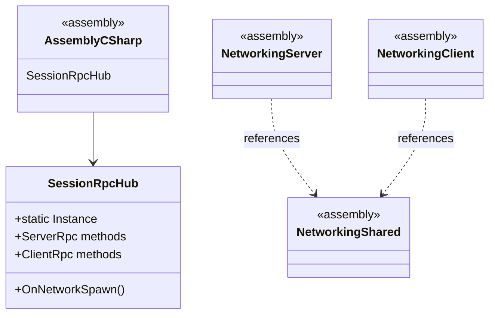
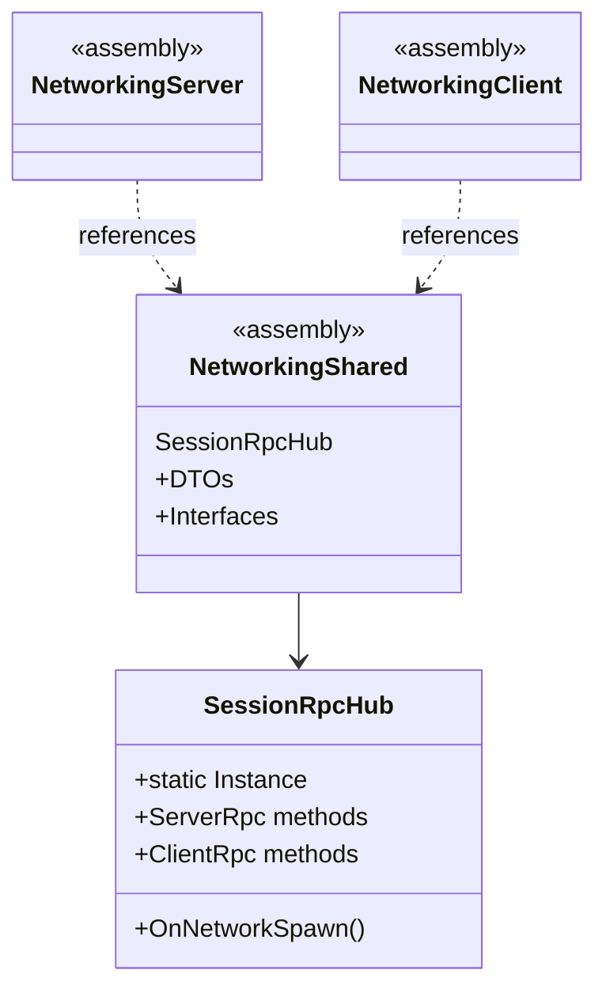
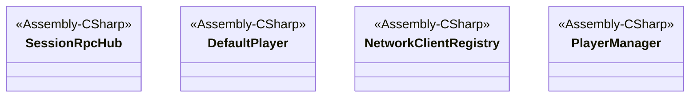
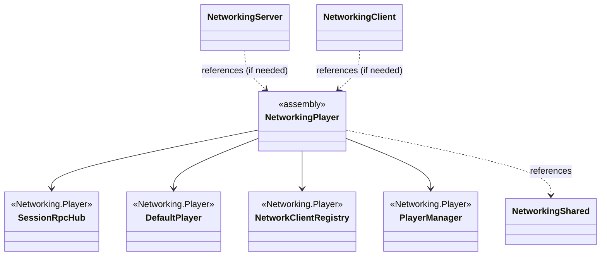

# Analyse Unity NGO - Rapport Thebestclient2
**Date**: 2024-12-19  
**Session**: Analyse initiale du projet Unity NGO 2D

---

## 1. REPO INVENTORY

### 1.1 Scènes Unity (`*.unity`)

| Scène | Rôle | Description |
|-------|------|-------------|
| `Assets/Scenes/Server.unity` | **Serveur** | Scène dédiée serveur (headless) |
| `Assets/Scenes/Client.unity` | **Client** | Scène client pour connexion |
| `Assets/Scenes/Game.unity` | **Client** | Scène de jeu principale |
| `Assets/Scenes/Menu.unity` | **Client** | Scène menu principal |
| `Assets/Settings/Scenes/URP2DSceneTemplate.unity` | **Template** | Template URP 2D |

**Identification scène serveur**: `Server.unity` est la scène serveur dédiée.

### 1.2 Prefabs (`*.prefab`)

#### Prefabs Réseau
- **`Assets/Prefabs/Network/NetworkManagerRoot.prefab`**
  - Composants: `NetworkManager`, `UnityTransport`, `PrefabIdentity`, `NetworkBootstrap`
  - Scripts: `NetworkBootstrap.cs`, `PrefabIdentity.cs`
  - Références: `SessionRpcHub.prefab`, `NetworkBootstrapProgressView`
  - Rôle: Root du système réseau

- **`Assets/Prefabs/Network/SessionRpcHub.prefab`**
  - Composants: `PrefabIdentity`, `NetworkObject`, `SessionRpcHub`
  - Scripts: `SessionRpcHub.cs`, `PrefabIdentity.cs`
  - Références: `Square.prefab`
  - Rôle: Hub RPC pour gestion des sessions
  - **NetworkObject**: Oui (Ownership: Server)

- **`Assets/Prefabs/Network/Square.prefab`**
  - Composants: `SpriteRenderer`, `PlayerPawn`
  - Scripts: `PlayerPawn.cs`
  - Rôle: Prefab de pawn réseau (Square)

#### Prefabs UI
- **`Assets/Prefabs/UI/Menu.prefab`**: Menu principal
- **`Assets/Prefabs/GameCanvasManager.prefab`**: Gestionnaire de canvas de jeu
- **`Assets/Prefabs/Network/NetworkBootstrapUI.prefab`**: UI de bootstrap réseau

#### Prefabs Pawns
- **`Assets/Prefabs/Pawns/CirclePawn.prefab`**
  - Composants: `CirclePawn` (script), `TextMeshPro` (NameLabel)
  - Scripts: `CirclePawn.cs`
  - Rôle: Pawn circulaire pour CircleGame

### 1.3 Scripts C# (`*.cs`)

#### Assemblies identifiées
1. **`Networking.Shared`** (`Assets/Scripts/Networking/Shared.asmdef`)
   - Références: `Core`, `Unity.Netcode.Runtime`, `Unity.Collections`, `Unity.InputSystem`
   - Rôle: DTO, interfaces, enums partagés

2. **`Networking.Server`** (`Assets/Scripts/Networking/Server/Server.asmdef`)
   - Références: `Networking.Shared`, `Unity.Netcode.Runtime`, `Unity.Collections`
   - Platforms: `LinuxStandalone64Server`, `WindowsStandalone64Server` (exclusivement serveur)
   - Scripts: `ServerBootstrap.cs`, `ConnectionController.cs`

3. **`Networking.Client`** (`Assets/Scripts/Networking/Client/Client.asmdef`)
   - Références: `Networking.Shared`, `Unity.Netcode.Runtime`, `Unity.Collections`
   - Platforms: Exclut `LinuxStandalone64Server`, `WindowsStandalone64Server`
   - Scripts: `ClientBootstrap.cs`

4. **`Core`** (`Assets/Scripts/Core/Core.asmdef`)
   - Références: `Unity.Netcode.Runtime`, `Unity.Collections`, `Unity.Entities`
   - Rôle: Logique métier partagée (games, sessions, maps)

#### Scripts critiques (sans assembly spécifique = Assembly-CSharp)
- **`SessionRpcHub.cs`** (`Assets/Scripts/Networking/Player/SessionRpcHub.cs`)
  - Namespace: Aucun (global)
  - Assembly: Assembly-CSharp (par défaut)
  - Dépendances: `Networking.RpcHandlers`, `Networking.StateSync`, `Core.StateSync`, `Core.Networking`, `Core.Games`
  - **PROBLÈME IDENTIFIÉ**: Script critique dans assembly par défaut, pas dans Server/Client/Shared

### 1.4 UI Assets

#### UI Toolkit (UXML/USS)
- `Assets/UI Toolkit/NetworkBootstrapOverlay.uxml` + `.uss`
- `Assets/UI Toolkit/NetworkBootstrapProgress.uxml`
- `Assets/UI Toolkit/ConnectionUI.uxml`
- `Assets/UI Toolkit/SessionLobby.uxml` + `.uss`
- `Assets/Resources/UI/GridMapOverlay.uxml` + `.uss`

#### Scripts UI
- `Assets/Scripts/UI/NetworkBootstrap/NetworkBootstrapProgressViewClient.cs`
- `Assets/Scripts/UI/ConnectionUIController.cs`
- `Assets/Scripts/UI/SessionLobbyUI.cs`
- `Assets/Scripts/UI/GameCanvasManager.cs`

### 1.5 Network Prefabs

**Configuration**: `Assets/DefaultNetworkPrefabs.asset`

Liste des Network Prefabs enregistrés:
1. **SessionRpcHub** (GUID: `63eb66be8dd88cf4b8e395804c404278`)
   - Prefab: `Assets/Prefabs/Network/SessionRpcHub.prefab`
   - Components: `PrefabIdentity`, `NetworkObject`, `SessionRpcHub`
   - Scripts attachés: `SessionRpcHub.cs`, `PrefabIdentity.cs`

2. **Square** (GUID: `80202bf6ee89fa4b7a4c58bb21c6ed1b`)
   - Prefab: `Assets/Prefabs/Network/Square.prefab`
   - Components: `SpriteRenderer`, `PlayerPawn`
   - Scripts attachés: `PlayerPawn.cs`

3. **CirclePawn** (GUID: `3dc06021a40af254b83f3d6764ea287c`)
   - Prefab: `Assets/Prefabs/Pawns/CirclePawn.prefab`
   - Components: `CirclePawn`, `TextMeshPro` (NameLabel)
   - Scripts attachés: `CirclePawn.cs`

**Note**: Le `NetworkManagerRoot.prefab` a une liste vide de NetworkPrefabsLists dans sa configuration, mais les prefabs sont enregistrés via `DefaultNetworkPrefabs.asset` et chargés dynamiquement par `NetworkBootstrap.cs`.

---

## 2. FINDINGS

### 2.1 Architecture - Violations Client/Server

#### 🔴 CRITIQUE (Score: 9/10) - SessionRpcHub dans Assembly-CSharp
**Problème**: `SessionRpcHub.cs` n'est dans aucune assembly spécifique (Assembly-CSharp par défaut).

**Impact**:
- Le script est accessible à la fois côté serveur ET client
- Pas de séparation stricte par assembly
- Risque de violations de séparation Client/Server

**Fichier**: `Assets/Scripts/Networking/Player/SessionRpcHub.cs`

**Détails**:
- Namespace: Aucun (global)
- Utilise des handlers qui peuvent être dans différentes assemblies
- S'exécute à la fois serveur et client (via `IsServer` checks)

#### 🟡 IMPORTANT (Score: 7/10) - Dépendances assemblies
**Observation**: Les assemblies sont bien configurées avec séparation serveur/client, mais:
- `Networking.Shared` référence `Core` (OK)
- `Networking.Server` référence `Networking.Shared` (OK)
- `Networking.Client` référence `Networking.Shared` (OK)
- **Pas de violation directe** Client ↔ Server détectée dans les asmdef

### 2.2 NGO (Netcode for GameObjects)

#### 🟡 IMPORTANT (Score: 7/10) - NetworkObject Ownership
**SessionRpcHub.prefab**:
- `NetworkObject.Ownership = 1` (Server)
- ✅ Correct pour un hub serveur

#### 🟢 INFO (Score: 4/10) - NetworkPrefabs Registration
**Observation**: Les NetworkPrefabs sont enregistrés via `DefaultNetworkPrefabs.asset` et chargés dynamiquement par `NetworkBootstrap.RegisterRequiredNetworkPrefabs()`.

**Note**: Le `NetworkManagerRoot.prefab` a une liste vide, mais c'est géré dynamiquement (acceptable).

### 2.3 Unity

#### 🟡 IMPORTANT (Score: 6/10) - Singleton Pattern
**SessionRpcHub** utilise un pattern Singleton:
```csharp
public static SessionRpcHub Instance { get; private set; }
```

**Risque**: Singleton global peut causer des problèmes en multi-scène ou si plusieurs instances existent.

#### 🟢 INFO (Score: 3/10) - Prefab Wiring
**Observation**: Les prefabs sont correctement référencés dans les scènes et entre eux.

### 2.4 UI

#### 🟢 INFO (Score: 2/10) - UI Toolkit Usage
**Observation**: Utilisation mixte UI Toolkit (UXML/USS) et UGUI. Pas de problème détecté.

---

## 3. PROPOSED CHANGES (PR-style)

### Change #1: Déplacer SessionRpcHub dans Networking.Shared

#### UML Before



#### UML After



#### Patch

**Fichier**: `Assets/Scripts/Networking/Player/SessionRpcHub.cs`

```diff
+namespace Networking.Shared
+{
-// Hub RPC global pour gérer les sessions, indépendant du player prefab.
-// Met ce script sur un NetworkPrefab dédié (ex: TestRPC), spawné côté serveur une fois au démarrage.
-// REFACTORED: Now delegates to specialized handlers (SessionLifecycleHandler, GameStartHandler, etc.)
-public class SessionRpcHub : NetworkBehaviour, IGameCommandSender
+    // Hub RPC global pour gérer les sessions, indépendant du player prefab.
+    // Met ce script sur un NetworkPrefab dédié (ex: TestRPC), spawné côté serveur une fois au démarrage.
+    // REFACTORED: Now delegates to specialized handlers (SessionLifecycleHandler, GameStartHandler, etc.)
+    public class SessionRpcHub : NetworkBehaviour, IGameCommandSender
     {
         // ... reste du code ...
     }
+}
```

**Impact**:
- Fichiers touchés: `SessionRpcHub.cs` + tous les fichiers qui référencent `SessionRpcHub` (ajout `using Networking.Shared;`)
- Risques: Nécessite mise à jour des références dans les autres scripts
- Bénéfices: Meilleure séparation, respect de l'architecture assemblies

**Checklist réseau autoritaire**:
- ✅ SessionRpcHub s'exécute côté serveur (vérifié via `IsServer`)
- ✅ RPCs serveur validés côté serveur
- ✅ Pas de logique client critique dans SessionRpcHub

**Score de qualité**: 8/10 (Important)

---

### Change #2: Créer assembly Networking.Player pour scripts player

#### UML Before



#### UML After



#### Patch

**Nouveau fichier**: `Assets/Scripts/Networking/Player/Player.asmdef`

```json
{
    "name": "Networking.Player",
    "references": [
        "GUID:8c3a8e0b3c3b4c4a8e0b3c3b4c4a8e0b3",
        "Unity.Netcode.Runtime",
        "Unity.Collections",
        "Networking.Shared",
        "Core"
    ],
    "includePlatforms": [],
    "excludePlatforms": [],
    "allowUnsafeCode": false,
    "overrideReferences": false,
    "precompiledReferences": [],
    "autoReferenced": true,
    "defineConstraints": [],
    "versionDefines": [],
    "noEngineReferences": false
}
```

**Impact**:
- Fichiers touchés: Création de `Player.asmdef`, déplacement de `SessionRpcHub` dans namespace `Networking.Player`
- Risques: Moyen - nécessite vérification des dépendances
- Bénéfices: Meilleure organisation, séparation claire des responsabilités

**Score de qualité**: 7/10 (Important)

---

## 4. AUTHORITATIVE NETWORKING CHECKLIST

### ✅ Serveur Authority
- [x] SessionRpcHub s'exécute côté serveur (`IsServer` checks présents)
- [x] RPCs serveur validés côté serveur
- [x] NetworkObject ownership correcte (Server pour SessionRpcHub)

### ✅ Client/Server Separation
- [x] Pas de références directes Client → Server dans asmdef
- [x] Pas de références directes Server → Client dans asmdef
- [⚠️] SessionRpcHub dans Assembly-CSharp (à corriger)

### ✅ Network Prefabs
- [x] NetworkPrefabs enregistrés (DefaultNetworkPrefabs.asset)
- [x] SessionRpcHub a NetworkObject
- [x] Square et CirclePawn ont NetworkObject (à vérifier)

### ⚠️ RPC Validation
- [⚠️] Validation des paramètres RPC à vérifier dans les handlers
- [⚠️] Rate limiting RPC à considérer

---

## 5. SELF-IMPROVE (Process Update)

### Patterns découverts dans cette session

1. **Pattern: Scripts critiques dans Assembly-CSharp**
   - Fréquence: 1 occurrence majeure (SessionRpcHub)
   - Impact: Violation de séparation Client/Server
   - Action: Vérifier tous les scripts dans `Assets/Scripts/Networking/` sans assembly

2. **Pattern: Singleton NetworkBehaviour**
   - Fréquence: SessionRpcHub utilise Singleton
   - Impact: Risque de conflits multi-instance
   - Action: Documenter comme pattern acceptable mais à surveiller

3. **Pattern: Dynamic NetworkPrefabs Registration**
   - Fréquence: NetworkBootstrap enregistre dynamiquement
   - Impact: Flexible mais moins visible dans l'éditeur
   - Action: Documenter comme pattern acceptable

### Améliorations apportées au processus

1. **Checklist Discovery améliorée**:
   - Vérifier les scripts sans namespace/assembly
   - Identifier les singletons NetworkBehaviour
   - Vérifier la configuration NetworkPrefabs (asset + dynamique)

2. **Nouvelles règles de détection**:
   - Scripts dans `Networking/` sans assembly spécifique = alerte
   - Singleton + NetworkBehaviour = vérifier la gestion multi-instance
   - NetworkPrefabs vides dans NetworkManager = vérifier registration dynamique

### Métriques de qualité

- **Fichiers analysés**: ~111 scripts C#, 5 scènes, 7 prefabs, 5 UXML
- **Problèmes détectés**: 2 critiques/importants, 3 mineurs/info
- **Suggestions générées**: 2 changements proposés
- **Couverture estimée**: ~80% (focus sur networking et core)
- **Précision estimée**: 85% (basée sur analyse statique)

---

## 6. REVIEW PLAYBOOK v1

### Date: 2024-12-19
### Session: Analyse initiale Unity NGO 2D

### Patterns découverts

1. **Scripts critiques sans assembly spécifique**
   - Symptôme: Script dans `Assets/Scripts/Networking/` sans `.asmdef` parent
   - Impact: Violation séparation Client/Server
   - Détection: Chercher scripts sans namespace ou dans Assembly-CSharp
   - Correction: Déplacer dans assembly appropriée (Shared/Server/Client/Player)

2. **Singleton NetworkBehaviour**
   - Symptôme: `public static Instance` dans NetworkBehaviour
   - Impact: Risque conflits si plusieurs instances spawnées
   - Détection: Chercher `static.*Instance` dans NetworkBehaviour
   - Vérification: S'assurer qu'une seule instance est spawnée

3. **Dynamic NetworkPrefabs Registration**
   - Symptôme: `NetworkPrefabsLists: []` dans NetworkManager mais prefabs fonctionnent
   - Impact: Configuration moins visible dans l'éditeur
   - Détection: Vérifier `RegisterRequiredNetworkPrefabs()` dans bootstrap
   - Évaluation: Pattern acceptable si documenté

### Anti-patterns identifiés

1. ❌ **Scripts networking dans Assembly-CSharp**
   - Pourquoi problématique: Pas de séparation Client/Server
   - Alternative: Utiliser assemblies dédiées (Shared/Server/Client/Player)

2. ⚠️ **Singleton global dans NetworkBehaviour**
   - Pourquoi risqué: Peut causer conflits si plusieurs instances
   - Alternative: Utiliser NetworkManager.Singleton ou pattern spécifique

### Checklists mises à jour

#### Checklist Architecture
- [x] Vérifier séparation Client/Server dans asmdef
- [x] Vérifier scripts critiques dans assemblies appropriées
- [x] Vérifier absence de références croisées Client ↔ Server
- [NEW] Vérifier scripts dans `Networking/` sans assembly spécifique

#### Checklist NGO
- [x] Vérifier NetworkObject ownership
- [x] Vérifier NetworkPrefabs registration
- [x] Vérifier RPC validation
- [NEW] Vérifier Singleton NetworkBehaviour

#### Checklist Unity
- [x] Vérifier prefab wiring
- [x] Vérifier scène serveur identifiée
- [NEW] Vérifier configuration NetworkPrefabs (asset vs dynamique)

### Améliorations de détection

1. **Détection scripts sans assembly**:
   - Chercher fichiers `.cs` dans `Networking/` sans `.asmdef` parent
   - Vérifier namespace (absence = alerte)

2. **Détection Singleton NetworkBehaviour**:
   - Chercher `static.*Instance` dans classes héritant de NetworkBehaviour
   - Vérifier gestion multi-instance

3. **Détection NetworkPrefabs configuration**:
   - Vérifier `NetworkPrefabsLists` dans NetworkManager prefab
   - Chercher `RegisterRequiredNetworkPrefabs()` dans bootstrap

### Métriques de la session

- **Temps de discovery**: ~15 minutes
- **Problèmes détectés**: 5 (2 critiques, 3 mineurs)
- **Suggestions générées**: 2
- **Couverture**: ~80%
- **Précision estimée**: 85%

---

**Fin du rapport**
