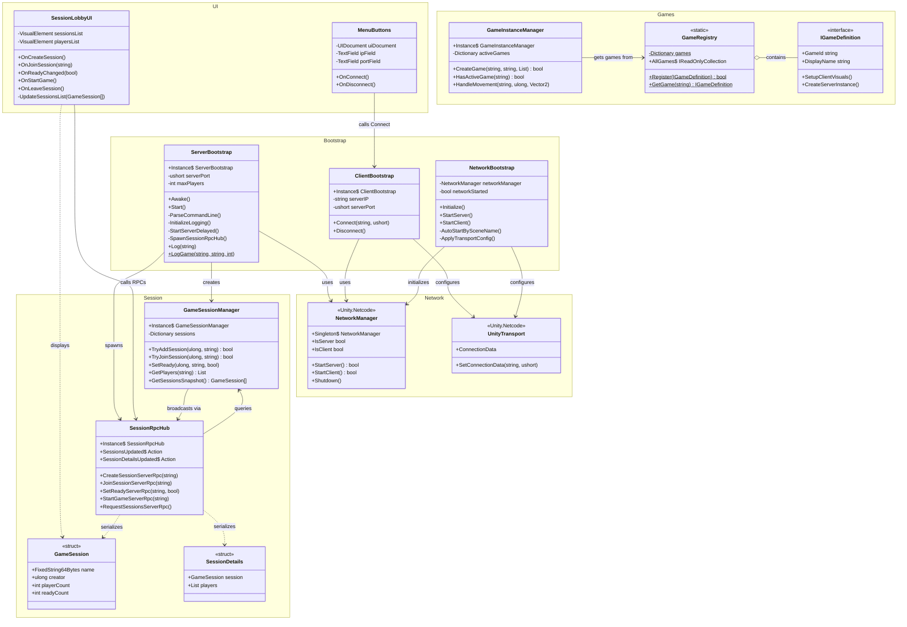

# Architecture du Projet

## Diagramme de Classes



## Flux de Données

### Démarrage Serveur
```
ServerBootstrap.Awake()
    └── ParseCommandLine() → serverPort, maxPlayers
    └── InitializeLogging()

ServerBootstrap.Start()
    └── StartServerDelayed()
        └── NetworkManager.StartServer()
        └── SpawnSessionRpcHub()
        └── EnsureGameSessionManager()
```

### Connexion Client
```
MenuButtons.OnConnect()
    └── ClientBootstrap.Connect(ip, port)
        └── UnityTransport.SetConnectionData()
        └── NetworkManager.StartClient()

→ Scene change: Menu → Client

SessionLobbyUI
    └── SessionRpcHub.RequestSessionsServerRpc()
    └── OnSessionsUpdated(sessions)
```

### Création de Session
```
SessionLobbyUI.OnCreateSession()
    └── SessionRpcHub.CreateSessionServerRpc(name)
        └── [Server] GameSessionManager.TryAddSession()
        └── [Server] SessionRpcHub.SyncSessionsClientRpc()
    └── [Client] OnSessionsUpdated()
```

### Démarrage de Partie
```
SessionLobbyUI.OnStartGame()
    └── SessionRpcHub.StartGameServerRpc(sessionName)
        └── [Server] GameSessionManager.GetPlayers()
        └── [Server] GameRegistry.GetGame(gameId)
        └── [Server] GameInstanceManager.CreateGame()
        └── [Server] SessionRpcHub.StartGameClientRpc()
    └── [Client] IGameDefinition.SetupClientVisuals()
```

## Scènes

| Scène | Bootstrap | UI | Description |
|-------|-----------|-----|-------------|
| Server | ServerBootstrap | - | Serveur dédié headless |
| Menu | ClientBootstrap | MenuButtons | Écran de connexion |
| Client | - | SessionLobbyUI | Lobby des sessions |
| Game | - | GameUI | Jeu en cours |
