# 📊 System Diagrams

## Architecture Overview

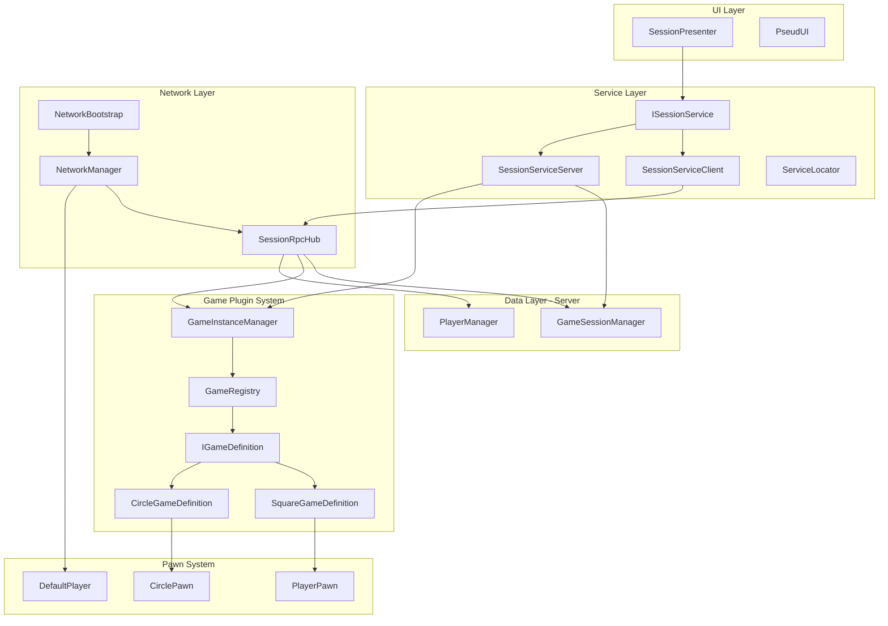

---

## Feature List

| # | Feature | Description |
|---|---------|-------------|
| 1 | **Session Creation** | Create named lobby sessions |
| 2 | **Session Joining** | Join existing sessions |
| 3 | **Session Leaving** | Leave current session |
| 4 | **Ready Toggle** | Mark player as ready/not ready |
| 5 | **Game Type Selection** | Host selects which game to play |
| 6 | **Game Start** | Start game when all players ready |
| 7 | **Pawn Spawning** | Server spawns player pawns |
| 8 | **Player Movement** | Server-authoritative movement |
| 9 | **Multi-Session** | Multiple concurrent sessions |

---

## Feature 1: Session Creation

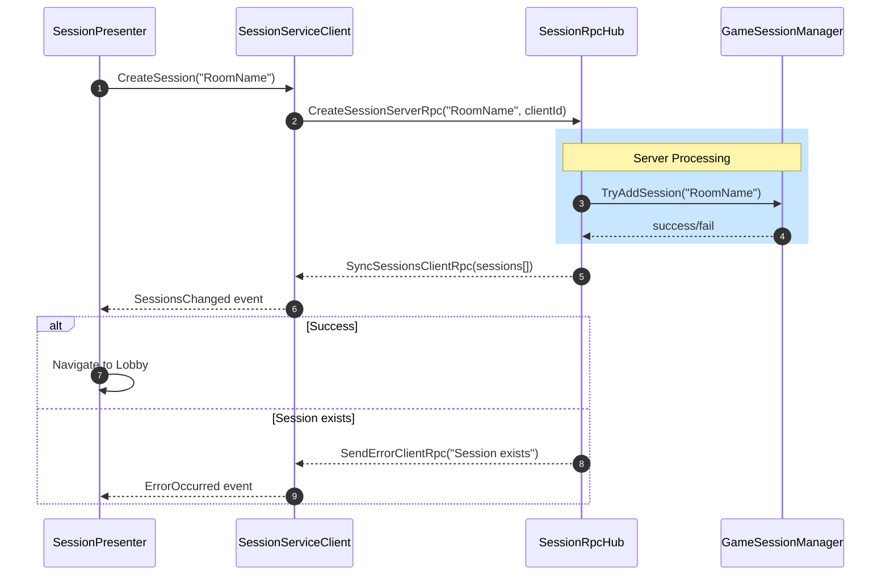

---

## Feature 2: Session Joining

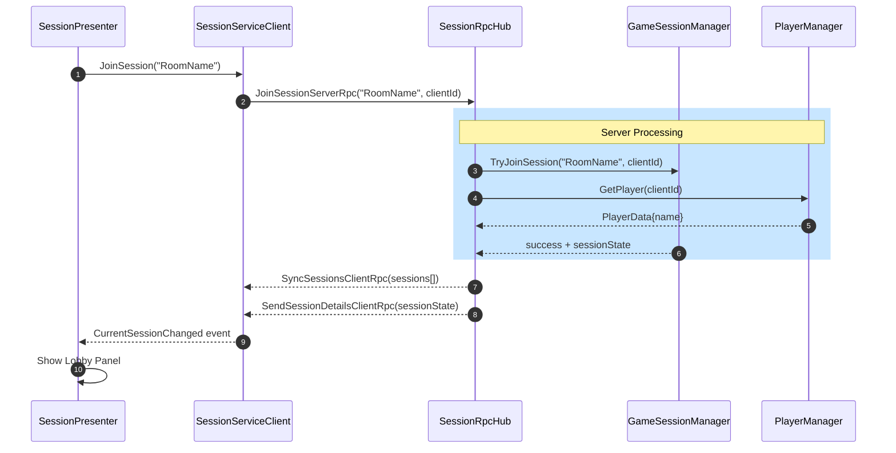

---

## Feature 3: Session Leaving

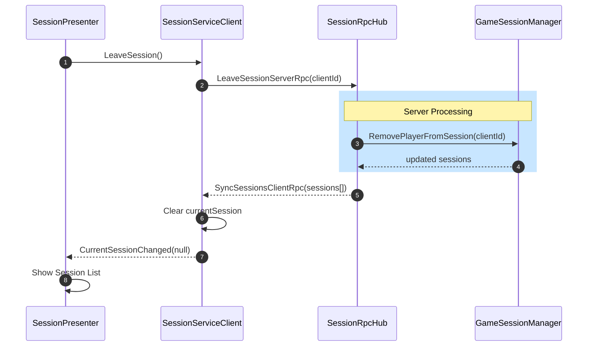

---

## Feature 4: Ready Toggle

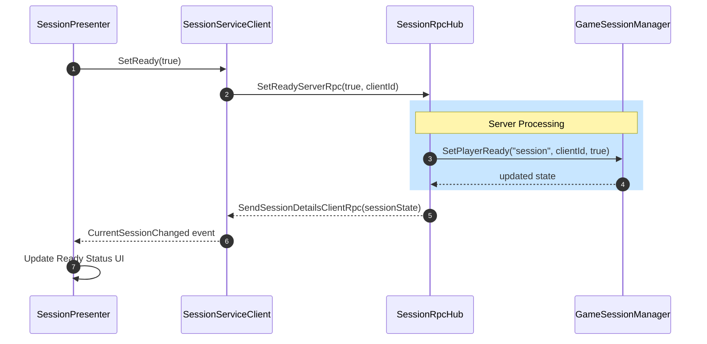

---

## Feature 5: Game Type Selection

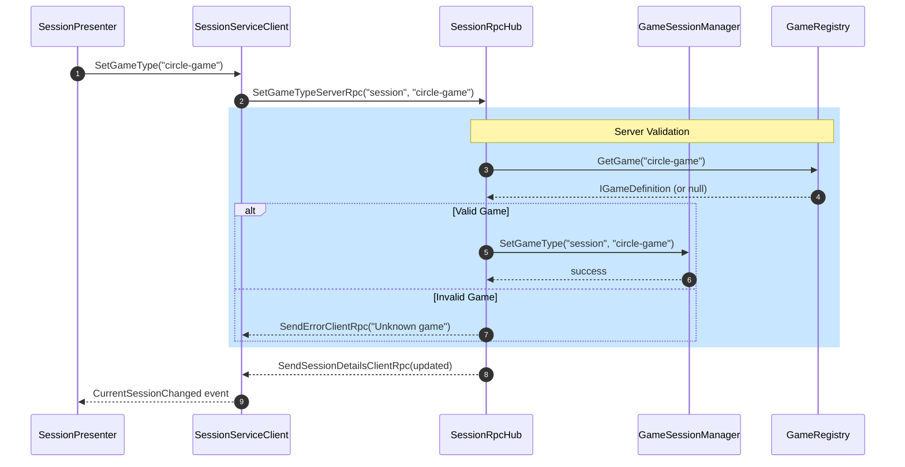

---

## Feature 6: Game Start

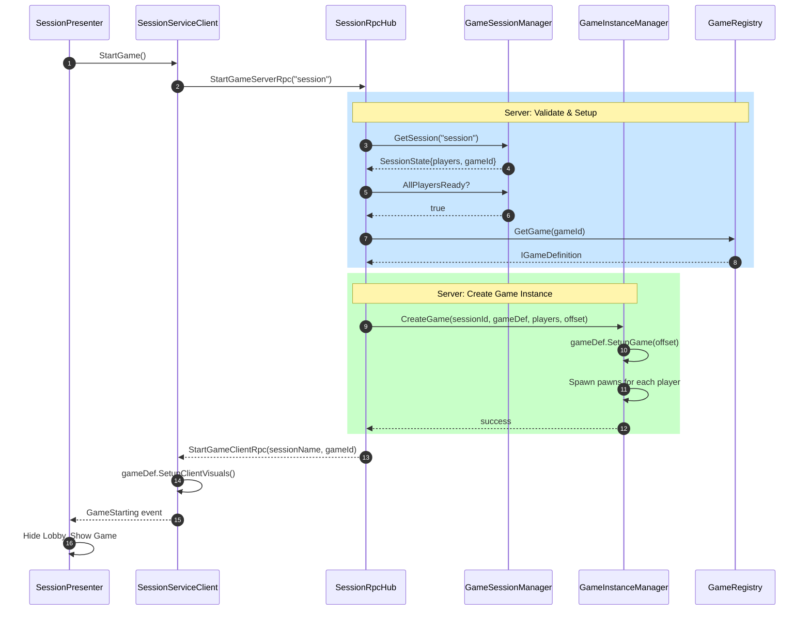

---

## Feature 7: Pawn Spawning (Server)

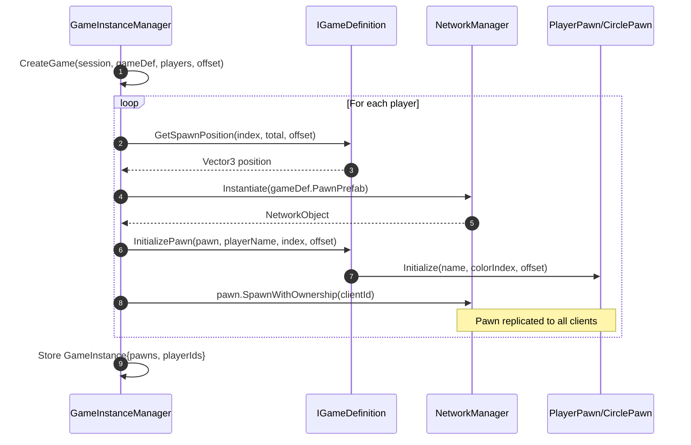

---

## Feature 8: Player Movement

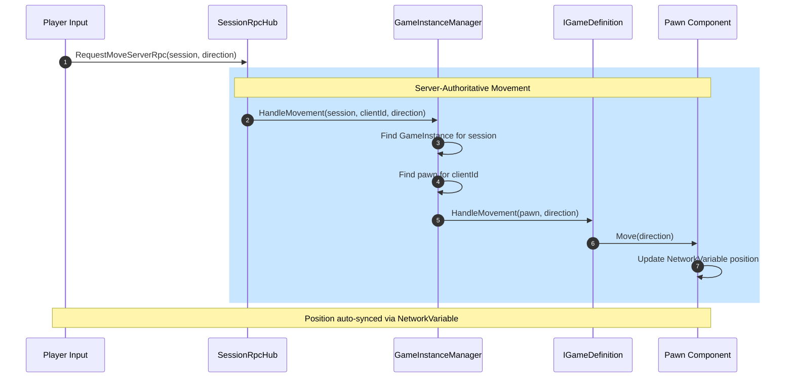

---

## Session State Diagram

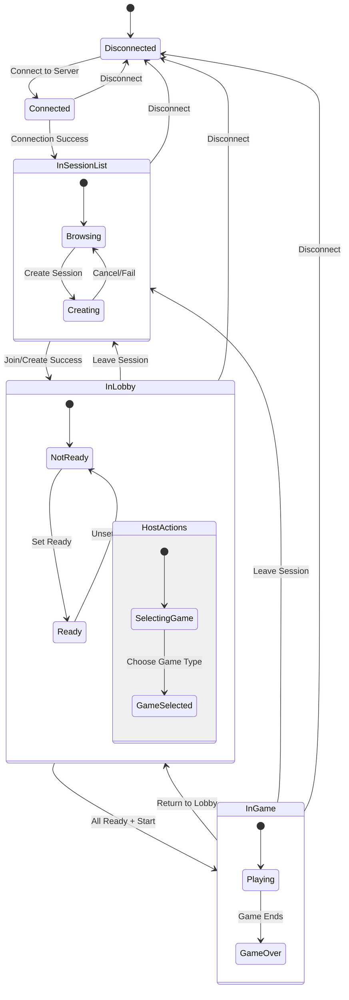

---

## Game Plugin State Diagram

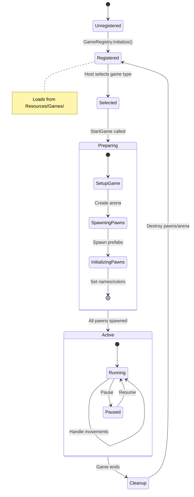

---

## Network Object Lifecycle

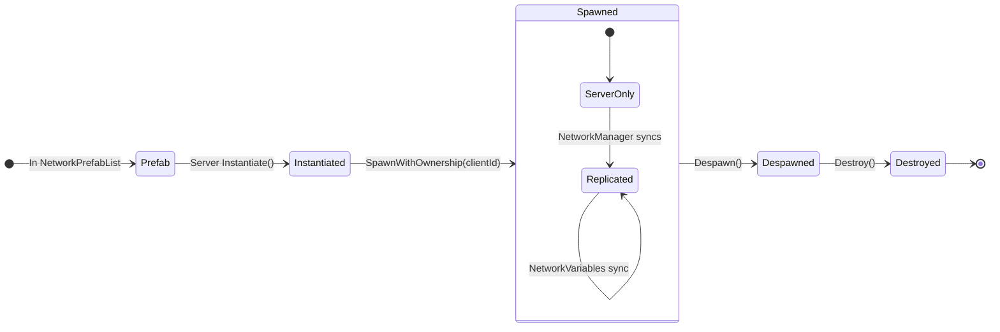

---

## File Dependencies

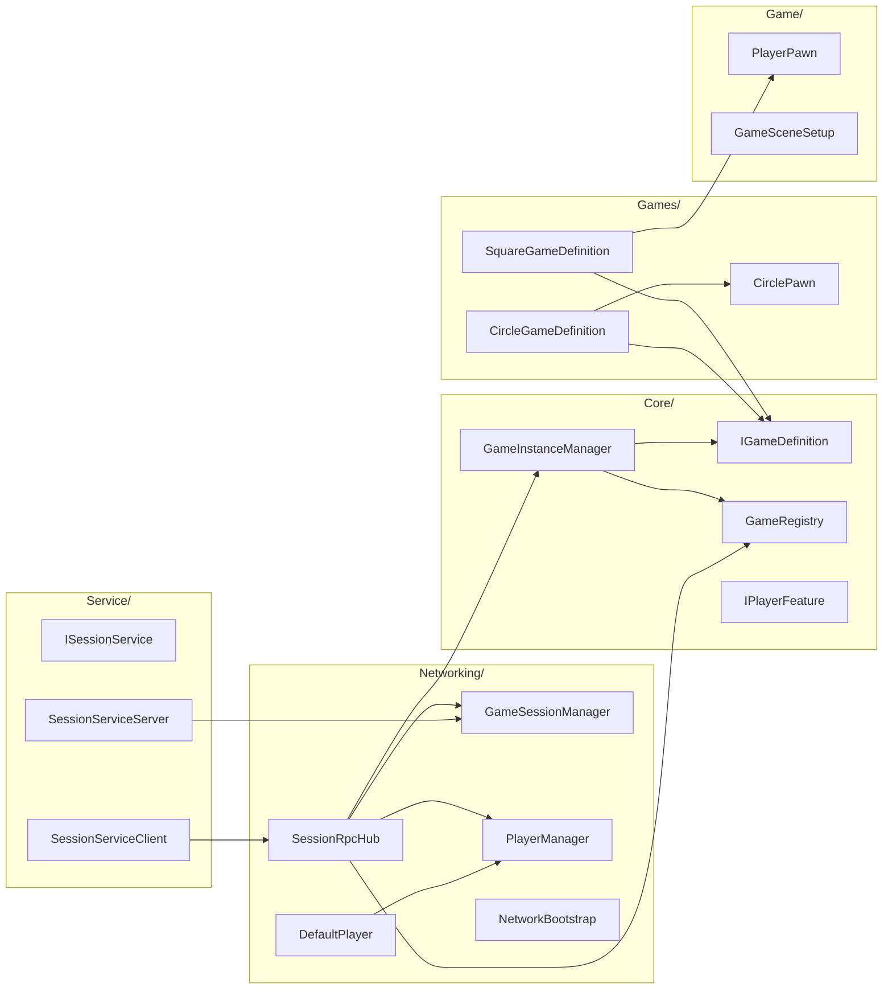

---

## Deleted Files (Cleanup)

| File | Reason Deleted |
|------|----------------|
| `Networking/Player/GameManager.cs` | Replaced by GameInstanceManager |
| `Networking/Player/GameRuntime.cs` | Legacy Game/GameStruct/GamePlayerState classes removed |
| `Data/Game/GameRuntimeModel.cs` | Referenced deleted `ISessionRuntimeModel` |
| `Data/Game/GameServerConfig.cs` | Never used |
| `Data/Player/PlayerRuntimeModel.cs` | Wrapper not used |
| `Data/Player/PlayerDataModel.cs` | Adapter not used |
| `Service/GameServer/IGameServer.cs` | Interface never implemented |
| `Service/GameServer/GameServerService.cs` | Never registered |
| `Service/PawnSpawner/IPawnSpawner.cs` | Interface never used |
| `Service/PawnSpawner/NetworkPawnSpawner.cs` | Never instantiated |
| `Service/PlayerRegistry/IPlayerRegistry.cs` | Interface never used |
| `Service/PlayerRegistry/PlayerRegistryService.cs` | Never registered |
| `Service/Core/IGameService.cs` | Interface never implemented |
| `Networking/Sessions/data/` | Empty folder |

---

**Last Updated:** 2026-01-07
