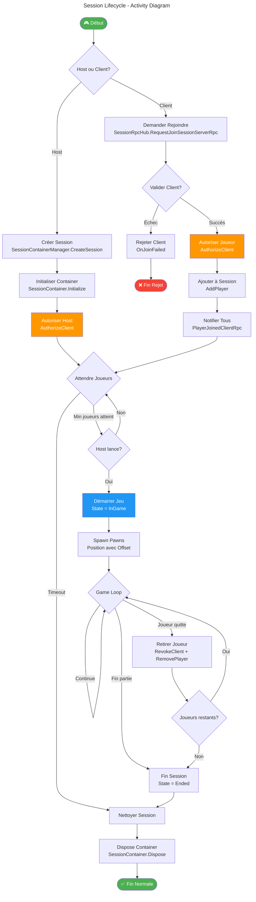

# Session Lifecycle - Diagramme d'Activité

Ce diagramme montre le flux complet du cycle de vie d'une session.

## Phases du Cycle de Vie

### 1️⃣ Phase de Création
- Le Host crée une session via `SessionContainerManager.CreateSession()`
- Un `SessionContainer` est initialisé avec un ID unique
- Le Host est automatiquement autorisé

### 2️⃣ Phase de Lobby
- Les clients demandent à rejoindre via RPC
- Validation et autorisation de chaque client
- Les joueurs sont ajoutés au conteneur
- Notification broadcast à tous les participants

### 3️⃣ Phase de Jeu
- Le Host lance la partie quand les conditions sont remplies
- Les pawns sont spawnés avec l'offset de session
- Game loop active avec validation continue

### 4️⃣ Phase de Fin
- Déclenchée par fin de partie ou déconnexion
- Révocation de tous les clients
- Nettoyage des ressources
- Dispose du conteneur

## Points de Sécurité

| Point | Validation |
|-------|------------|
| **Join** | `ValidateClient` vérifie les conditions d'entrée |
| **Autorisation** | `AuthorizeClient` ajoute aux clients autorisés |
| **Game Loop** | Validation continue des accès |
| **Cleanup** | `RevokeClient` retire les autorisations |
