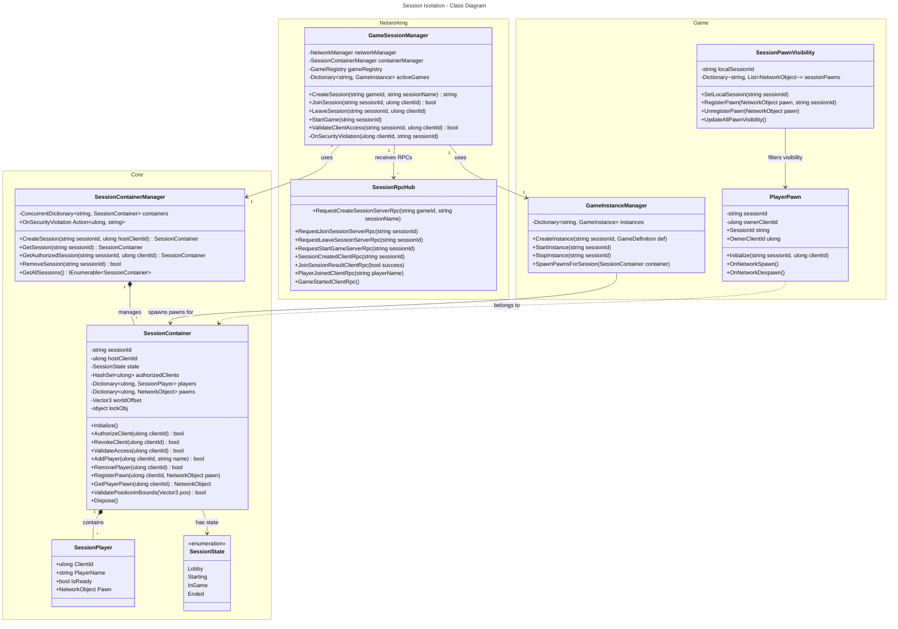

# Session Isolation - Diagramme de Classes

Ce diagramme montre l'architecture des classes du système d'isolation des sessions.

## Description des Classes

### Namespace Core (Core.Games)

| Classe | Responsabilité |
|--------|----------------|
| **SessionContainer** | Conteneur isolé par session avec autorisation, gestion des joueurs et des pawns |
| **SessionContainerManager** | Gestionnaire thread-safe de tous les conteneurs de session |
| **SessionPlayer** | Données d'un joueur dans une session |
| **SessionState** | États possibles d'une session |

### Namespace Networking

| Classe | Responsabilité |
|--------|----------------|
| **GameSessionManager** | Orchestration des sessions de jeu côté serveur |
| **SessionRpcHub** | Hub RPC pour la communication client-serveur |

### Namespace Game

| Classe | Responsabilité |
|--------|----------------|
| **GameInstanceManager** | Gestion des instances de jeu |
| **SessionPawnVisibility** | Filtrage visuel des pawns par session (côté client) |
| **PlayerPawn** | Représentation réseau d'un joueur |
