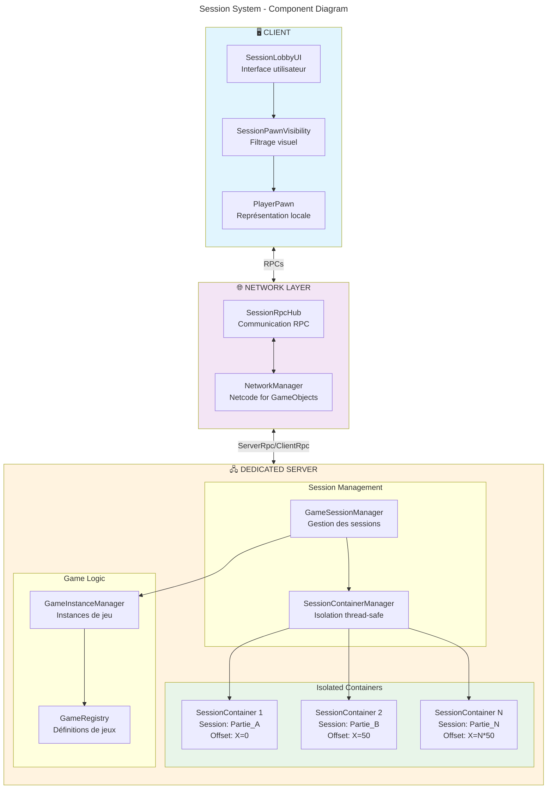

# Session System - Diagramme de Composants

Ce diagramme montre l'architecture des composants et leurs interactions.

## Architecture des Composants

### 🖥️ Client Side

| Composant | Rôle |
|-----------|------|
| **SessionLobbyUI** | Interface utilisateur pour créer/rejoindre des sessions |
| **SessionPawnVisibility** | Filtre les pawns visibles selon la session locale |
| **PlayerPawn** | Représentation locale du joueur |

### 🌐 Network Layer

| Composant | Rôle |
|-----------|------|
| **SessionRpcHub** | Centralise tous les appels RPC session |
| **NetworkManager** | Gestionnaire Netcode for GameObjects |

### 🖧 Dedicated Server

| Composant | Rôle |
|-----------|------|
| **GameSessionManager** | Orchestration principale des sessions |
| **SessionContainerManager** | Gestion thread-safe des conteneurs |
| **SessionContainer 1..N** | Conteneurs isolés avec offset spatial |
| **GameInstanceManager** | Gestion des instances de jeu |
| **GameRegistry** | Définitions et règles des jeux |

## Isolation des Sessions

Chaque `SessionContainer` est isolé avec :
- **Autorisation** : Seuls les clients autorisés peuvent accéder
- **Offset spatial** : Position X = `N * 50` unités
- **Données séparées** : Players, pawns, état indépendants
- **Thread-safety** : ConcurrentDictionary et locks
