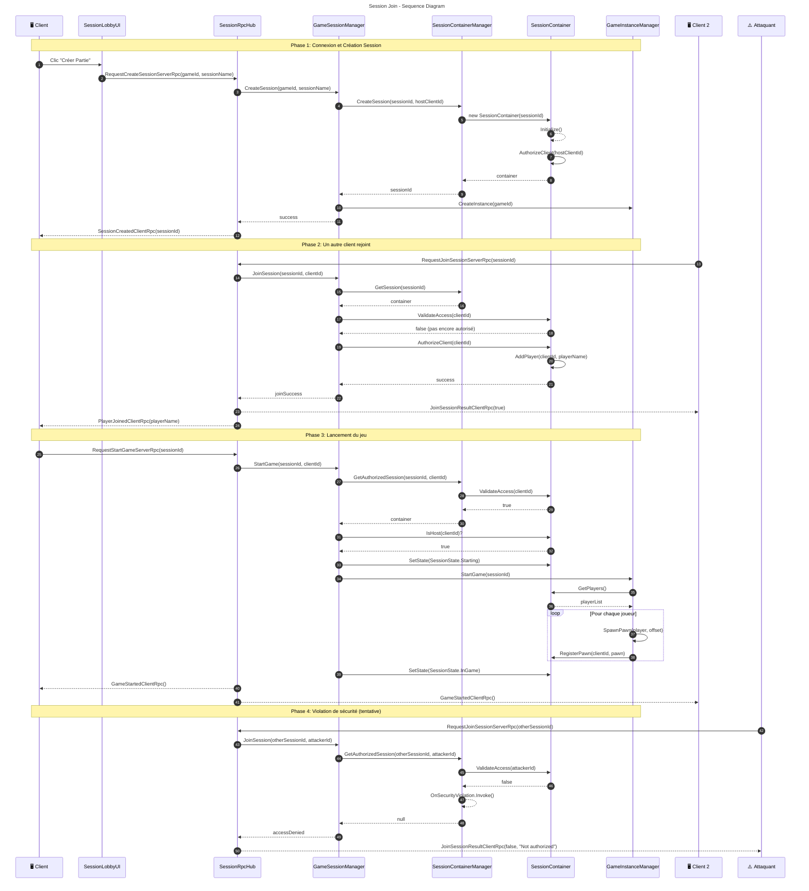

# Session Join - Diagramme de Séquence

Ce diagramme détaille les interactions lors de la création et jonction d'une session.

## Description des Phases

### Phase 1: Création de Session

1. Client clique "Créer Partie" dans l'UI
2. `SessionRpcHub` transmet la demande au serveur
3. `GameSessionManager` orchestre la création
4. `SessionContainerManager` crée un nouveau conteneur
5. Le Host est automatiquement autorisé
6. Confirmation envoyée au client

### Phase 2: Jonction d'un Client

1. Client 2 demande à rejoindre via RPC
2. Le serveur valide que la session existe
3. Client est autorisé et ajouté aux joueurs
4. Tous les participants sont notifiés

### Phase 3: Lancement du Jeu

1. Host demande le démarrage
2. Validation que le demandeur est bien le host
3. État passe à `Starting` puis `InGame`
4. Pawns spawnés pour chaque joueur
5. Tous les clients reçoivent la notification

### Phase 4: Gestion des Violations

1. Un attaquant tente d'accéder à une session non autorisée
2. `ValidateAccess` retourne `false`
3. Événement `OnSecurityViolation` déclenché
4. Accès refusé avec message d'erreur

## Points Clés de Sécurité

| Mécanisme | Description |
|-----------|-------------|
| `ValidateAccess()` | Vérifie l'autorisation avant chaque opération |
| `GetAuthorizedSession()` | Retourne null si non autorisé |
| `OnSecurityViolation` | Événement pour logging/bannissement |
| Host-only operations | Certaines actions réservées au host |
