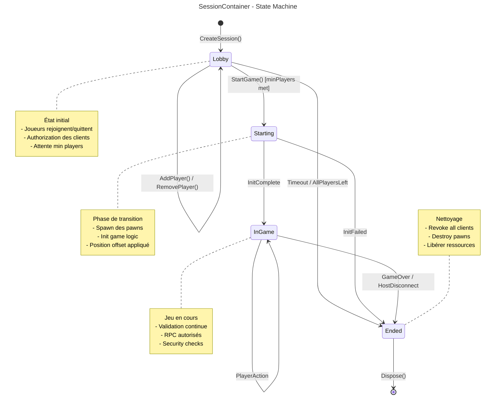

# SessionContainer - State Machine

Ce diagramme montre les états possibles d'un `SessionContainer` et leurs transitions.



## États de Session

### 🟢 Lobby
**État initial après création**

| Action | Résultat |
|--------|----------|
| `AddPlayer()` | Ajoute un joueur, reste en Lobby |
| `RemovePlayer()` | Retire un joueur, reste en Lobby |
| `StartGame()` | Passe à Starting (si min players) |
| Timeout | Passe à Ended |
| Tous partent | Passe à Ended |

### 🟡 Starting
**Phase de transition**

| Action | Résultat |
|--------|----------|
| Init réussie | Passe à InGame |
| Init échouée | Passe à Ended |

Opérations effectuées :
- Spawn des pawns avec offset
- Initialisation de la logique de jeu
- Configuration des NetworkObjects

### 🔵 InGame
**Partie en cours**

| Action | Résultat |
|--------|----------|
| GameTick | Continue en InGame |
| PlayerAction | Continue en InGame |
| GameOver | Passe à Ended |
| Host déconnecté | Passe à Ended |

Validations continues :
- Accès autorisé pour chaque RPC
- Position dans les bounds
- État cohérent

### 🔴 Ended
**Fin de session**

| Action | Résultat |
|--------|----------|
| `Dispose()` | Destruction complète |

Nettoyage :
- Révocation de tous les clients
- Destruction des pawns
- Libération des ressources
- Retrait du SessionContainerManager

## Code de l'Enum

```csharp
public enum SessionState
{
    /// <summary>En attente de joueurs</summary>
    Lobby,
    
    /// <summary>Initialisation du jeu</summary>
    Starting,
    
    /// <summary>Partie en cours</summary>
    InGame,
    
    /// <summary>Partie terminée</summary>
    Ended
}
```

## Transitions Valides

| De | Vers | Condition |
|----|------|-----------|
| `[Initial]` | `Lobby` | CreateSession() appelé |
| `Lobby` | `Starting` | StartGame() + min players |
| `Lobby` | `Ended` | Timeout ou plus de joueurs |
| `Starting` | `InGame` | Initialisation réussie |
| `Starting` | `Ended` | Erreur d'initialisation |
| `InGame` | `Ended` | Fin de partie ou host parti |
| `Ended` | `[Final]` | Dispose() appelé |
