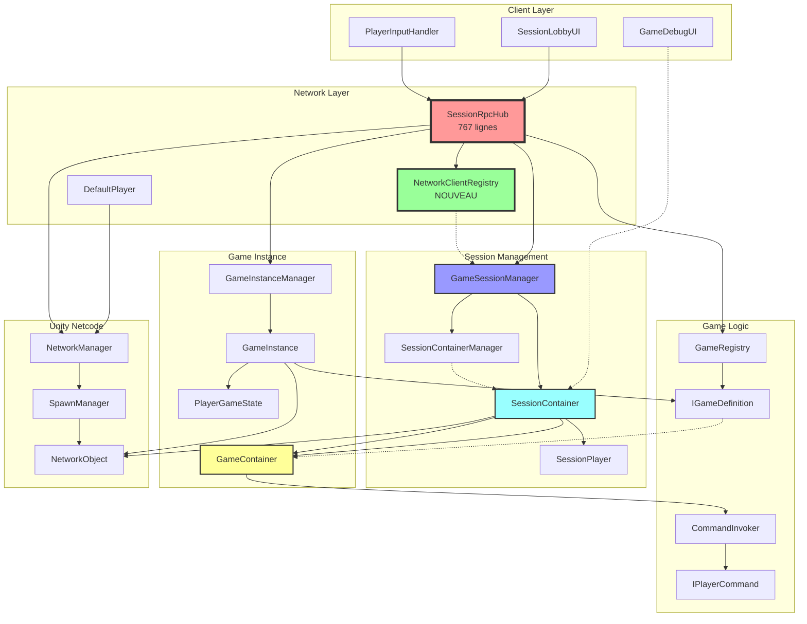

# Graphe de Dépendances - Architecture Réseau

## Vue d'ensemble actuelle



## Détails des liaisons

### SessionRpcHub → Autres fichiers

| Fichier cible | Type de liaison | Méthodes utilisées | Responsabilité |
|--------------|----------------|-------------------|----------------|
| **GameSessionManager** | Forte (appels directs) | TryAddSession, TryJoinSession, GetSession, ValidateClientAccess | Gestion des sessions |
| **GameInstanceManager** | Forte (appels directs) | CreateGame, HasActiveGame, HandleMovement, GetPlayerIds | Gestion des instances de jeu |
| **GameRegistry** | Moyenne (via static) | Initialize, GetGame | Récupération des définitions de jeux |
| **NetworkManager** | Forte (via Singleton) | IsServer, SpawnManager, LocalClientId | Accès réseau Unity |
| **NetworkClientRegistry** | Nouvelle (à implémenter) | RegisterClient, SetClientSession, GetClient | Registre centralisé de clients |
| **SessionLobbyUI** | Faible (via événements) | OnGameStartFailed (via événement) | Notification UI |
| **ToastNotification** | Faible (via static) | Show | Affichage de notifications |
| **PlayerInputHandler** | Moyenne (via Instance) | SetSession | Configuration d'entrée |
| **GameDebugUI** | Moyenne (via Instance) | SetSession, SetClientId, Show | UI de debug |
| **SessionPawnVisibility** | Moyenne (via Instance) | RegisterPawn, SetLocalSession | Filtrage de visibilité |
| **DefaultPlayer** | Faible (via recherche) | NameAgent | Résolution de noms |

### GameSessionManager → SessionContainer

```csharp
// GameSessionManager stocke les SessionContainers
private SessionContainerManager containerManager;

// Création de session
SessionContainer CreateSession(string sessionName, int maxPlayers, ulong hostClientId);

// Accès aux sessions
SessionContainer GetSession(string sessionName);
SessionContainer GetSecureContainer(string sessionName);

// Mapping client → session
string GetClientSession(ulong clientId);
```

### SessionContainer → GameContainer

```csharp
// SessionContainer encapsule GameContainer
private GameContainer gameContainer;
public GameContainer Game => gameContainer;

// Initialisation quand le jeu démarre
gameContainer = new GameContainer(SessionName, gameId, WorldOffset);

// Enregistrement de pawns
gameContainer.RegisterPawn(clientId, pawn, playerName);
```

### GameContainer → CommandInvoker

```csharp
// GameContainer utilise CommandInvoker pour exécuter les commandes
private readonly CommandInvoker commandInvoker = new CommandInvoker();

public void ExecutePlayerCommand(IPlayerCommand command)
{
    commandInvoker.ExecuteCommand(command);
}
```

### NetworkClientRegistry → GameSessionManager (Nouvelle liaison)

```csharp
// NetworkClientRegistry suit les sessions des clients
registry.SetClientSession(clientId, sessionName);

// GameSessionManager peut interroger le registre
var clientsInSession = registry.GetClientsInSession(sessionName);
var clientData = registry.GetClient(clientId);
```

## Flux de données complets

### 1. Connexion Client

```
NetworkManager.OnClientConnectedCallback
  → NetworkClientRegistry.OnClientConnected(clientId)
    → NetworkClientRegistry.RegisterClient(clientId)
      → ClientNetworkData créé et stocké
      → Événement OnClientRegistered déclenché
```

### 2. Création de Session

```
Client UI: SessionLobbyUI.OnCreateSession()
  → SessionRpcHub.CreateSessionServerRpc(sessionName, rpcParams)
    → Extract clientId from rpcParams.Receive.SenderClientId
    → GameSessionManager.TryAddSession(clientId, sessionName)
      → SessionContainerManager.CreateSession(sessionName, maxPlayers, hostClientId)
        → new SessionContainer(sessionName, hostClientId, worldOffset)
        → SessionContainer.AddPlayer(hostClientId, playerName)
      → NetworkClientRegistry.SetClientSession(hostClientId, sessionName)
    → SessionRpcHub.SyncSessionsClientRpc(sessions)
      → Tous les clients reçoivent la mise à jour
        → SessionLobbyUI.OnSessionsUpdated(sessions)
```

### 3. Rejoindre une Session

```
Client UI: SessionLobbyUI.OnJoinSession(sessionName)
  → SessionRpcHub.JoinSessionServerRpc(sessionName, rpcParams)
    → Extract clientId from rpcParams
    → GameSessionManager.TryJoinSession(clientId, sessionName)
      → SessionContainer.ValidateAccess(clientId)
      → SessionContainer.AddPlayer(clientId, playerName)
      → NetworkClientRegistry.SetClientSession(clientId, sessionName)
    → SessionRpcHub.SyncSessionsClientRpc(sessions)
```

### 4. Démarrage de Jeu

```
Host UI: SessionLobbyUI.OnStartGame()
  → SessionRpcHub.StartGameServerRpc(sessionName, rpcParams)
    → Validation (8 checks):
      1. Session exists
      2. Client is host
      3. Minimum players
      4. All ready
      5. State = Lobby
      6. Game ID valid
      7. Session state allows start
      8. No active game
    → GameSessionManager.GetSession(sessionName)
      → SessionContainer.StartGame(gameId, clientId)
        → new GameContainer(sessionName, gameId, worldOffset)
        → SessionContainer.State = Starting
    → GameInstanceManager.CreateGame(sessionName, gameId, playerData, worldOffset)
      → new GameInstance()
      → GameDefinition.SetupGame(worldOffset)
      → SpawnPlayers()
    → SessionRpcHub.StartGameClientRpc(sessionName, gameId, worldOffset, clientRpcParams)
      → Clients: LoadGameSceneAndInitialize()
        → SceneManager.LoadSceneAsync("Game", LoadSceneMode.Additive)
        → GameDefinition.SetupClientVisuals()
        → PlayerInputHandler.SetSession(sessionName)
        → GameDebugUI.Show()
```

### 5. Mouvement Joueur (avec Command Pattern)

```
Client: PlayerInputHandler détecte WASD
  → SessionRpcHub.RequestMoveServerRpc(sessionName, direction, rpcParams)
    → Extract clientId from rpcParams
    → Validation:
      - Session exists
      - Client authorized
      - Rate limiting (20 req/s)
      - Direction clamping
    → GameSessionManager.GetSession(sessionName)
      → SessionContainer.ValidateAccess(clientId)
      → GameContainer.ExecutePlayerCommand(moveCommand)
        → MovePlayerCommand créé avec (gameContainer, clientId, direction)
        → CommandInvoker.ExecuteCommand(command)
          → MovePlayerCommand.Execute()
            → pawn = gameContainer.GetPlayerPawn(clientId)
            → pawn.transform.position += movement
              → NetworkObject synchronise automatiquement vers tous les clients
```

## Dépendances circulaires à éviter

### ❌ Problèmes actuels

1. **SessionRpcHub ↔ GameSessionManager**
   - SessionRpcHub appelle GameSessionManager
   - GameSessionManager pourrait vouloir appeler SessionRpcHub pour les ClientRpcs
   - **Solution**: SessionRpcHub garde le contrôle des RPCs, GameSessionManager utilise des événements

2. **GameContainer ↔ SessionContainer**
   - GameContainer a besoin de SessionContainer pour la validation
   - SessionContainer crée GameContainer
   - **Solution**: GameContainer ne connaît pas SessionContainer, utilise uniquement WorldOffset

3. **NetworkClientRegistry ↔ GameSessionManager**
   - Risque de créer une boucle si mal implémenté
   - **Solution**: NetworkClientRegistry est indépendant, utilisé par GameSessionManager mais ne l'appelle pas

## Recommandations pour la refactorisation

### 1. Extraire les Handlers (Priority 1)

```
SessionRpcHub (767 lignes)
  → SessionLifecycleHandler (création, join, leave)
  → GameStartHandler (validation, démarrage)
  → PlayerMovementHandler (mouvement, commandes)
  → SceneLoadHandler (chargement de scènes)
  → SessionQueryHandler (requêtes d'infos)
```

**Avantage**: Réduit SessionRpcHub à ~200 lignes

### 2. Utiliser NetworkClientRegistry (Priority 1)

```csharp
// Au lieu de chercher dans SpawnedObjectsList
var playerName = registry.GetClient(clientId)?.PlayerName ?? $"Player {clientId}";

// Au lieu de clientSessions dans GameSessionManager
var sessionName = registry.GetClientSession(clientId);

// Liste des clients dans une session
var clients = registry.GetClientsInSession(sessionName);
```

**Avantage**: Lookups O(1) au lieu de O(n), données centralisées

### 3. Interfaces et Abstraction (Priority 2)

```csharp
// Au lieu de dépendre directement de GameSessionManager
public interface ISessionManager
{
    SessionContainer GetSession(string sessionName);
    bool ValidateClientAccess(ulong clientId, string sessionName);
}

// Handlers dépendent de l'interface, pas de la classe concrète
public class SessionLifecycleHandler
{
    private ISessionManager sessionManager;
}
```

**Avantage**: Testabilité, découplage

### 4. Événements pour Communication (Priority 2)

```csharp
// GameSessionManager déclenche des événements
public event Action<string, List<ulong>> OnGameStarted;

// SessionRpcHub écoute et envoie les ClientRpcs
GameSessionManager.Instance.OnGameStarted += (sessionName, players) => {
    StartGameClientRpc(sessionName, gameId, offset, BuildClientRpcParams(players));
};
```

**Avantage**: Élimine les dépendances circulaires

## Métriques de complexité

| Fichier | Lignes | Responsabilités | Score de complexité |
|---------|--------|----------------|-------------------|
| SessionRpcHub.cs | 767 | 6+ | ⚠️ Élevé |
| GameSessionManager.cs | 527 | 4 | ⚠️ Moyen-Élevé |
| SessionContainer.cs | 512 | 3 | ✅ Acceptable |
| GameInstanceManager.cs | 372 | 2 | ✅ Bon |
| GameContainer.cs | 165 | 2 | ✅ Excellent |
| NetworkClientRegistry.cs | 350 | 1 | ✅ Excellent |

**Objectif**: Réduire SessionRpcHub à <250 lignes, <3 responsabilités
