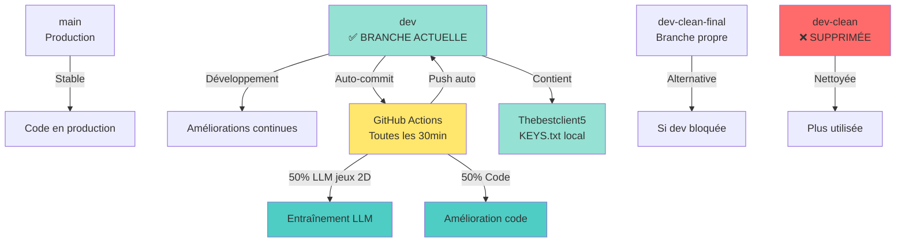
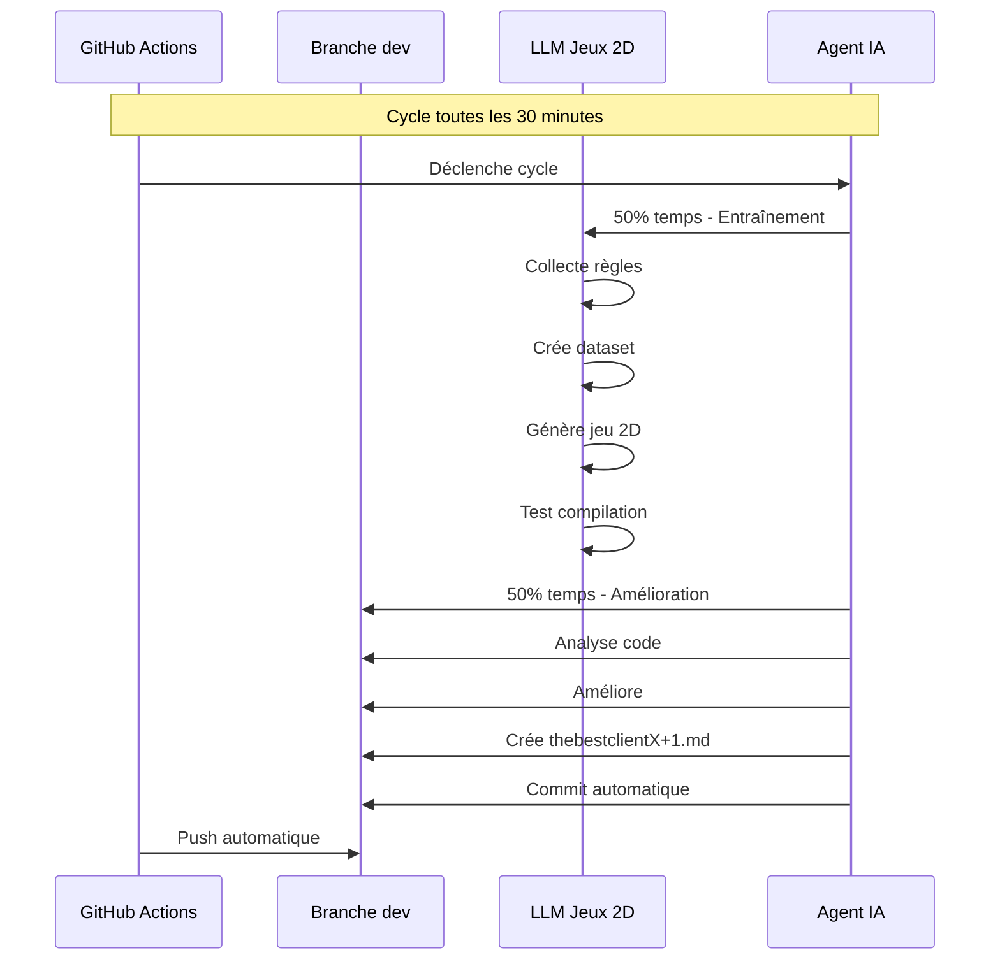

# 📊 Diagramme Final - Gestion des Branches

## Structure des Branches (État Actuel)



## Flux de Travail Actuel



## Comparaison des Branches

| Branche | État | Usage | Clés |
|---------|------|-------|------|
| **main** | Production | Code stable | - |
| **dev** | ✅ **ACTIVE** | **Développement principal** | Local (KEYS.txt) |
| **dev-clean-final** | Alternative | Si dev bloquée | - |
| ~~dev-clean~~ | ❌ **SUPPRIMÉE** | Plus utilisée | - |

## Ce que tu dois faire

### 1. Tu es sur `dev` ✅
```bash
git branch --show-current
# Doit afficher: dev
```

### 2. KEYS.txt existe ✅
```bash
cat .github/KEYS.txt
# Doit afficher les clés
```

### 3. Ajouter clé dans GitHub Secrets
1. https://github.com/alexisdeudon01/cursor/settings/secrets/actions
2. New repository secret
3. Name: `ANTHROPIC_API_KEY`
4. Secret: (voir .github/KEYS.txt)
5. Add secret

### 4. Le système fonctionnera automatiquement! ✅

## Répartition 50/50

```
Cycle de 30 minutes:
├─ 15 minutes: Entraînement LLM jeux 2D
│  ├─ Collecte règles
│  ├─ Création dataset
│  ├─ Entraînement LLM
│  ├─ Génération jeu
│  └─ Test compilation
│
└─ 15 minutes: Amélioration code
   ├─ Analyse codebase
   ├─ Recherche patterns
   ├─ Améliorations
   ├─ Tests compilation
   └─ Génération diagrammes
```

## Résumé

- ✅ **Branche**: `dev` (active)
- ✅ **KEYS.txt**: Créé localement
- ✅ **Agent**: Thebestclient5 (50/50)
- ✅ **Branches inutiles**: Supprimées
- ✅ **Scripts**: setup-complete.sh, cleanup-branches.sh
- ⏳ **Action requise**: Ajouter clé dans GitHub Secrets

Une fois la clé ajoutée, le système fonctionnera automatiquement! 🚀
