# 🔍 Analyse et Recommandations d'Amélioration

## Date d'analyse
7 janvier 2026

---

## 📋 Résumé Exécutif

Après analyse approfondie du projet Unity multiplayer avec isolation de sessions, voici les améliorations prioritaires identifiées :

### ⚠️ Problèmes Critiques
1. **Protocole StartGame fragile** - Validation insuffisante et gestion d'erreurs limitée
2. **État UI incohérent** - Synchronisation problématique entre lobby et jeu
3. **Feedback utilisateur minimal** - Pas de messages d'erreur clairs

### 🎯 Opportunités d'Amélioration
1. **GUI modernisation** - Interface utilisateur datée, manque de feedback visuel
2. **Gestion d'état robuste** - Machine à états pour le cycle de vie des sessions
3. **Tests automatisés insuffisants** - Couverture limitée du protocole StartGame

---

## 🚨 Problèmes Critiques Identifiés

### 1. Protocole StartGame - Validation Insuffisante

**Fichier**: `Assets/Scripts/Networking/Player/SessionRpcHub.cs` (lignes 180-270)

**Problème**:
```csharp
// ❌ PROBLÈME: Validation fragmentée et silencieuse
if (details.Value.session.readyCount < details.Value.session.playerCount)
{
    Debug.LogWarning(...); // Seulement un log serveur!
    return; // Client ne sait pas pourquoi rien ne se passe
}
```

**Impact**: Les joueurs cliquent sur "Start" sans feedback visible.

**Solution Recommandée**:
```csharp
// ✅ AMÉLIORATION: Feedback explicite au client
[ServerRpc(RequireOwnership = false)]
public void StartGameServerRpc(string sessionName, ServerRpcParams serverRpcParams = default)
{
    var sender = serverRpcParams.Receive.SenderClientId;
    
    // Validation avec feedback
    var validationResult = ValidateGameStart(sessionName, sender);
    if (!validationResult.IsValid)
    {
        SendStartGameFailedClientRpc(
            validationResult.ErrorMessage,
            new ClientRpcParams
            {
                Send = new ClientRpcSendParams
                {
                    TargetClientIds = new List<ulong> { sender }
                }
            }
        );
        return;
    }
    
    // Procéder au lancement...
}

private struct GameStartValidation
{
    public bool IsValid;
    public string ErrorMessage;
    public GameStartFailureReason Reason;
}

public enum GameStartFailureReason
{
    NotEnoughPlayers,
    NotAllPlayersReady,
    NotSessionHost,
    SessionNotFound,
    GameAlreadyStarted,
    InvalidGameType
}

private GameStartValidation ValidateGameStart(string sessionName, ulong clientId)
{
    // Validation centralisée avec messages clairs
    if (!sessions.TryGetValue(sessionName, out var state))
    {
        return new GameStartValidation
        {
            IsValid = false,
            ErrorMessage = $"Session '{sessionName}' n'existe plus",
            Reason = GameStartFailureReason.SessionNotFound
        };
    }
    
    if (state.Creator != clientId)
    {
        return new GameStartValidation
        {
            IsValid = false,
            ErrorMessage = "Seul l'hôte peut démarrer la partie",
            Reason = GameStartFailureReason.NotSessionHost
        };
    }
    
    var details = BuildDetails(sessionName);
    if (details.Value.session.readyCount < details.Value.session.playerCount)
    {
        return new GameStartValidation
        {
            IsValid = false,
            ErrorMessage = $"En attente: {details.Value.session.readyCount}/{details.Value.session.playerCount} joueurs prêts",
            Reason = GameStartFailureReason.NotAllPlayersReady
        };
    }
    
    // Plus de validations...
    
    return new GameStartValidation { IsValid = true };
}

[ClientRpc]
private void SendStartGameFailedClientRpc(string errorMessage, ClientRpcParams clientRpcParams = default)
{
    Debug.LogWarning($"[SessionRpcHub] Game start failed: {errorMessage}");
    SessionLobbyUI.Instance?.ShowError(errorMessage);
}
```

---

### 2. État UI Incohérent

**Fichier**: `Assets/Scripts/UI/SessionLobbyUI.cs` (lignes 100-120, 600-640)

**Problème**:
```csharp
// ❌ PROBLÈME: État UI géré manuellement, risque de désynchronisation
private UIState currentUIState = UIState.Lobby;
private bool inGame; // Redondant avec currentUIState!
private bool isHost;
private bool isReady;
// Plusieurs variables d'état qui peuvent diverger
```

**Impact**: Bugs d'affichage, boutons actifs quand ils ne devraient pas l'être.

**Solution Recommandée**:
```csharp
// ✅ AMÉLIORATION: Machine à états explicite
public class SessionLobbyUI : MonoBehaviour
{
    private StateMachine<LobbyState> _stateMachine;
    
    private enum LobbyState
    {
        Disconnected,
        BrowsingSessions,
        InSessionLobby,
        GameStarting,
        InGame
    }
    
    private void Awake()
    {
        // Configuration de la machine à états
        _stateMachine = new StateMachine<LobbyState>(LobbyState.Disconnected);
        
        // État: BrowsingSessions
        _stateMachine.ConfigureState(LobbyState.BrowsingSessions)
            .OnEnter(() => {
                ShowSessionList();
                EnableCreateSession(true);
                EnableJoinSession(true);
            })
            .OnExit(() => {
                EnableCreateSession(false);
            });
        
        // État: InSessionLobby
        _stateMachine.ConfigureState(LobbyState.InSessionLobby)
            .OnEnter(() => {
                ShowSessionPopup();
                UpdateReadyButton();
                UpdateStartButton();
            })
            .OnUpdate(() => {
                // Mise à jour continue des infos session
                RefreshSessionDetails();
            })
            .OnExit(() => {
                ClosePopup();
                ResetSessionState();
            });
        
        // État: GameStarting
        _stateMachine.ConfigureState(LobbyState.GameStarting)
            .OnEnter(() => {
                DisableAllButtons();
                ShowLoadingIndicator("Démarrage de la partie...");
            })
            .OnExit(() => {
                HideLoadingIndicator();
            });
        
        // État: InGame
        _stateMachine.ConfigureState(LobbyState.InGame)
            .OnEnter(() => {
                HideAllLobbyUI();
                InitializeGameUI();
            })
            .OnExit(() => {
                CleanupGameUI();
            });
    }
    
    private void OnStartGame()
    {
        // Transition d'état claire
        _stateMachine.TransitionTo(LobbyState.GameStarting);
        
        if (SessionRpcHub.Instance != null)
        {
            SessionRpcHub.Instance.StartGameServerRpc(currentSessionName);
        }
    }
    
    private void OnGameStart(string sessionName, List<ulong> players, NetworkObject pawn)
    {
        if (sessionName == currentSessionName)
        {
            // Transition automatique vers InGame
            _stateMachine.TransitionTo(LobbyState.InGame);
        }
    }
}

// Machine à états simple
public class StateMachine<TState> where TState : System.Enum
{
    private TState _currentState;
    private Dictionary<TState, StateConfig> _states = new Dictionary<TState, StateConfig>();
    
    public TState CurrentState => _currentState;
    
    public StateMachine(TState initialState)
    {
        _currentState = initialState;
    }
    
    public StateConfig ConfigureState(TState state)
    {
        if (!_states.ContainsKey(state))
            _states[state] = new StateConfig();
        return _states[state];
    }
    
    public void TransitionTo(TState newState)
    {
        if (_currentState.Equals(newState)) return;
        
        // OnExit ancien état
        if (_states.TryGetValue(_currentState, out var oldConfig))
            oldConfig.OnExitAction?.Invoke();
        
        _currentState = newState;
        
        // OnEnter nouveau état
        if (_states.TryGetValue(_currentState, out var newConfig))
            newConfig.OnEnterAction?.Invoke();
        
        Debug.Log($"[StateMachine] {typeof(TState).Name}: {_currentState}");
    }
    
    public class StateConfig
    {
        public System.Action OnEnterAction;
        public System.Action OnExitAction;
        public System.Action OnUpdateAction;
        
        public StateConfig OnEnter(System.Action action) { OnEnterAction = action; return this; }
        public StateConfig OnExit(System.Action action) { OnExitAction = action; return this; }
        public StateConfig OnUpdate(System.Action action) { OnUpdateAction = action; return this; }
    }
}
```

---

### 3. Feedback Utilisateur Minimal

**Fichier**: `Assets/Scripts/UI/SessionLobbyUI.cs` (lignes 606-622)

**Problème**:
```csharp
// ❌ PROBLÈME: Pas de feedback visuel pendant l'action
private void OnStartGame()
{
    Debug.Log(...); // Seulement console!
    
    if (SessionRpcHub.Instance != null)
    {
        SessionRpcHub.Instance.StartGameServerRpc(currentSessionName);
    }
    // Que se passe-t-il maintenant? L'utilisateur ne sait pas.
}
```

**Solution Recommandée**:
```csharp
// ✅ AMÉLIORATION: Feedback visuel et sonore
private void OnStartGame()
{
    // Désactiver le bouton pour éviter double-clic
    if (popupStartButton != null)
    {
        popupStartButton.SetEnabled(false);
        popupStartButton.text = "Démarrage...";
    }
    
    // Afficher un indicateur de chargement
    ShowLoadingSpinner("Lancement de la partie");
    
    // Feedback sonore
    PlayUISound(UISoundType.GameStarting);
    
    if (SessionRpcHub.Instance != null)
    {
        SessionRpcHub.Instance.StartGameServerRpc(currentSessionName);
        
        // Timeout de sécurité (si le serveur ne répond pas)
        StartCoroutine(GameStartTimeout(10f));
    }
}

private IEnumerator GameStartTimeout(float timeoutSeconds)
{
    yield return new WaitForSeconds(timeoutSeconds);
    
    // Si toujours en attente après timeout
    if (_stateMachine.CurrentState == LobbyState.GameStarting)
    {
        HideLoadingSpinner();
        ShowError("Le démarrage de la partie a échoué (timeout)");
        
        // Réactiver le bouton
        if (popupStartButton != null)
        {
            popupStartButton.SetEnabled(true);
            popupStartButton.text = "Démarrer";
        }
        
        // Retour au lobby
        _stateMachine.TransitionTo(LobbyState.InSessionLobby);
    }
}

private void ShowLoadingSpinner(string message)
{
    if (loadingOverlay != null)
    {
        loadingOverlay.style.display = DisplayStyle.Flex;
        if (loadingMessage != null)
            loadingMessage.text = message;
    }
}

private void ShowError(string message)
{
    // Affichage toast/notification
    var errorNotification = new VisualElement();
    errorNotification.AddToClassList("error-notification");
    
    var label = new Label(message);
    errorNotification.Add(label);
    
    root.Add(errorNotification);
    
    // Animation de disparition après 5 secondes
    StartCoroutine(FadeOutNotification(errorNotification, 5f));
}
```

---

## 🎨 Améliorations GUI

### Interface Utilisateur Actuelle - Analyse

**Fichiers concernés**:
- `Assets/Scripts/UI/SessionLobbyUI.cs`
- `Assets/UI Toolkit/*.uxml` (si existant)

**Problèmes identifiés**:
1. ❌ Pas d'animations/transitions
2. ❌ Feedback visuel limité
3. ❌ Design minimal sans polish
4. ❌ Pas de gestion d'accessibilité

### Recommandations GUI

#### 1. Système de Notifications Toast
```csharp
public class ToastNotification : MonoBehaviour
{
    public enum ToastType { Info, Success, Warning, Error }
    
    public static void Show(string message, ToastType type = ToastType.Info, float duration = 3f)
    {
        var instance = FindOrCreate();
        instance.ShowToastInternal(message, type, duration);
    }
    
    private void ShowToastInternal(string message, ToastType type, float duration)
    {
        var toast = CreateToastElement(message, type);
        rootElement.Add(toast);
        
        // Animation d'entrée
        StartCoroutine(AnimateToast(toast, duration));
    }
    
    private IEnumerator AnimateToast(VisualElement toast, float duration)
    {
        // Slide in from top
        toast.style.translate = new Translate(0, -100);
        yield return AnimateTranslate(toast, new Translate(0, 0), 0.3f);
        
        // Wait
        yield return new WaitForSeconds(duration);
        
        // Fade out
        yield return AnimateFade(toast, 0f, 0.3f);
        
        // Remove
        toast.RemoveFromHierarchy();
    }
}

// Utilisation:
ToastNotification.Show("Session créée avec succès!", ToastType.Success);
ToastNotification.Show("Tous les joueurs doivent être prêts", ToastType.Warning);
ToastNotification.Show("Impossible de démarrer la partie", ToastType.Error);
```

#### 2. Indicateurs de Progression
```csharp
public class ProgressIndicator : MonoBehaviour
{
    private VisualElement progressBar;
    private Label progressLabel;
    
    public void ShowProgress(string title, float progress, string details = "")
    {
        if (progressBar != null)
        {
            progressBar.style.width = Length.Percent(progress * 100);
        }
        
        if (progressLabel != null)
        {
            progressLabel.text = $"{title} ({Mathf.RoundToInt(progress * 100)}%)";
            if (!string.IsNullOrEmpty(details))
                progressLabel.text += $"\n{details}";
        }
    }
}

// Utilisation dans StartGame:
private void OnStartGame()
{
    progressIndicator.Show();
    progressIndicator.ShowProgress("Initialisation", 0.1f, "Validation des joueurs...");
    
    // Après spawn des pawns
    progressIndicator.ShowProgress("Chargement", 0.5f, "Création du monde de jeu...");
    
    // Après setup
    progressIndicator.ShowProgress("Finalisation", 0.9f, "Synchronisation...");
    
    // Terminé
    progressIndicator.Hide();
}
```

#### 3. Amélioration Visuelle du Popup de Session
```csharp
// Ajouter dans SessionLobbyUI.cs

private void UpdatePopupVisuals()
{
    if (!currentSessionDetails.HasValue) return;
    
    var details = currentSessionDetails.Value;
    
    // 1. Indicateur de statut avec couleur
    UpdateStatusIndicator(details);
    
    // 2. Liste des joueurs avec badges
    UpdatePlayerListWithBadges(details);
    
    // 3. Barre de progression "Prêt"
    UpdateReadyProgressBar(details);
    
    // 4. Animation du bouton Start si conditions remplies
    if (CanStartGame(details))
    {
        AnimateStartButton();
    }
}

private void UpdateStatusIndicator(SessionDetails details)
{
    var statusBadge = popupOverlay.Q<VisualElement>("status-badge");
    if (statusBadge == null) return;
    
    // Effacer classes existantes
    statusBadge.ClearClassList();
    statusBadge.AddToClassList("status-badge");
    
    if (details.session.readyCount == details.session.playerCount)
    {
        statusBadge.AddToClassList("status-ready");
        statusBadge.Q<Label>().text = "✓ Prêt à démarrer";
    }
    else
    {
        statusBadge.AddToClassList("status-waiting");
        statusBadge.Q<Label>().text = $"⏳ En attente ({details.session.readyCount}/{details.session.playerCount})";
    }
}

private void UpdatePlayerListWithBadges(SessionDetails details)
{
    if (popupPlayersList == null) return;
    
    popupPlayersList.Clear();
    
    foreach (var player in details.players)
    {
        var playerCard = new VisualElement();
        playerCard.AddToClassList("player-card");
        
        // Icône de statut
        var statusIcon = new Label();
        statusIcon.AddToClassList("player-status-icon");
        statusIcon.text = player.isReady ? "✓" : "○";
        statusIcon.AddToClassList(player.isReady ? "ready" : "not-ready");
        
        // Nom du joueur
        var nameLabel = new Label(player.name);
        nameLabel.AddToClassList("player-name");
        
        // Badge hôte
        if (player.clientId == details.session.creator)
        {
            var hostBadge = new Label("👑 Hôte");
            hostBadge.AddToClassList("host-badge");
            playerCard.Add(hostBadge);
        }
        
        // Badge "Vous"
        if (player.clientId == LocalClientId)
        {
            nameLabel.text += " (Vous)";
            playerCard.AddToClassList("local-player");
        }
        
        playerCard.Add(statusIcon);
        playerCard.Add(nameLabel);
        popupPlayersList.Add(playerCard);
    }
}

private void UpdateReadyProgressBar(SessionDetails details)
{
    var progressBar = popupOverlay.Q<VisualElement>("ready-progress-bar");
    if (progressBar == null) return;
    
    float progress = details.session.playerCount > 0 
        ? (float)details.session.readyCount / details.session.playerCount 
        : 0f;
    
    progressBar.style.width = Length.Percent(progress * 100);
    
    // Changer la couleur selon progression
    if (progress >= 1f)
        progressBar.style.backgroundColor = new Color(0.2f, 0.8f, 0.2f); // Vert
    else if (progress >= 0.5f)
        progressBar.style.backgroundColor = new Color(1f, 0.8f, 0.2f); // Orange
    else
        progressBar.style.backgroundColor = new Color(0.5f, 0.5f, 0.5f); // Gris
}

private void AnimateStartButton()
{
    if (popupStartButton == null) return;
    
    // Pulse animation
    StartCoroutine(PulseButton(popupStartButton));
}

private IEnumerator PulseButton(Button button)
{
    float duration = 0.5f;
    float elapsed = 0f;
    
    while (elapsed < duration)
    {
        elapsed += Time.deltaTime;
        float scale = 1f + Mathf.Sin(elapsed / duration * Mathf.PI) * 0.1f;
        button.style.scale = new Scale(new Vector3(scale, scale, 1f));
        yield return null;
    }
    
    button.style.scale = new Scale(Vector3.one);
}
```

---

## 🔧 Améliorations du Protocole StartGame

### Architecture Recommandée

```csharp
// Nouveau fichier: Assets/Scripts/Networking/Sessions/GameStartProtocol.cs

using System;
using System.Collections;
using System.Collections.Generic;
using Unity.Netcode;
using UnityEngine;

/// <summary>
/// Protocole robuste pour le démarrage de parties avec validation et feedback.
/// </summary>
public class GameStartProtocol : NetworkBehaviour
{
    public static GameStartProtocol Instance { get; private set; }
    
    // Events pour suivi
    public static event Action<string> OnValidationFailed;
    public static event Action<string, float> OnStartProgress;
    public static event Action<string> OnStartComplete;
    
    private Dictionary<string, GameStartState> activeStarts = new Dictionary<string, GameStartState>();
    
    private class GameStartState
    {
        public string SessionName;
        public ulong InitiatorClientId;
        public float StartTime;
        public GameStartPhase Phase;
        public List<ulong> PlayersToSpawn;
        public int SpawnedCount;
    }
    
    private enum GameStartPhase
    {
        Validating,
        SpawningPawns,
        InitializingGame,
        NotifyingClients,
        Complete
    }
    
    [ServerRpc(RequireOwnership = false)]
    public void RequestGameStartServerRpc(string sessionName, ServerRpcParams rpcParams = default)
    {
        var clientId = rpcParams.Receive.SenderClientId;
        
        Debug.Log($"[GameStartProtocol] Start requested for '{sessionName}' by client {clientId}");
        
        // Vérifier si un start est déjà en cours
        if (activeStarts.ContainsKey(sessionName))
        {
            SendValidationFailedClientRpc(
                "Démarrage déjà en cours",
                GameStartFailureReason.GameAlreadyStarted,
                CreateTargetedRpc(clientId)
            );
            return;
        }
        
        // Phase 1: Validation
        var validation = ValidateGameStart(sessionName, clientId);
        if (!validation.IsValid)
        {
            SendValidationFailedClientRpc(
                validation.ErrorMessage,
                validation.Reason,
                CreateTargetedRpc(clientId)
            );
            return;
        }
        
        // Commencer le processus
        var state = new GameStartState
        {
            SessionName = sessionName,
            InitiatorClientId = clientId,
            StartTime = Time.time,
            Phase = GameStartPhase.Validating,
            PlayersToSpawn = GameSessionManager.Instance.GetPlayers(sessionName),
            SpawnedCount = 0
        };
        
        activeStarts[sessionName] = state;
        
        // Notifier tous les clients de la session
        NotifyStartInitiatedClientRpc(sessionName, CreateSessionTargetedRpc(sessionName));
        
        // Lancer le processus asynchrone
        StartCoroutine(ExecuteGameStart(state));
    }
    
    private IEnumerator ExecuteGameStart(GameStartState state)
    {
        string sessionName = state.SessionName;
        
        try
        {
            // Phase 2: Spawn des pawns
            state.Phase = GameStartPhase.SpawningPawns;
            BroadcastProgress(sessionName, 0.2f, "Création des joueurs...");
            
            yield return StartCoroutine(SpawnAllPawns(state));
            
            // Phase 3: Initialisation du jeu
            state.Phase = GameStartPhase.InitializingGame;
            BroadcastProgress(sessionName, 0.6f, "Initialisation du monde...");
            
            yield return StartCoroutine(InitializeGameWorld(state));
            
            // Phase 4: Notification clients
            state.Phase = GameStartPhase.NotifyingClients;
            BroadcastProgress(sessionName, 0.9f, "Synchronisation finale...");
            
            string gameId = GameSessionManager.Instance.GetSelectedGameId(sessionName);
            NotifyGameReadyClientRpc(sessionName, gameId, CreateSessionTargetedRpc(sessionName));
            
            yield return new WaitForSeconds(0.5f);
            
            // Phase 5: Complet
            state.Phase = GameStartPhase.Complete;
            BroadcastProgress(sessionName, 1.0f, "Partie démarrée!");
            
            Debug.Log($"[GameStartProtocol] ✓ Game start complete for '{sessionName}'");
            
            // Cleanup
            activeStarts.Remove(sessionName);
        }
        catch (Exception ex)
        {
            Debug.LogError($"[GameStartProtocol] ❌ Exception during game start: {ex.Message}");
            
            // Notifier l'échec
            SendValidationFailedClientRpc(
                "Erreur lors du démarrage de la partie",
                GameStartFailureReason.ServerError,
                CreateSessionTargetedRpc(sessionName)
            );
            
            // Cleanup
            activeStarts.Remove(sessionName);
        }
    }
    
    private IEnumerator SpawnAllPawns(GameStartState state)
    {
        var container = GameSessionManager.Instance.GetSessionContainer(state.SessionName);
        if (container == null)
        {
            Debug.LogError($"[GameStartProtocol] Session container not found for '{state.SessionName}'");
            yield break;
        }
        
        string gameId = GameSessionManager.Instance.GetSelectedGameId(state.SessionName);
        var gameDef = GameRegistry.GetGame(gameId);
        
        if (gameDef == null)
        {
            Debug.LogError($"[GameStartProtocol] Game definition not found: {gameId}");
            yield break;
        }
        
        int playerIndex = 0;
        foreach (var clientId in state.PlayersToSpawn)
        {
            // Spawn pawn
            Vector3 spawnPos = gameDef.GetSpawnPosition(playerIndex, state.PlayersToSpawn.Count, container.WorldOffset);
            var pawn = Instantiate(gameDef.PawnPrefab);
            pawn.transform.position = spawnPos;
            pawn.SpawnAsPlayerObject(clientId);
            
            // Initialize
            string playerName = GameSessionManager.Instance.ResolvePlayerName(clientId);
            gameDef.InitializePawn(pawn, playerName, playerIndex, container.WorldOffset);
            
            state.SpawnedCount++;
            playerIndex++;
            
            // Yield pour éviter freeze
            yield return null;
        }
        
        Debug.Log($"[GameStartProtocol] Spawned {state.SpawnedCount} pawns for '{state.SessionName}'");
    }
    
    private IEnumerator InitializeGameWorld(GameStartState state)
    {
        // Setup du monde de jeu
        var container = GameSessionManager.Instance.GetSessionContainer(state.SessionName);
        string gameId = GameSessionManager.Instance.GetSelectedGameId(state.SessionName);
        var gameDef = GameRegistry.GetGame(gameId);
        
        if (gameDef != null)
        {
            gameDef.SetupGame(container.WorldOffset);
        }
        
        yield return new WaitForSeconds(0.1f);
    }
    
    private void BroadcastProgress(string sessionName, float progress, string message)
    {
        Debug.Log($"[GameStartProtocol] {sessionName}: {progress * 100}% - {message}");
        
        UpdateProgressClientRpc(
            sessionName,
            progress,
            message,
            CreateSessionTargetedRpc(sessionName)
        );
    }
    
    // Client RPCs
    
    [ClientRpc]
    private void NotifyStartInitiatedClientRpc(string sessionName, ClientRpcParams rpcParams = default)
    {
        Debug.Log($"[GameStartProtocol] Game start initiated for '{sessionName}'");
        OnStartProgress?.Invoke(sessionName, 0f);
    }
    
    [ClientRpc]
    private void UpdateProgressClientRpc(string sessionName, float progress, string message, ClientRpcParams rpcParams = default)
    {
        OnStartProgress?.Invoke(sessionName, progress);
        
        if (SessionLobbyUI.Instance != null)
        {
            SessionLobbyUI.Instance.UpdateGameStartProgress(progress, message);
        }
    }
    
    [ClientRpc]
    private void NotifyGameReadyClientRpc(string sessionName, string gameId, ClientRpcParams rpcParams = default)
    {
        Debug.Log($"[GameStartProtocol] Game ready: '{sessionName}' (game: {gameId})");
        
        // Setup visuals client
        var gameDef = GameRegistry.GetGame(gameId);
        if (gameDef != null)
        {
            gameDef.SetupClientVisuals();
        }
        
        // Notifier UI
        OnStartComplete?.Invoke(sessionName);
    }
    
    [ClientRpc]
    private void SendValidationFailedClientRpc(string errorMessage, GameStartFailureReason reason, ClientRpcParams rpcParams = default)
    {
        Debug.LogWarning($"[GameStartProtocol] Validation failed: {errorMessage} (reason: {reason})");
        
        OnValidationFailed?.Invoke(errorMessage);
        
        if (SessionLobbyUI.Instance != null)
        {
            SessionLobbyUI.Instance.ShowGameStartError(errorMessage);
        }
    }
    
    // Helper methods
    
    private ClientRpcParams CreateTargetedRpc(ulong targetClientId)
    {
        return new ClientRpcParams
        {
            Send = new ClientRpcSendParams
            {
                TargetClientIds = new List<ulong> { targetClientId }
            }
        };
    }
    
    private ClientRpcParams CreateSessionTargetedRpc(string sessionName)
    {
        var players = GameSessionManager.Instance.GetPlayers(sessionName);
        return new ClientRpcParams
        {
            Send = new ClientRpcSendParams
            {
                TargetClientIds = players
            }
        };
    }
}
```

---

## 📝 Plan d'Implémentation Recommandé

### Phase 1: Corrections Critiques (1-2 jours)
1. ✅ Ajouter validation centralisée StartGame
2. ✅ Implémenter feedback client (SendStartGameFailedClientRpc)
3. ✅ Ajouter timeouts de sécurité
4. ✅ Tests de validation StartGame

### Phase 2: Améliorations GUI (2-3 jours)
1. ✅ Système de notifications toast
2. ✅ Indicateurs de progression
3. ✅ Amélioration visuelle popup session
4. ✅ Animations de transitions

### Phase 3: Refactoring État (2-3 jours)
1. ✅ Machine à états pour SessionLobbyUI
2. ✅ Tests d'état UI
3. ✅ Documentation des transitions

### Phase 4: Protocole StartGame Robuste (3-4 jours)
1. ✅ Implémenter GameStartProtocol
2. ✅ Migration du code existant
3. ✅ Tests d'intégration
4. ✅ Tests de charge (stress test)

---

## 🧪 Tests Recommandés

### Tests Unitaires Manquants

```csharp
// Assets/Scripts/Tests/GameStartValidationTests.cs

[TestFixture]
public class GameStartValidationTests
{
    [Test]
    public void StartGame_WithNotAllPlayersReady_ShouldFail()
    {
        // Arrange
        var session = CreateMockSession(playerCount: 3, readyCount: 2);
        
        // Act
        var result = GameStartProtocol.ValidateGameStart(session);
        
        // Assert
        Assert.IsFalse(result.IsValid);
        Assert.AreEqual(GameStartFailureReason.NotAllPlayersReady, result.Reason);
    }
    
    [Test]
    public void StartGame_ByNonHost_ShouldFail()
    {
        // Arrange
        var session = CreateMockSession(creatorId: 1);
        ulong requesterId = 2;
        
        // Act
        var result = GameStartProtocol.ValidateGameStart(session, requesterId);
        
        // Assert
        Assert.IsFalse(result.IsValid);
        Assert.AreEqual(GameStartFailureReason.NotSessionHost, result.Reason);
    }
    
    [Test]
    public void StartGame_WithValidConditions_ShouldSucceed()
    {
        // Arrange
        var session = CreateMockSession(
            creatorId: 1,
            playerCount: 2,
            readyCount: 2
        );
        
        // Act
        var result = GameStartProtocol.ValidateGameStart(session, requesterId: 1);
        
        // Assert
        Assert.IsTrue(result.IsValid);
    }
}
```

---

## 📚 Documentation à Ajouter

### 1. Diagramme de Séquence StartGame

```mermaid
sequenceDiagram
    participant Client as Client (Hôte)
    participant UI as SessionLobbyUI
    participant RPC as SessionRpcHub
    participant Protocol as GameStartProtocol
    participant Manager as GameSessionManager
    participant Game as IGameDefinition
    
    Client->>UI: Clic sur "Démarrer"
    UI->>UI: Désactive bouton + affiche loading
    UI->>RPC: StartGameServerRpc(sessionName)
    
    RPC->>Protocol: RequestGameStart(sessionName, clientId)
    Protocol->>Protocol: ValidateGameStart()
    
    alt Validation échouée
        Protocol-->>Client: SendValidationFailedClientRpc(error)
        Client->>UI: Affiche erreur + réactive bouton
    else Validation réussie
        Protocol->>Client: NotifyStartInitiated()
        Client->>UI: Affiche "Initialisation..."
        
        Protocol->>Protocol: SpawnAllPawns()
        Protocol->>Client: UpdateProgress(20%, "Création joueurs")
        
        Protocol->>Game: SetupGame(worldOffset)
        Protocol->>Client: UpdateProgress(60%, "Monde de jeu")
        
        Protocol->>Client: NotifyGameReady(gameId)
        Client->>Game: SetupClientVisuals()
        Client->>UI: Transition vers InGame
        
        Protocol->>Client: UpdateProgress(100%, "Terminé!")
    end
```



### 2. Guide de Dépannage StartGame

```markdown
# Dépannage: Problèmes de Démarrage de Partie

## Symptôme: Le bouton "Démarrer" ne fait rien

### Causes possibles:
1. ❌ **Tous les joueurs ne sont pas prêts**
   - Vérifier: Console serveur affiche "Not all players are ready"
   - Solution: Attendez que tous cliquent sur "Prêt"

2. ❌ **Vous n'êtes pas l'hôte**
   - Vérifier: Badge "👑 Hôte" absent dans la liste des joueurs
   - Solution: Seul l'hôte peut démarrer

3. ❌ **SessionRpcHub.Instance est null**
   - Vérifier: Console client affiche une erreur
   - Solution: Redémarrer la connexion

### Diagnostic:
```csharp
// Ajouter des logs détaillés dans OnStartGame()
Debug.Log($"isHost: {isHost}");
Debug.Log($"currentSessionName: '{currentSessionName}'");
Debug.Log($"SessionRpcHub.Instance: {SessionRpcHub.Instance != null}");
Debug.Log($"Session details: {currentSessionDetails}");
```

## Symptôme: La partie démarre mais les pawns ne spawn pas

### Causes possibles:
1. ❌ **PawnPrefab manquant dans IGameDefinition**
2. ❌ **NetworkObject pas configuré sur le prefab**
3. ❌ **WorldOffset incorrect**

### Solution:
- Vérifier les logs serveur pour "Spawned X pawns"
- Vérifier que le prefab a bien un NetworkObject component
```

---

## 🎯 Conclusion

### Priorités Immédiates
1. 🔴 **CRITIQUE**: Implémenter validation StartGame avec feedback client
2. 🟡 **IMPORTANT**: Ajouter système de notifications
3. 🟢 **SOUHAITABLE**: Refactoring machine à états UI

### ROI Estimé
- **Validation + Feedback**: -90% des bugs "ça ne marche pas"
- **Système de notifications**: +50% satisfaction utilisateur
- **Machine à états**: -70% bugs d'état UI

### Temps Estimé Total
- **Phase 1 (Critique)**: 2 jours
- **Phase 2 (GUI)**: 3 jours
- **Phase 3 (État)**: 3 jours
- **Phase 4 (Protocole)**: 4 jours
- **Total**: ~12 jours de développement

---

**Prochaines étapes suggérées**:
1. Valider ces recommandations avec l'équipe
2. Prioriser les phases selon les besoins
3. Créer des tickets/issues pour chaque amélioration
4. Commencer par Phase 1 (critique)
