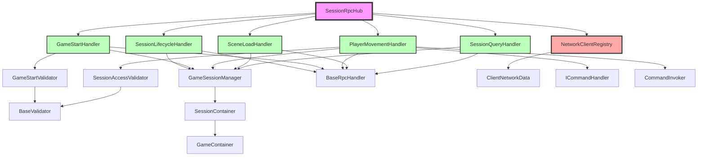

# Plan de Refactorisation - SessionRpcHub

## Problème actuel

`SessionRpcHub.cs` : **767 lignes** avec trop de responsabilités:
- Gestion des RPCs (20+ méthodes)
- Validation des sessions
- Démarrage de jeux
- Mouvement des joueurs
- Chargement de scènes
- Synchronisation de positions

## Nouvelle Architecture

### 1. Interfaces de base

```csharp
// ISessionRpcHandler.cs - Interface pour handlers RPC
public interface ISessionRpcHandler
{
    void Initialize(SessionRpcHub hub);
    void Cleanup();
}

// ISessionValidator.cs - Interface pour validation
public interface ISessionValidator
{
    ValidationResult Validate(string sessionName, ulong clientId);
}

// ICommandHandler.cs - Interface pour commandes réseau
public interface ICommandHandler
{
    void HandleCommand(NetworkCommandData command, ulong senderId);
}
```

### 2. Classes de base abstraites

```csharp
// BaseRpcHandler.cs
public abstract class BaseRpcHandler : ISessionRpcHandler
{
    protected SessionRpcHub Hub { get; private set; }
    protected GameSessionManager SessionManager => GameSessionManager.Instance;
    protected NetworkManager NetManager => NetworkManager.Singleton;
    
    public virtual void Initialize(SessionRpcHub hub)
    {
        Hub = hub;
    }
    
    public virtual void Cleanup() { }
    
    protected ClientRpcParams BuildClientRpcParams(List<ulong> targetClientIds)
    {
        // Implémentation commune
    }
}

// BaseValidator.cs
public abstract class BaseValidator : ISessionValidator
{
    public abstract ValidationResult Validate(string sessionName, ulong clientId);
    
    protected bool ValidateClientInSession(ulong clientId, string sessionName)
    {
        // Logique de validation commune
    }
}
```

### 3. Handlers spécialisés

```csharp
// SessionLifecycleHandler.cs - Gestion création/join/leave
public class SessionLifecycleHandler : BaseRpcHandler
{
    public void HandleCreateSession(string sessionName, ulong creatorId);
    public void HandleJoinSession(string sessionName, ulong clientId);
    public void HandleLeaveSession(string sessionName, ulong clientId);
    public void HandleSetReady(string sessionName, ulong clientId, bool ready);
}

// GameStartHandler.cs - Gestion démarrage de jeux
public class GameStartHandler : BaseRpcHandler
{
    private ISessionValidator validator;
    
    public GameStartValidation ValidateGameStart(string sessionName, ulong clientId);
    public void StartGameForPlayers(string sessionName, List<ulong> players, string gameId);
}

// PlayerMovementHandler.cs - Gestion mouvements
public class PlayerMovementHandler : BaseRpcHandler, ICommandHandler
{
    private Dictionary<ulong, float> lastMoveTimes;
    private const float MOVE_RPC_COOLDOWN = 0.05f;
    
    public void HandleMoveRequest(string sessionName, Vector2 direction, ulong senderId);
    public void HandleCommand(NetworkCommandData command, ulong senderId);
}

// SceneLoadHandler.cs - Gestion chargement scènes
public class SceneLoadHandler : BaseRpcHandler
{
    public IEnumerator LoadGameSceneAndInitialize(string sessionName, string gameId, Vector3 worldOffset);
    public void SetupClientVisuals(string gameId, Vector3 worldOffset);
}

// SessionQueryHandler.cs - Gestion requêtes infos
public class SessionQueryHandler : BaseRpcHandler
{
    public void HandleRequestSessions(ulong requesterId);
    public void HandleRequestDetails(string sessionName, ulong requesterId);
}
```

### 4. Validateurs

```csharp
// GameStartValidator.cs
public class GameStartValidator : BaseValidator
{
    public override ValidationResult Validate(string sessionName, ulong clientId)
    {
        // 8 checks de validation
    }
}

// SessionAccessValidator.cs
public class SessionAccessValidator : BaseValidator
{
    public override ValidationResult Validate(string sessionName, ulong clientId)
    {
        // Validation d'accès session
    }
}
```

### 5. Registre de Clients Réseau

```csharp
// NetworkClientRegistry.cs - NOUVEAU
public class NetworkClientRegistry : MonoBehaviour
{
    public static NetworkClientRegistry Instance { get; private set; }
    
    // Registre principal: clientId → ClientNetworkData
    private Dictionary<ulong, ClientNetworkData> clients;
    
    // Index inverse: sessionId → List<ulong>
    private Dictionary<string, HashSet<ulong>> sessionClients;
    
    public void RegisterClient(ulong clientId, string initialName = null);
    public void UnregisterClient(ulong clientId);
    public void SetClientSession(ulong clientId, string sessionId);
    public void ClearClientSession(ulong clientId);
    
    public ClientNetworkData GetClient(ulong clientId);
    public List<ClientNetworkData> GetClientsInSession(string sessionId);
    public string GetClientSession(ulong clientId);
    public bool IsClientInSession(ulong clientId, string sessionId);
}

// ClientNetworkData.cs - NOUVEAU
public class ClientNetworkData
{
    public ulong ClientId { get; }
    public string PlayerName { get; set; }
    public string CurrentSessionId { get; set; }
    public DateTime ConnectedAt { get; }
    public DateTime LastActivity { get; set; }
    public bool IsReady { get; set; }
    public NetworkObject PlayerObject { get; set; }
    public NetworkObject CurrentPawn { get; set; }
    
    // Stats
    public int MessagesReceived { get; set; }
    public int MessagesSent { get; set; }
    
    public ClientNetworkData(ulong clientId)
    {
        ClientId = clientId;
        ConnectedAt = DateTime.UtcNow;
        LastActivity = DateTime.UtcNow;
    }
}
```

### 6. SessionRpcHub refactorisé

```csharp
// SessionRpcHub.cs - SIMPLIFIÉ (~200 lignes)
public class SessionRpcHub : NetworkBehaviour
{
    public static SessionRpcHub Instance { get; private set; }
    
    // Handlers
    private SessionLifecycleHandler lifecycleHandler;
    private GameStartHandler gameStartHandler;
    private PlayerMovementHandler movementHandler;
    private SceneLoadHandler sceneHandler;
    private SessionQueryHandler queryHandler;
    
    // Registry
    private NetworkClientRegistry clientRegistry;
    
    private void Awake()
    {
        if (Instance != null) { Destroy(gameObject); return; }
        Instance = this;
        DontDestroyOnLoad(gameObject);
        
        InitializeHandlers();
    }
    
    private void InitializeHandlers()
    {
        lifecycleHandler = new SessionLifecycleHandler();
        lifecycleHandler.Initialize(this);
        
        gameStartHandler = new GameStartHandler();
        gameStartHandler.Initialize(this);
        
        movementHandler = new PlayerMovementHandler();
        movementHandler.Initialize(this);
        
        sceneHandler = new SceneLoadHandler();
        sceneHandler.Initialize(this);
        
        queryHandler = new SessionQueryHandler();
        queryHandler.Initialize(this);
        
        clientRegistry = NetworkClientRegistry.Instance;
    }
    
    // ============================================================
    //  SERVER RPCs - Délégués aux handlers
    // ============================================================
    
    [Rpc(SendTo.Server, RequireOwnership = false)]
    public void CreateSessionServerRpc(string sessionName, RpcParams rpcParams = default)
    {
        if (!IsServer) return;
        lifecycleHandler.HandleCreateSession(sessionName, rpcParams.Receive.SenderClientId);
    }
    
    [Rpc(SendTo.Server, RequireOwnership = false)]
    public void JoinSessionServerRpc(string sessionName, RpcParams rpcParams = default)
    {
        if (!IsServer) return;
        lifecycleHandler.HandleJoinSession(sessionName, rpcParams.Receive.SenderClientId);
    }
    
    [Rpc(SendTo.Server, RequireOwnership = false)]
    public void StartGameServerRpc(string sessionName, RpcParams rpcParams = default)
    {
        if (!IsServer) return;
        gameStartHandler.HandleGameStart(sessionName, rpcParams.Receive.SenderClientId);
    }
    
    [Rpc(SendTo.Server, RequireOwnership = false)]
    public void RequestMoveServerRpc(string sessionName, Vector2 direction, RpcParams rpcParams = default)
    {
        if (!IsServer) return;
        movementHandler.HandleMoveRequest(sessionName, direction, rpcParams.Receive.SenderClientId);
    }
    
    // ============================================================
    //  CLIENT RPCs - Accessibles par handlers
    // ============================================================
    
    [ClientRpc]
    public void SyncSessionsClientRpc(GameSession[] sessions) { /* ... */ }
    
    [ClientRpc]
    public void SendSessionErrorClientRpc(string message, ClientRpcParams clientRpcParams = default) { /* ... */ }
    
    [ClientRpc]
    public void StartGameClientRpc(string sessionName, string gameId, Vector3 worldOffset, ClientRpcParams clientRpcParams = default)
    {
        StartCoroutine(sceneHandler.LoadGameSceneAndInitialize(sessionName, gameId, worldOffset));
    }
}
```

## Structure de fichiers

```
Assets/Scripts/Networking/
├── Player/
│   ├── SessionRpcHub.cs (simplifié, ~200 lignes)
│   └── NetworkClientRegistry.cs (NOUVEAU)
├── RpcHandlers/ (NOUVEAU)
│   ├── Interfaces/
│   │   ├── ISessionRpcHandler.cs
│   │   ├── ISessionValidator.cs
│   │   └── ICommandHandler.cs
│   ├── Base/
│   │   ├── BaseRpcHandler.cs
│   │   └── BaseValidator.cs
│   ├── SessionLifecycleHandler.cs
│   ├── GameStartHandler.cs
│   ├── PlayerMovementHandler.cs
│   ├── SceneLoadHandler.cs
│   └── SessionQueryHandler.cs
├── Validators/ (NOUVEAU)
│   ├── GameStartValidator.cs
│   └── SessionAccessValidator.cs
└── Data/ (NOUVEAU)
    ├── ClientNetworkData.cs
    ├── NetworkCommandData.cs (déjà existe)
    └── ValidationResult.cs
```

## Graphe de liaisons refactorisé



## Avantages

1. **Séparation des responsabilités**: Chaque handler a un rôle clair
2. **Testabilité**: Handlers peuvent être testés indépendamment
3. **Réutilisabilité**: BaseRpcHandler/BaseValidator partagent le code commun
4. **Extensibilité**: Ajouter de nouveaux handlers sans toucher SessionRpcHub
5. **Lisibilité**: Fichiers de 100-200 lignes au lieu de 750+
6. **Registre centralisé**: NetworkClientRegistry suit tous les clients avec métadonnées
7. **Type safety**: Interfaces garantissent les contrats

## Migration progressive

1. Créer NetworkClientRegistry en premier
2. Créer les interfaces et classes de base
3. Extraire un handler à la fois (commencer par SessionLifecycleHandler)
4. Tester après chaque extraction
5. Supprimer le code dupliqué de SessionRpcHub
6. Refactoriser les validators en dernier
