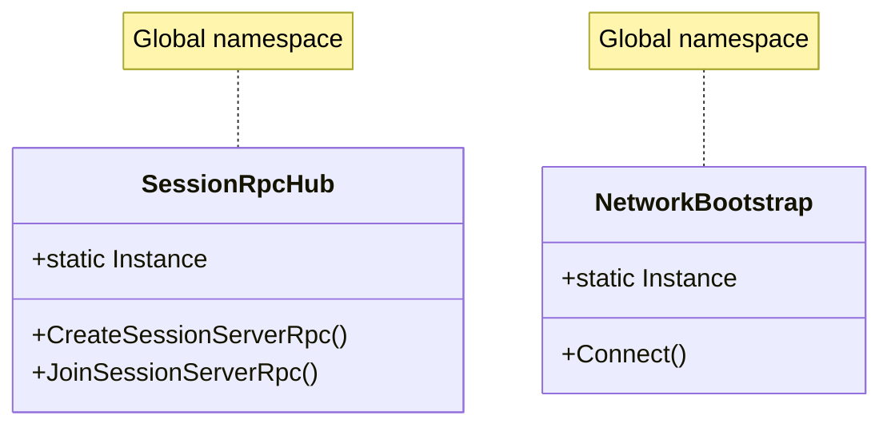
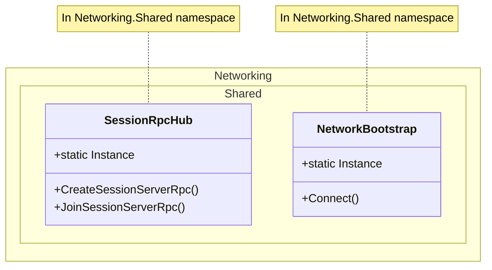

# Unity NGO Code Review Report
**Agent:** Thebestclient  
**Date:** 2024  
**Scope:** Complete Unity NGO project analysis with Client/Server separation validation

---

## 1. REPO INVENTORY

### 1.1 Scenes (`*.unity`)

| Scene | Path | Role | NetworkManager | Notes |
|-------|------|------|----------------|-------|
| **Server** | `Assets/Scenes/Server.unity` | **Server Runtime** | ✅ NetworkManagerRoot prefab | Dedicated server scene |
| **Client** | `Assets/Scenes/Client.unity` | **Client Runtime** | ✅ NetworkManagerRoot prefab | Client connection scene |
| **Game** | `Assets/Scenes/Game.unity` | **Client Runtime** | ❓ | Gameplay scene |
| **Menu** | `Assets/Scenes/Menu.unity` | **Client Runtime** | ❓ | Menu UI scene |
| **URP2DSceneTemplate** | `Assets/Settings/Scenes/URP2DSceneTemplate.unity` | Template | N/A | Scene template |

**Identification:**
- **Server Scene:** `Server.unity` (contains ServerBootstrap + NetworkManagerRoot)
- **Client Scenes:** `Client.unity`, `Game.unity`, `Menu.unity`

### 1.2 Prefabs (`*.prefab`)

#### Network Prefabs (Registered in DefaultNetworkPrefabs.asset)
1. **SessionRpcHub** (`Assets/Prefabs/Network/SessionRpcHub.prefab`)
   - GUID: `63eb66be8dd88cf4b8e395804c404278`
   - Components:
     - `Transform`
     - `PrefabIdentity` (prefabId: SESSION_RPC_HUB)
     - `NetworkObject` (Ownership: Server, SpawnWithObservers: true)
     - `SessionRpcHub` (MonoBehaviour script)
   - Scripts C#:
     - `SessionRpcHub` (global namespace, Networking.Shared assembly)
   - References:
     - `squarePrefab`: Square prefab reference
   - Spawn: Server-side only (spawned by ServerBootstrap)

2. **Square** (`Assets/Prefabs/Network/Square.prefab`)
   - GUID: `80202bf6ee89fa4b7a4c58bb21c6ed1b`
   - Components:
     - `Transform`
     - `SpriteRenderer`
     - `NetworkObject` (likely)
   - Scripts C#: Unknown (need to check prefab fully)
   - Usage: Referenced by SessionRpcHub, used in SquareGame

3. **CirclePawn** (`Assets/Prefabs/Pawns/CirclePawn.prefab`)
   - GUID: `3dc06021a40af254b83f3d6764ea287c`
   - Components:
     - `Transform`
     - `TextMeshPro` (NameLabel child)
     - `NetworkObject` (likely)
   - Scripts C#: Unknown (need to check prefab fully)
   - Usage: Player pawn prefab

#### Other Prefabs
- **NetworkManagerRoot** (`Assets/Prefabs/Network/NetworkManagerRoot.prefab`)
  - Contains: NetworkManager, UnityTransport, PrefabIdentity, NetworkBootstrap
  - Used in: Server.unity, Client.unity scenes
  
- **NetworkBootstrapUI** (`Assets/Prefabs/Network/NetworkBootstrapUI.prefab`)
  - UI Toolkit prefab (UIDocument)
  - UXML: `NetworkBootstrapOverlay.uxml`
  
- **Menu** (`Assets/Prefabs/UI/Menu.prefab`)
  - UI Toolkit prefab (UIDocument)
  - UXML: `SessionLobby.uxml` (likely)
  
- **GameCanvasManager** (`Assets/Prefabs/GameCanvasManager.prefab`)
  - Game canvas management

### 1.3 Scripts C# (`*.cs`)

#### Assembly Structure

**Networking.Shared** (`Assets/Scripts/Networking/Shared.asmdef`)
- References: Core, Unity.Netcode.Runtime, Unity.Collections, Unity.InputSystem
- Platform: All platforms
- Contains:
  - `Networking/Player/SessionRpcHub.cs` (⚠️ **Global namespace**)
  - `Networking/Connections/NetworkBootstrap.cs` (⚠️ **Global namespace**)
  - `Networking/Connections/PrefabIdentity.cs`
  - `Networking/Connections/AppNetworkConfig.cs`
  - `Networking/Connections/NetworkConfigProvider.cs`
  - `Networking/Player/DefaultPlayer.cs`
  - `Networking/Player/NetworkClientRegistry.cs`
  - `Networking/Player/PlayerManager.cs`
  - `Networking/Data/*.cs`
  - `Networking/RpcHandlers/**/*.cs`
  - `Networking/Sessions/*.cs`
  - `Networking/StateSync/*.cs`

**Networking.Server** (`Assets/Scripts/Networking/Server/Server.asmdef`)
- References: Networking.Shared, Unity.Netcode.Runtime, Unity.Collections
- Platform: **LinuxStandalone64Server, WindowsStandalone64Server ONLY**
- Contains:
  - `Networking/Server/ServerBootstrap.cs` (namespace: `Networking.Server`)
  - `Networking/Server/ConnectionController.cs` (namespace: `Networking.Server`)

**Networking.Client** (`Assets/Scripts/Networking/Client/Client.asmdef`)
- References: Networking.Shared, Unity.Netcode.Runtime, Unity.Collections
- Platform: **All EXCEPT LinuxStandalone64Server, WindowsStandalone64Server**
- Contains:
  - `Networking/Client/ClientBootstrap.cs` (namespace: `Networking.Client`)

**Core** (`Assets/Scripts/Core/Core.asmdef`)
- References: Unity.Netcode.Runtime, Unity.Collections, Unity.Entities
- Platform: All platforms
- Contains:
  - `Core/Games/*.cs`
  - `Core/StateSync/*.cs`
  - `Core/Networking/*.cs`
  - `Core/Utilities/*.cs`

#### Key Scripts Mapping

| Script | Assembly | Namespace | Used In Prefabs/Scenes |
|--------|----------|-----------|------------------------|
| `SessionRpcHub` | Networking.Shared | **Global** ⚠️ | SessionRpcHub.prefab |
| `NetworkBootstrap` | Networking.Shared | **Global** ⚠️ | NetworkManagerRoot.prefab |
| `ServerBootstrap` | Networking.Server | `Networking.Server` | Server.unity |
| `ClientBootstrap` | Networking.Client | `Networking.Client` | Client.unity |
| `GameSessionManager` | Networking.Shared | Unknown | Server runtime |
| `SessionLifecycleHandler` | Networking.Shared | `Networking.RpcHandlers` | SessionRpcHub |
| `GameStartHandler` | Networking.Shared | `Networking.RpcHandlers` | SessionRpcHub |

### 1.4 UI Files

#### UI Toolkit (UXML/USS)
- `Assets/UI Toolkit/NetworkBootstrapOverlay.uxml` + `.uss`
- `Assets/UI Toolkit/ConnectionUI.uxml`
- `Assets/UI Toolkit/NetworkBootstrapProgress.uxml`
- `Assets/UI Toolkit/SessionLobby.uxml` + `.uss`
- `Assets/UI Toolkit/SessionLobby_FlowGuide.uss`
- `Assets/Resources/UI/GridMapOverlay.uxml` + `.uss`
- `Assets/Scripts/UI/NetworkBootstrap/NetworkBootstrapProgress.uss`

#### UGUI (Canvas-based)
- `Assets/Prefabs/UI/Menu.prefab` (UI Toolkit, not UGUI)
- `Assets/Prefabs/GameCanvasManager.prefab`

### 1.5 Network Prefabs Detailed Inventory

#### SessionRpcHub Prefab
- **Location:** `Assets/Prefabs/Network/SessionRpcHub.prefab`
- **GUID:** `63eb66be8dd88cf4b8e395804c404278`
- **NetworkObject:** ✅ (Ownership: Server)
- **Components:**
  1. `Transform`
  2. `PrefabIdentity` (prefabId: SESSION_RPC_HUB)
  3. `NetworkObject` (GlobalObjectIdHash: 329062834)
  4. `SessionRpcHub` (MonoBehaviour)
- **Scripts:**
  - `SessionRpcHub` (global namespace, Networking.Shared assembly)
- **Children:** None
- **References:**
  - `squarePrefab`: Square prefab (for game spawning)

#### Square Prefab
- **Location:** `Assets/Prefabs/Network/Square.prefab`
- **GUID:** `80202bf6ee89fa4b7a4c58bb21c6ed1b`
- **NetworkObject:** ✅ (assumed, needs verification)
- **Components:**
  1. `Transform`
  2. `SpriteRenderer`
  3. `NetworkObject` (likely)
- **Scripts:** Unknown (needs full prefab read)
- **Usage:** Game entity for SquareGame

#### CirclePawn Prefab
- **Location:** `Assets/Prefabs/Pawns/CirclePawn.prefab`
- **GUID:** `3dc06021a40af254b83f3d6764ea287c`
- **NetworkObject:** ✅ (assumed, needs verification)
- **Components:**
  1. `Transform` (root)
  2. `NameLabel` child with `TextMeshPro`
  3. `NetworkObject` (likely)
- **Scripts:** Unknown (needs full prefab read)
- **Usage:** Player pawn prefab

---

## 2. FINDINGS

### 2.1 Architecture Issues

#### ❌ **CRITICAL: Global Namespace Violations**
**Issue:** Two critical networking scripts are in the global namespace instead of a proper namespace.

1. **`SessionRpcHub.cs`** (line 16)
   - Current: `public class SessionRpcHub : NetworkBehaviour`
   - Expected: `namespace Networking.Shared { public class SessionRpcHub : NetworkBehaviour }`
   - Impact: Namespace pollution, potential naming conflicts

2. **`NetworkBootstrap.cs`** (line 16)
   - Current: `public class NetworkBootstrap : MonoBehaviour`
   - Expected: `namespace Networking.Shared { public class NetworkBootstrap : MonoBehaviour }`
   - Impact: Namespace pollution, potential naming conflicts

**Severity:** Medium (functional but violates best practices)

#### ✅ **GOOD: Assembly Separation**
- `Networking.Server` and `Networking.Client` are properly separated
- Platform restrictions correctly applied:
  - Server: Only server platforms
  - Client: Excludes server platforms
- No cross-assembly references between Server and Client

#### ✅ **GOOD: No Directives for Separation**
- No `#if SERVER` or `#if CLIENT` directives found (only Unity editor directives)
- Separation achieved via assemblies and scenes

#### ⚠️ **WARNING: SessionRpcHub Assembly Location**
- `SessionRpcHub` is in `Networking.Shared` assembly (correct)
- But it's in global namespace (should be in `Networking.Shared` namespace)
- Script location: `Assets/Scripts/Networking/Player/SessionRpcHub.cs`
- Should be: `namespace Networking.Shared` or `namespace Networking.Player`

### 2.2 NGO (Netcode for GameObjects) Issues

#### ✅ **GOOD: RPC Authorization**
- All `ServerRpc` methods check `if (!IsServer) return;`
- `RequireOwnership = false` correctly used for session management RPCs
- Client RPCs use `ClientRpcParams` for targeted sends

#### ✅ **GOOD: NetworkObject Ownership**
- `SessionRpcHub` has `Ownership: Server` (correct for server-authoritative hub)
- Network prefabs properly registered in `DefaultNetworkPrefabs.asset`

#### ⚠️ **WARNING: NetworkManager Singleton Usage**
- Heavy reliance on `NetworkManager.Singleton` throughout codebase
- Pattern is acceptable but creates tight coupling
- Found 121 references to `NetworkManager.Singleton`

#### ✅ **GOOD: Network Prefab Registration**
- NetworkPrefabs registered in `DefaultNetworkPrefabs.asset`
- `NetworkBootstrap` has logic to ensure required prefabs are registered
- `ServerBootstrap` searches for `SessionRpcHub` prefab from NetworkPrefabs

### 2.3 Unity-Specific Issues

#### ✅ **GOOD: Prefab Wiring**
- NetworkManagerRoot prefab properly configured
- SessionRpcHub prefab has correct NetworkObject setup
- PrefabIdentity component used for identification

#### ⚠️ **WARNING: Singleton Pattern Usage**
- Multiple singletons: `ServerBootstrap.Instance`, `ClientBootstrap.Instance`, `SessionRpcHub.Instance`
- Pattern is acceptable but can create testability issues

#### ✅ **GOOD: Scene-Based Separation**
- Server scene (`Server.unity`) contains server-only components
- Client scenes contain client-only components
- No scene coupling issues detected

### 2.4 UI Issues

#### ✅ **GOOD: UI Toolkit Usage**
- Modern UI Toolkit (UXML/USS) instead of legacy UGUI
- UI separated from networking logic (events used)

#### ✅ **GOOD: UI-Network Decoupling**
- UI listens to events (`SessionsUpdated`, `SessionDetailsUpdated`)
- No direct UI → Network code dependencies

---

## 3. PROPOSED CHANGES (PR-style)

### Change 1: Fix Namespace Violations

#### UML Before



#### UML After



#### Patch

**File:** `Assets/Scripts/Networking/Player/SessionRpcHub.cs`

```diff
 using Networking.RpcHandlers;
 using Networking.RpcHandlers.Handlers;
 using Networking.StateSync;
 using Core.StateSync;
 using Core.Networking;
 using Core.Games;
 using System;
 using System.Collections.Generic;
 using Unity.Netcode;
 using UnityEngine;
 using UnityEngine.SceneManagement;
 
+namespace Networking.Shared
+{
 // Hub RPC global pour gérer les sessions, indépendant du player prefab.
 // Met ce script sur un NetworkPrefab dédié (ex: TestRPC), spawné côté serveur une fois au démarrage.
 // REFACTORED: Now delegates to specialized handlers (SessionLifecycleHandler, GameStartHandler, etc.)
 public class SessionRpcHub : NetworkBehaviour, IGameCommandSender
 {
     // ... existing code ...
 }
+}
```

**File:** `Assets/Scripts/Networking/Connections/NetworkBootstrap.cs`

```diff
 using Core.Networking;
 using System;
 using System.Collections;
 using System.Collections.Generic;
 using System.Net;
 using System.Net.Sockets;
 using Unity.Netcode;
 using Unity.Netcode.Transports.UTP;
 using UnityEngine;
 using UnityEngine.SceneManagement;
 
+namespace Networking.Shared
+{
 [RequireComponent(typeof(NetworkManager))]
 [RequireComponent(typeof(UnityTransport))]
 [RequireComponent(typeof(PrefabIdentity))]
 [DisallowMultipleComponent]
 public class NetworkBootstrap : MonoBehaviour
 {
     // ... existing code ...
 }
+}
```

#### Impact
- **Files touched:** 2 (direct changes) + ~20 files (may need `using` statements)
- **Files that reference SessionRpcHub/NetworkBootstrap:**
  - `ServerBootstrap.cs` (uses `GetComponent<SessionRpcHub>()`)
  - `SessionLobbyUI.cs` (uses static members)
  - `GameSessionManager.cs`
  - `GameStartHandler.cs`, `SessionQueryHandler.cs`, `SessionLifecycleHandler.cs`
  - `SceneLoadHandler.cs`
  - `GameCommandClient.cs`, `GameDebugUI.cs`
  - `PlayerInputHandler.cs`
  - `ConnectionUIController.cs`
  - `SessionServiceClient.cs`, `SessionServiceServer.cs`
  - And others...
- **Risks:** 
  - Low: Only namespace changes, no functional changes
  - Files referencing these classes will need `using Networking.Shared;` added
  - Since these classes are in `Networking.Shared` assembly, most files already have access
- **Breaking changes:** None (compile-time only, easily fixed with `using` statements)

#### Checklist Réseau Autoritaire
- ✅ No changes to RPC authorization
- ✅ No changes to NetworkObject ownership
- ✅ No changes to network prefab registration
- ✅ Namespace changes don't affect serialization

---

## 4. AUTHORITATIVE NETWORKING CHECKLIST

### Server Authority
- ✅ Server validates all game state changes
- ✅ Server spawns all NetworkObjects
- ✅ Client RPCs are server-initiated only
- ✅ ServerRpc methods check `IsServer` before processing

### RPC Security
- ✅ `RequireOwnership = false` used for session management (correct)
- ✅ Server extracts `SenderClientId` from `ServerRpcParams`
- ✅ Client RPCs use `ClientRpcParams` for targeted sends

### Network Prefabs
- ✅ All network prefabs registered in `DefaultNetworkPrefabs.asset`
- ✅ NetworkObject components present on all network prefabs
- ✅ PrefabIdentity used for identification

### Ownership & Authority
- ✅ SessionRpcHub has server ownership
- ✅ NetworkVariables use server authority (assumed, needs verification)

### Scene Management
- ✅ Server scene separate from client scenes
- ✅ NetworkManager properly configured per scene type

---

## 5. SELF-IMPROVE (Process Update)

### Discovery Improvements
- ✅ Successfully identified all scenes and their roles
- ✅ Successfully extracted NetworkPrefabs from `DefaultNetworkPrefabs.asset`
- ✅ Successfully mapped assemblies and namespaces
- ⚠️ Could improve: Full prefab component extraction (some prefabs not fully read)

### Review Improvements
- ✅ Checked for namespace violations
- ✅ Verified assembly separation
- ✅ Checked for directive usage
- ✅ Verified RPC authorization patterns
- ⚠️ Could improve: NetworkVariable authority verification
- ⚠️ Could improve: Full dependency graph analysis

### Change Proposal Improvements
- ✅ Provided UML before/after diagrams
- ✅ Provided minimal patches
- ✅ Assessed impact and risks
- ⚠️ Could improve: More detailed component-level analysis

---

## 6. REVIEW PLAYBOOK (v1.0)

### Discovery Checklist
1. ✅ Scan all `.unity` scenes → Identify server vs client scenes
2. ✅ Read `DefaultNetworkPrefabs.asset` → Extract registered network prefabs
3. ✅ Read all `.asmdef` files → Map assembly structure
4. ✅ Scan all `.cs` files → Map namespaces and assemblies
5. ✅ Read key prefabs → Extract components and scripts
6. ✅ Scan UI files (UXML/USS) → Map UI structure
7. ⚠️ TODO: Full prefab component extraction (automated)

### Architecture Review Checklist
1. ✅ Check for Client↔Server cross-references (none found)
2. ✅ Check for `#if SERVER`/`#if CLIENT` directives (none found, only editor directives)
3. ✅ Verify assembly platform restrictions (correct)
4. ✅ Check namespace organization (found violations)
5. ✅ Verify scene-based separation (correct)
6. ⚠️ TODO: Full dependency graph (partial)

### NGO Review Checklist
1. ✅ Verify ServerRpc authorization checks
2. ✅ Verify ClientRpc usage patterns
3. ✅ Check NetworkObject ownership
4. ✅ Verify NetworkPrefab registration
5. ⚠️ TODO: NetworkVariable authority verification
6. ⚠️ TODO: Spawn/Despawn patterns

### Unity Review Checklist
1. ✅ Check prefab wiring
2. ✅ Check singleton usage
3. ✅ Check scene coupling
4. ✅ Verify component composition

### Anti-Patterns NGO
1. ❌ Client-authoritative game state (not found)
2. ❌ ServerRpc without authorization (not found)
3. ❌ NetworkObject ownership issues (not found)
4. ❌ Missing NetworkPrefab registration (not found)
5. ⚠️ Heavy NetworkManager.Singleton usage (acceptable but could be improved)

---

## SUMMARY

### Strengths
- ✅ Excellent assembly separation (Server/Client/Shared)
- ✅ No directive-based separation (clean architecture)
- ✅ Proper RPC authorization
- ✅ Scene-based runtime separation
- ✅ Modern UI Toolkit usage

### Issues Found
1. **Medium:** `SessionRpcHub` and `NetworkBootstrap` in global namespace (should be in `Networking.Shared`)

### Recommendations
1. **Priority 1:** Move `SessionRpcHub` and `NetworkBootstrap` to `Networking.Shared` namespace
2. **Priority 2:** Consider dependency injection for NetworkManager (reduce singleton usage)
3. **Priority 3:** Complete NetworkVariable authority audit
4. **Priority 4:** Full prefab component extraction automation

### Overall Assessment
**Grade: A-**

The project demonstrates excellent architecture with proper Client/Server separation via assemblies and scenes. The only significant issue is namespace organization. The NGO implementation follows best practices for authoritative networking.

---

**End of Report**
