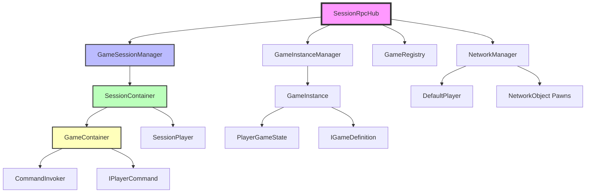

# Architecture de Stockage Serveur

## Vue d'ensemble du stockage

```
SERVER
├── GameSessionManager (Singleton MonoBehaviour)
│   ├── sessions: Dictionary<string, SessionContainer>
│   │   └── SessionContainer (par session)
│   │       ├── SessionName: string
│   │       ├── SessionId: string (GUID)
│   │       ├── WorldOffset: Vector3 (isolation spatiale)
│   │       ├── HostClientId: ulong
│   │       ├── players: Dictionary<ulong, SessionPlayer>
│   │       ├── authorizedClients: HashSet<ulong>
│   │       ├── playerPawns: Dictionary<ulong, NetworkObject>
│   │       ├── State: SessionState (Lobby/Starting/InGame/Ended)
│   │       ├── GameId: string
│   │       ├── GameDefinition: IGameDefinition
│   │       └── Game: GameContainer (instance de jeu)
│   │           ├── GameScene: Scene (Game.unity chargée additivement)
│   │           ├── gameCamera: Camera
│   │           ├── mapRoot: Transform
│   │           ├── playerPawns: Dictionary<ulong, NetworkObject>
│   │           ├── playerNames: Dictionary<ulong, string>
│   │           └── commandInvoker: CommandInvoker
│   │
│   └── clientSessions: Dictionary<ulong, string> (mapping client → session)
│
├── GameInstanceManager (Singleton MonoBehaviour)
│   └── activeGames: Dictionary<string, GameInstance>
│       └── GameInstance (par session)
│           ├── SessionName: string
│           ├── GameDefinition: IGameDefinition
│           ├── WorldOffset: Vector3
│           └── players: Dictionary<ulong, PlayerGameState>
│               └── PlayerGameState
│                   ├── ClientId: ulong
│                   ├── PlayerName: string
│                   └── Pawn: NetworkObject
│
└── NetworkManager.SpawnManager
    └── SpawnedObjectsList: List<NetworkObject>
        ├── SessionRpcHub (singleton)
        ├── DefaultPlayer (préfab joueur par client)
        └── Pawns (préfabs de jeu)
```

## Structure détaillée

### 1. GameSessionManager
**Fichier**: `Assets/Scripts/Networking/Sessions/GameSessionManager.cs`
**Responsabilité**: Gestion globale des sessions

```csharp
public class GameSessionManager : MonoBehaviour
{
    // Stockage principal des sessions
    private Dictionary<string, SessionContainer> sessions;
    
    // Mapping client → session (pour validation autoritaire)
    private Dictionary<ulong, string> clientSessions;
    
    // Méthodes principales
    bool TryAddSession(ulong hostClientId, string sessionName);
    bool TryJoinSession(ulong clientId, string sessionName);
    void LeaveSession(ulong clientId, string sessionName);
    SessionContainer GetSession(string sessionName);
    string GetClientSession(ulong clientId);
}
```

### 2. SessionContainer
**Fichier**: `Assets/Scripts/Core/Games/SessionContainer.cs`
**Responsabilité**: Conteneur isolé pour une session

```csharp
public class SessionContainer : IDisposable
{
    // Identification
    public string SessionName { get; }
    public string SessionId { get; }
    public Vector3 WorldOffset { get; } // Isolation spatiale
    
    // Joueurs (thread-safe)
    private Dictionary<ulong, SessionPlayer> players;
    private HashSet<ulong> authorizedClients;
    private object playerLock;
    
    // Pawns réseau
    private Dictionary<ulong, NetworkObject> playerPawns;
    private object pawnLock;
    
    // État de session
    public SessionState State { get; }
    public string GameId { get; }
    public IGameDefinition GameDefinition { get; }
    
    // Instance de jeu encapsulée
    private GameContainer gameContainer;
    public GameContainer Game => gameContainer;
}

public class SessionPlayer
{
    public ulong ClientId { get; set; }
    public string Name { get; set; }
    public bool IsReady { get; set; }
    public DateTime JoinedAt { get; set; }
}
```

### 3. GameContainer
**Fichier**: `Assets/Scripts/Core/Games/GameContainer.cs`
**Responsabilité**: Instance de jeu dans une session

```csharp
public class GameContainer
{
    // Scène additionnelle
    public Scene GameScene { get; private set; }
    
    // Composants de jeu
    private Camera gameCamera;
    private Transform mapRoot;
    
    // Joueurs dans le jeu
    private Dictionary<ulong, NetworkObject> playerPawns;
    private Dictionary<ulong, string> playerNames;
    
    // Commandes
    private CommandInvoker commandInvoker;
}
```

### 4. GameInstanceManager
**Fichier**: `Assets/Scripts/Core/Games/GameInstanceManager.cs`
**Responsabilité**: Gestion des instances de jeu (ancien système)

```csharp
public class GameInstanceManager : MonoBehaviour
{
    private Dictionary<string, GameInstance> activeGames;
}

public class GameInstance
{
    public string SessionName;
    public IGameDefinition GameDefinition;
    public Vector3 WorldOffset;
    private Dictionary<ulong, PlayerGameState> players;
}

public class PlayerGameState
{
    public ulong ClientId;
    public string PlayerName;
    public NetworkObject Pawn;
}
```

## Graphe de dépendances



## Flux de données

### Création de session
```
Client → SessionRpcHub.CreateSessionServerRpc()
  → GameSessionManager.TryAddSession()
    → new SessionContainer(sessionName, hostClientId, worldOffset)
      → sessions[sessionName] = container
      → clientSessions[hostClientId] = sessionName
```

### Démarrage de jeu
```
Client → SessionRpcHub.StartGameServerRpc()
  → GameSessionManager.GetSession(sessionName)
    → SessionContainer.StartGame(gameId, clientId)
      → new GameContainer(sessionName, gameId, worldOffset)
      → gameContainer = container
      → State = Starting
  → GameInstanceManager.CreateGame(sessionName, gameId, playerData, worldOffset)
    → new GameInstance()
    → activeGames[sessionName] = instance
```

### Mouvement joueur
```
Client → SessionRpcHub.RequestMoveServerRpc(sessionName, direction)
  → GameSessionManager.GetSession(sessionName)
    → SessionContainer.ValidateAccess(clientId)
      → GameContainer.ExecutePlayerCommand(moveCommand)
        → commandInvoker.ExecuteCommand()
          → MovePlayerCommand.Execute()
            → pawn.transform.position += movement
              → NetworkObject syncs to all clients
```

## Problèmes actuels

### 1. SessionRpcHub trop gros (750+ lignes)
- Mélange validation, routing, et logique métier
- Responsabilités multiples (sessions, games, movement, etc.)

### 2. Duplication de stockage
- GameSessionManager ET GameInstanceManager stockent des données similaires
- PlayerGameState existe dans GameInstanceManager mais pas dans GameContainer

### 3. Pas de registre centralisé de clients
- clientSessions dans GameSessionManager est limité
- Pas de suivi des NetworkClient avec métadonnées

### 4. Couplage fort
- SessionRpcHub connaît trop de détails d'implémentation
- Pas d'abstraction entre couches

## Solutions proposées

Voir `REFACTORING_PLAN.md` pour la restructuration complète.
