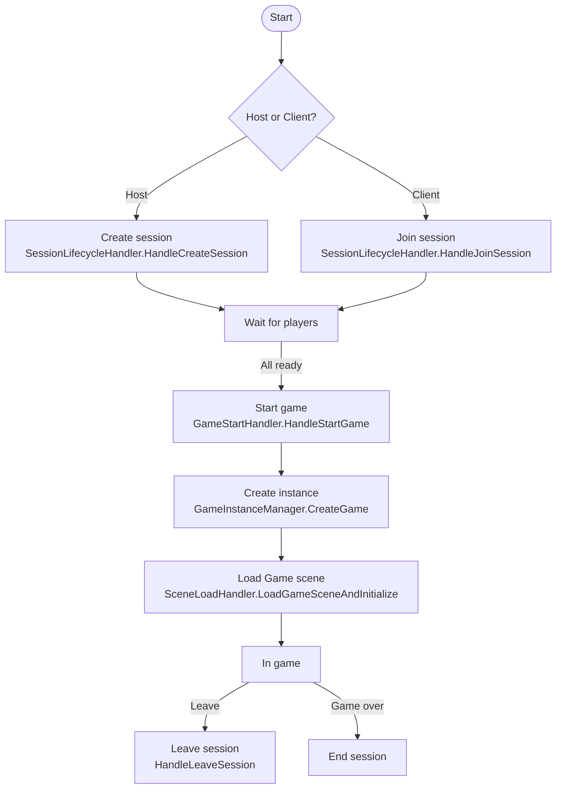

```mermaid
%% Sources: Assets/Scripts/Networking/RpcHandlers/Handlers/SessionLifecycleHandler.cs, Assets/Scripts/Networking/RpcHandlers/Handlers/GameStartHandler.cs, Assets/Scripts/Networking/RpcHandlers/Handlers/SceneLoadHandler.cs, Assets/Scripts/Core/Games/GameInstanceManager.cs
flowchart TD
    Start([Start]) --> Role{Host or Client?}
    Role -->|Host| Create[Create session<br/>SessionLifecycleHandler.HandleCreateSession]
    Role -->|Client| Join[Join session<br/>SessionLifecycleHandler.HandleJoinSession]
    Create --> Wait[Wait for players]
    Join --> Wait
    Wait -->|All ready| StartGame[Start game<br/>GameStartHandler.HandleStartGame]
    StartGame --> CreateGame[Create instance<br/>GameInstanceManager.CreateGame]
    CreateGame --> LoadScene[Load Game scene<br/>SceneLoadHandler.LoadGameSceneAndInitialize]
    LoadScene --> Running[In game]
    Running -->|Leave| Leave[Leave session<br/>HandleLeaveSession]
    Running -->|Game over| End[End session]
```
