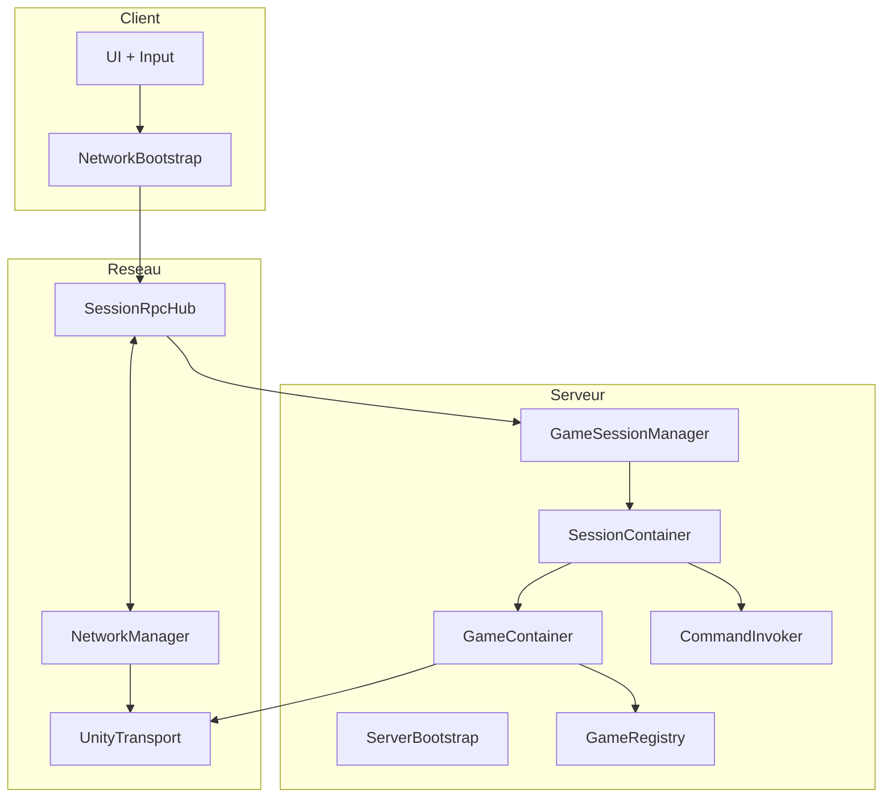

```mermaid
flowchart TB
    subgraph Client["Client"]
        UI[UI + Input]
        NB[NetworkBootstrap]
    end

    subgraph Reseau["Reseau"]
        RPC[SessionRpcHub]
        NM[NetworkManager]
        UT[UnityTransport]
    end

    subgraph Serveur["Serveur"]
        SB[ServerBootstrap]
        GSM[GameSessionManager]
        SC[SessionContainer]
        GC[GameContainer]
        GR[GameRegistry]
        CI[CommandInvoker]
    end

    UI --> NB
    NB --> RPC
    RPC <--> NM
    NM --> UT

    RPC --> GSM
    GSM --> SC
    SC --> GC
    GC --> GR
    SC --> CI
    GC --> UT
```
