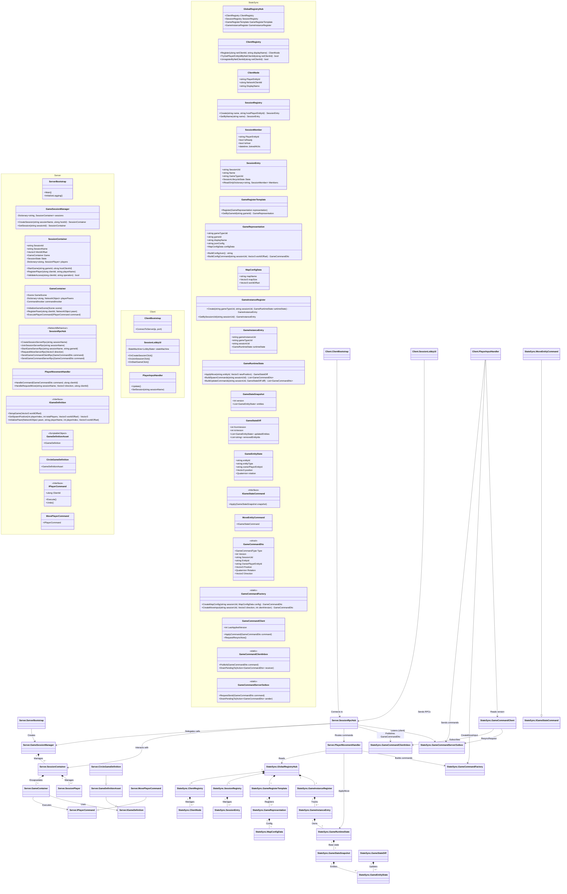

```mermaid
classDiagram
    direction TB

    namespace Server {
        class ServerBootstrap {
            +Main()
            +InitializeLogging()
        }
        class GameSessionManager {
            -Dictionary~string, SessionContainer~ sessions
            +CreateSession(string sessionName, ulong hostId) SessionContainer
            +GetSession(string sessionId) SessionContainer
        }
        class SessionContainer {
            +string SessionId
            +string SessionName
            +Vector3 WorldOffset
            +GameContainer Game
            +SessionState State
            -Dictionary~ulong, SessionPlayer~ players
            +StartGame(string gameId, ulong hostClientId)
            +RegisterPlayer(ulong clientId, string playerName)
            +ValidateAccess(ulong clientId, string operation) bool
        }
        class GameContainer {
            +Scene GameScene
            -Dictionary~ulong, NetworkObject~ playerPawns
            -CommandInvoker commandInvoker
            +InitializeGameScene(Scene scene)
            +RegisterPawn(ulong clientId, NetworkObject pawn)
            +ExecutePlayerCommand(IPlayerCommand command)
        }
        class SessionRpcHub {
            <<NetworkBehaviour>>
            +CreateSessionServerRpc(string sessionName)
            +JoinSessionServerRpc(string sessionName)
            +StartGameServerRpc(string sessionName, string gameId)
            +RequestMoveServerRpc(Vector2 direction)
            +SendGameCommandClientRpc(GameCommandDto command)
            +SendGameCommandServerRpc(GameCommandDto command)
        }
        class PlayerMovementHandler {
            +HandleCommand(GameCommandDto command, ulong clientId)
            +HandleRequestMove(string sessionName, Vector2 direction, ulong clientId)
        }
        class IGameDefinition {
            <<Interface>>
            +SetupGame(Vector3 worldOffset)
            +GetSpawnPosition(int playerIndex, int totalPlayers, Vector3 worldOffset) Vector3
            +InitializePawn(NetworkObject pawn, string playerName, int playerIndex, Vector3 worldOffset)
        }
        class GameDefinitionAsset {
            <<ScriptableObject>>
            +IGameDefinition
        }
        class CircleGameDefinition {
            +GameDefinitionAsset
        }
        class IPlayerCommand {
            <<Interface>>
            +Execute()
            +Undo()
            +ulong ClientId
        }
        class MovePlayerCommand {
            +IPlayerCommand
        }
    }

    namespace Client {
        class ClientBootstrap {
            +ConnectToServer(ip, port)
        }
        class SessionLobbyUI {
            -StateMachine~LobbyState~ stateMachine
            +OnCreateSessionClick()
            +OnJoinSessionClick()
            +OnStartGameClick()
        }
        class PlayerInputHandler {
            +Update()
            +SetSession(string sessionName)
        }
    }

    namespace StateSync {
        class GlobalRegistryHub {
            +ClientRegistry ClientRegistry
            +SessionRegistry SessionRegistry
            +GameRegisterTemplate GameRegisterTemplate
            +GameInstanceRegister GameInstanceRegister
        }
        class ClientRegistry {
            +Register(ulong netClientId, string displayName) ClientNode
            +TryGetPlayerEntityIdByNetClientId(ulong netClientId) bool
            +UnregisterByNetClientId(ulong netClientId) bool
        }
        class ClientNode {
            +string PlayerEntityId
            +ulong NetworkClientId
            +string DisplayName
        }
        class SessionRegistry {
            +Create(string name, string hostPlayerEntityId) SessionEntry
            +GetByName(string name) SessionEntry
        }
        class SessionMember {
            +string PlayerEntityId
            +bool IsReady
            +bool IsHost
            +datetime JoinedAtUtc
        }
        class SessionEntry {
            +string SessionUid
            +string Name
            +string GameTypeUid
            +SessionLifecycleState State
            +IReadOnlyDictionary~string, SessionMember~ Members
        }
        class GameRegisterTemplate {
            +Register(GameRepresentation representation)
            +GetByGameId(string gameId) GameRepresentation
        }
        class GameRepresentation {
            +string gameTypeUid
            +string gameId
            +string displayName
            +string jsonConfig
            +MapConfigData configData
            +BuildConfigJson() string
            +BuildConfigCommand(string sessionUid, Vector3 worldOffset) GameCommandDto
        }
        class MapConfigData {
            +string mapName
            +Vector3 mapSize
            +Vector3 worldOffset
        }
        class GameInstanceRegister {
            +Create(string gameTypeUid, string sessionUid, GameRuntimeState runtimeState) GameInstanceEntry
            +GetBySessionUid(string sessionUid) GameInstanceEntry
        }
        class GameInstanceEntry {
            +string gameInstanceUid
            +string gameTypeUid
            +string sessionUid
            +GameRuntimeState runtimeState
        }
        class GameRuntimeState {
            +ApplyMove(string entityId, Vector3 newPosition) GameStateDiff
            +BuildSpawnCommands(string sessionUid) List~GameCommandDto~
            +BuildUpdateCommands(string sessionUid, GameStateDiff diff) List~GameCommandDto~
        }
        class GameStateSnapshot {
            +int version
            +List~GameEntityState~ entities
        }
        class GameStateDiff {
            +int fromVersion
            +int toVersion
            +List~GameEntityState~ updatedEntities
            +List~string~ removedEntityIds
        }
        class GameEntityState {
            +string entityId
            +string entityType
            +string ownerPlayerEntityId
            +Vector3 position
            +Quaternion rotation
        }
        class IGameStateCommand {
            <<Interface>>
            +Apply(GameStateSnapshot snapshot)
        }
        class MoveEntityCommand {
            +IGameStateCommand
        }
        class GameCommandDto {
            <<struct>>
            +GameCommandType Type
            +int Version
            +string SessionUid
            +string EntityId
            +string OwnerPlayerEntityId
            +Vector3 Position
            +Quaternion Rotation
            +Vector2 Direction
        }
        class GameCommandFactory {
            <<static>>
            +CreateMapConfig(string sessionUid, MapConfigData config) GameCommandDto
            +CreateMoveInput(string sessionUid, Vector2 direction, int clientVersion) GameCommandDto
        }
        class GameCommandClient {
            +ApplyCommand(GameCommandDto command)
            +RequestResyncNow()
            +int LastAppliedVersion
        }
        class GameCommandClientInbox {
            <<static>>
            +Publish(GameCommandDto command)
            +DrainPendingTo(Action~GameCommandDto~ receiver)
        }
        class GameCommandServerOutbox {
            <<static>>
            +RequestSend(GameCommandDto command)
            +DrainPendingTo(Action~GameCommandDto~ sender)
        }
    }

    Server.ServerBootstrap --> Server.GameSessionManager : Creates
    Server.GameSessionManager "1" *-- "0..*" Server.SessionContainer : Manages
    Server.SessionContainer "1" *-- "1" Server.GameContainer : Encapsulates
    Server.SessionContainer "1" *-- "0..*" Server.SessionPlayer : Manages
    Server.SessionRpcHub --> Server.GameSessionManager : Delegates calls
    Server.SessionRpcHub --> Server.SessionContainer : Interacts with
    Server.SessionRpcHub --> Server.PlayerMovementHandler : Routes commands
    Server.GameContainer --> Server.IPlayerCommand : Executes
    Server.GameContainer --> Server.IGameDefinition : Uses
    Server.GameDefinitionAsset --|> Server.IGameDefinition
    Server.CircleGameDefinition --|> Server.GameDefinitionAsset
    Server.MovePlayerCommand --|> Server.IPlayerCommand
    Server.PlayerMovementHandler --> StateSync.GlobalRegistryHub : Reads
    Server.PlayerMovementHandler --> StateSync.GameRuntimeState : ApplyMove
    Server.PlayerMovementHandler --> StateSync.GameCommandFactory : Builds commands

    Client.ClientBootstrap --> Server.SessionRpcHub : Connects to
    Client.SessionLobbyUI --> Server.SessionRpcHub : Sends RPCs
    Client.PlayerInputHandler --> StateSync.GameCommandServerOutbox : Sends commands
    Client.PlayerInputHandler --> StateSync.GameCommandFactory : CreateMoveInput
    Client.PlayerInputHandler --> StateSync.GameCommandClient : Reads version

    Server.SessionRpcHub --> StateSync.GameCommandClientInbox : Publishes GameCommandDto
    StateSync.GameCommandClient --> StateSync.GameCommandClientInbox : Subscribes
    StateSync.GameCommandClient --> StateSync.GameCommandServerOutbox : ResyncRequest
    Server.SessionRpcHub --> StateSync.GameCommandServerOutbox : Listens (client)

    StateSync.GlobalRegistryHub "1" *-- "1" StateSync.ClientRegistry
    StateSync.GlobalRegistryHub "1" *-- "1" StateSync.SessionRegistry
    StateSync.GlobalRegistryHub "1" *-- "1" StateSync.GameRegisterTemplate
    StateSync.GlobalRegistryHub "1" *-- "1" StateSync.GameInstanceRegister

    StateSync.ClientRegistry "1" *-- "0..*" StateSync.ClientNode : Manages
    StateSync.SessionRegistry "1" *-- "0..*" StateSync.SessionEntry : Manages
    StateSync.GameRegisterTemplate "1" *-- "0..*" StateSync.GameRepresentation : Registers
    StateSync.GameRepresentation "1" *-- "1" StateSync.MapConfigData : Config
    StateSync.GameInstanceRegister "1" *-- "0..*" StateSync.GameInstanceEntry : Tracks
    StateSync.GameInstanceEntry "1" *-- "1" StateSync.GameRuntimeState : Owns
    StateSync.GameRuntimeState "1" *-- "1" StateSync.GameStateSnapshot : Base state
    StateSync.GameStateSnapshot "1" *-- "0..*" StateSync.GameEntityState : Entities
    StateSync.GameStateDiff "1" *-- "0..*" StateSync.GameEntityState : Updates
    StateSync.MoveEntityCommand --|> StateSync.IGameStateCommand

```
