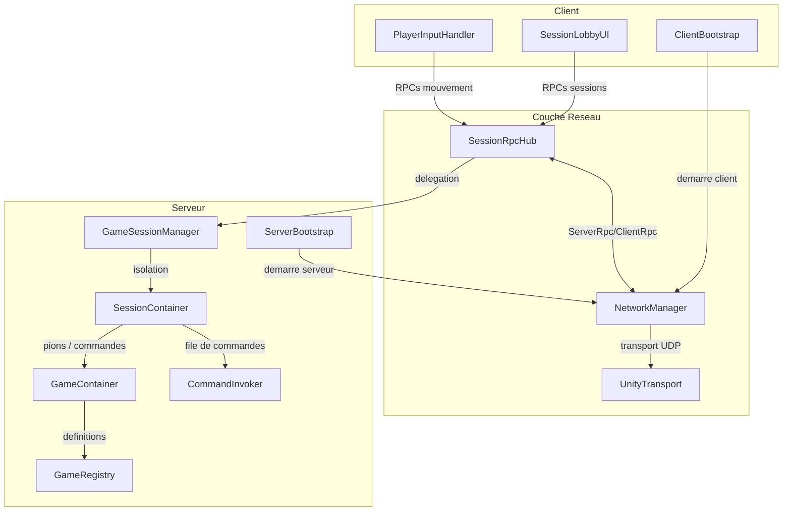

```mermaid
flowchart TB
    subgraph Client[Client]
        SessionLobbyUI[SessionLobbyUI]
        PlayerInputHandler[PlayerInputHandler]
        ClientBootstrap[ClientBootstrap]
    end

    subgraph Network[Couche Reseau]
        SessionRpcHub[SessionRpcHub]
        NetworkManager[NetworkManager]
        UnityTransport[UnityTransport]
    end

    subgraph Server[Serveur]
        ServerBootstrap[ServerBootstrap]
        GameSessionManager[GameSessionManager]
        SessionContainer[SessionContainer]
        GameContainer[GameContainer]
        GameRegistry[GameRegistry]
        CommandInvoker[CommandInvoker]
    end

    SessionLobbyUI -->|RPCs sessions| SessionRpcHub
    PlayerInputHandler -->|RPCs mouvement| SessionRpcHub

    ClientBootstrap -->|demarre client| NetworkManager
    SessionRpcHub <--> |ServerRpc/ClientRpc| NetworkManager
    NetworkManager -->|transport UDP| UnityTransport

    ServerBootstrap -->|demarre serveur| NetworkManager
    SessionRpcHub -->|delegation| GameSessionManager
    GameSessionManager -->|isolation| SessionContainer
    SessionContainer -->|pions / commandes| GameContainer
    SessionContainer -->|file de commandes| CommandInvoker
    GameContainer -->|definitions| GameRegistry
```
