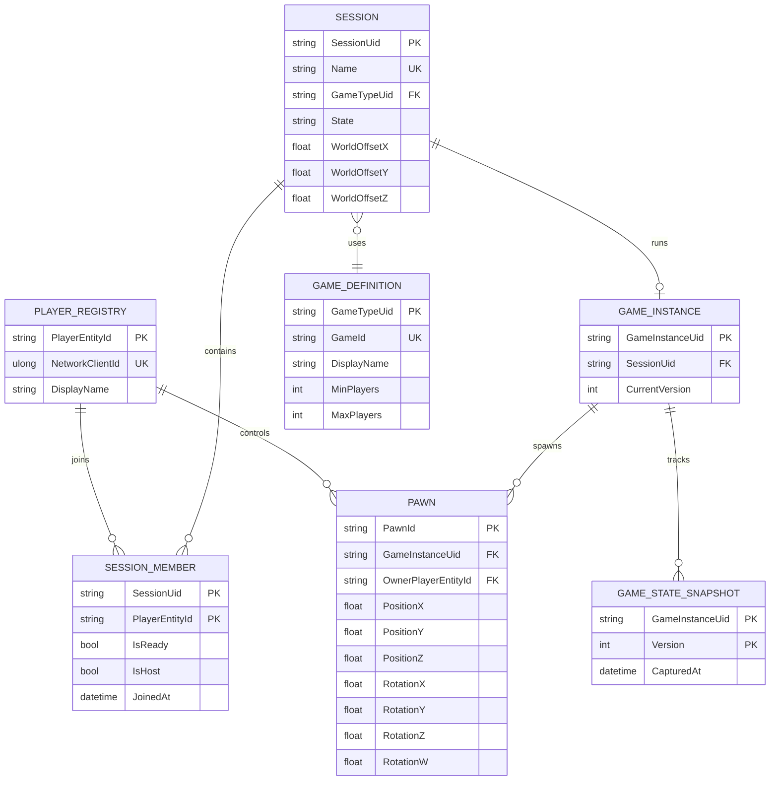

```mermaid
erDiagram
    PLAYER_REGISTRY {
        string PlayerEntityId PK
        ulong NetworkClientId UK
        string DisplayName
    }

    SESSION {
        string SessionUid PK
        string Name UK
        string GameTypeUid FK
        string State
        float WorldOffsetX
        float WorldOffsetY
        float WorldOffsetZ
    }

    SESSION_MEMBER {
        string SessionUid PK
        string PlayerEntityId PK
        bool IsReady
        bool IsHost
        datetime JoinedAt
    }

    GAME_INSTANCE {
        string GameInstanceUid PK
        string SessionUid FK
        int CurrentVersion
    }

    GAME_DEFINITION {
        string GameTypeUid PK
        string GameId UK
        string DisplayName
        int MinPlayers
        int MaxPlayers
    }

    PAWN {
        string PawnId PK
        string GameInstanceUid FK
        string OwnerPlayerEntityId FK
        float PositionX
        float PositionY
        float PositionZ
        float RotationX
        float RotationY
        float RotationZ
        float RotationW
    }

    GAME_STATE_SNAPSHOT {
        string GameInstanceUid PK
        int Version PK
        datetime CapturedAt
    }

PLAYER_REGISTRY ||--o{ SESSION_MEMBER : joins
SESSION ||--o{ SESSION_MEMBER : contains

SESSION ||--o| GAME_INSTANCE : runs

SESSION }o--|| GAME_DEFINITION : uses

PLAYER_REGISTRY ||--o{ PAWN : controls
GAME_INSTANCE ||--o{ PAWN : spawns
GAME_INSTANCE ||--o{ GAME_STATE_SNAPSHOT : tracks
```
