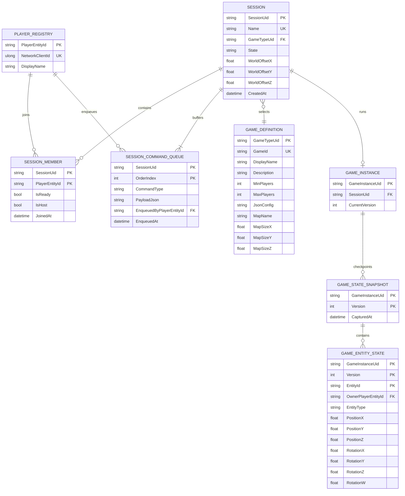

```mermaid
erDiagram
    PLAYER_REGISTRY {
        string PlayerEntityId PK
        ulong NetworkClientId UK
        string DisplayName
    }

    SESSION {
        string SessionUid PK
        string Name UK
        string GameTypeUid FK
        string State
        float WorldOffsetX
        float WorldOffsetY
        float WorldOffsetZ
        datetime CreatedAt
    }

    SESSION_MEMBER {
        string SessionUid PK
        string PlayerEntityId PK
        bool IsReady
        bool IsHost
        datetime JoinedAt
    }

    SESSION_COMMAND_QUEUE {
        string SessionUid PK
        int OrderIndex PK
        string CommandType
        string PayloadJson
        string EnqueuedByPlayerEntityId FK
        datetime EnqueuedAt
    }

    GAME_DEFINITION {
        string GameTypeUid PK
        string GameId UK
        string DisplayName
        string Description
        int MinPlayers
        int MaxPlayers
        string JsonConfig
        string MapName
        float MapSizeX
        float MapSizeY
        float MapSizeZ
    }

    GAME_INSTANCE {
        string GameInstanceUid PK
        string SessionUid FK
        int CurrentVersion
    }

    GAME_ENTITY_STATE {
        string GameInstanceUid PK
        int Version PK
        string EntityId PK
        string OwnerPlayerEntityId FK
        string EntityType
        float PositionX
        float PositionY
        float PositionZ
        float RotationX
        float RotationY
        float RotationZ
        float RotationW
    }

    GAME_STATE_SNAPSHOT {
        string GameInstanceUid PK
        int Version PK
        datetime CapturedAt
    }

PLAYER_REGISTRY ||--o{ SESSION_MEMBER : joins
SESSION ||--o{ SESSION_MEMBER : contains

SESSION ||--|{ SESSION_COMMAND_QUEUE : buffers
PLAYER_REGISTRY ||--o{ SESSION_COMMAND_QUEUE : enqueues

SESSION }o--|| GAME_DEFINITION : selects
SESSION ||--o| GAME_INSTANCE : runs

GAME_INSTANCE ||--o{ GAME_STATE_SNAPSHOT : checkpoints
GAME_STATE_SNAPSHOT ||--o{ GAME_ENTITY_STATE : contains
```
