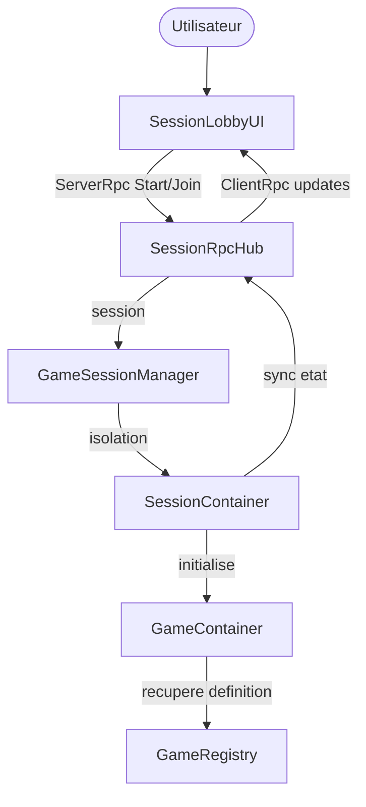

```mermaid
%% Diagramme de Flux (Creation -> Jeu)
flowchart TB
    User([Utilisateur])
    UI[SessionLobbyUI]
    RPC[SessionRpcHub]
    GSM[GameSessionManager]
    Container[SessionContainer]
    Game[GameContainer]
    Registry[GameRegistry]

    User --> UI
    UI -->|ServerRpc Start/Join| RPC
    RPC -->|session| GSM
    GSM -->|isolation| Container
    Container -->|initialise| Game
    Game -->|recupere definition| Registry
    Container -->|sync etat| RPC
    RPC -->|ClientRpc updates| UI
```
