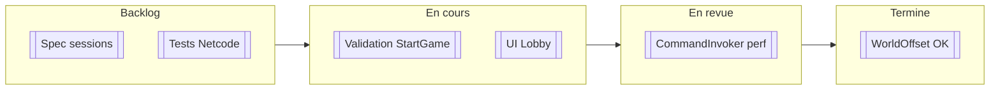

```mermaid
%% Diagramme Kanban (Flux de Travail)
flowchart LR
    subgraph Backlog["Backlog"]
        T1[[Spec sessions]]
        T2[[Tests Netcode]]
    end
    subgraph InProgress["En cours"]
        T3[[Validation StartGame]]
        T4[[UI Lobby]]
    end
    subgraph Review["En revue"]
        T5[[CommandInvoker perf]]
    end
    subgraph Done["Termine"]
        T6[[WorldOffset OK]]
    end

    Backlog --> InProgress
    InProgress --> Review
    Review --> Done
```
