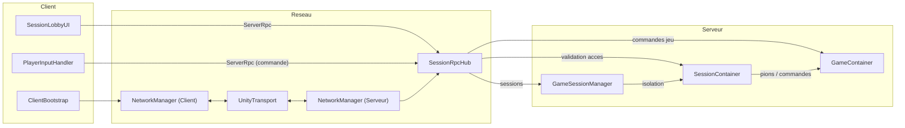

```mermaid
%% Diagramme de Liaisons (Client <-> Serveur)
flowchart LR
    subgraph Client[Client]
        UI[SessionLobbyUI]
        Input[PlayerInputHandler]
        Bootstrap[ClientBootstrap]
    end

    subgraph Net[Reseau]
        NMClient["NetworkManager (Client)"]
        Transport[UnityTransport]
        NMServer["NetworkManager (Serveur)"]
        Hub[SessionRpcHub]
    end

    subgraph Server[Serveur]
        GSM[GameSessionManager]
        Container[SessionContainer]
        Game[GameContainer]
    end

    UI -- ServerRpc --> Hub
    Input -- ServerRpc (commande) --> Hub

    Bootstrap --> NMClient
    NMClient <--> Transport
    Transport <--> NMServer
    NMServer --> Hub

    Hub -->|sessions| GSM
    Hub -->|validation acces| Container
    Hub -->|commandes jeu| Game

    GSM -->|isolation| Container
    Container -->|pions / commandes| Game
```
