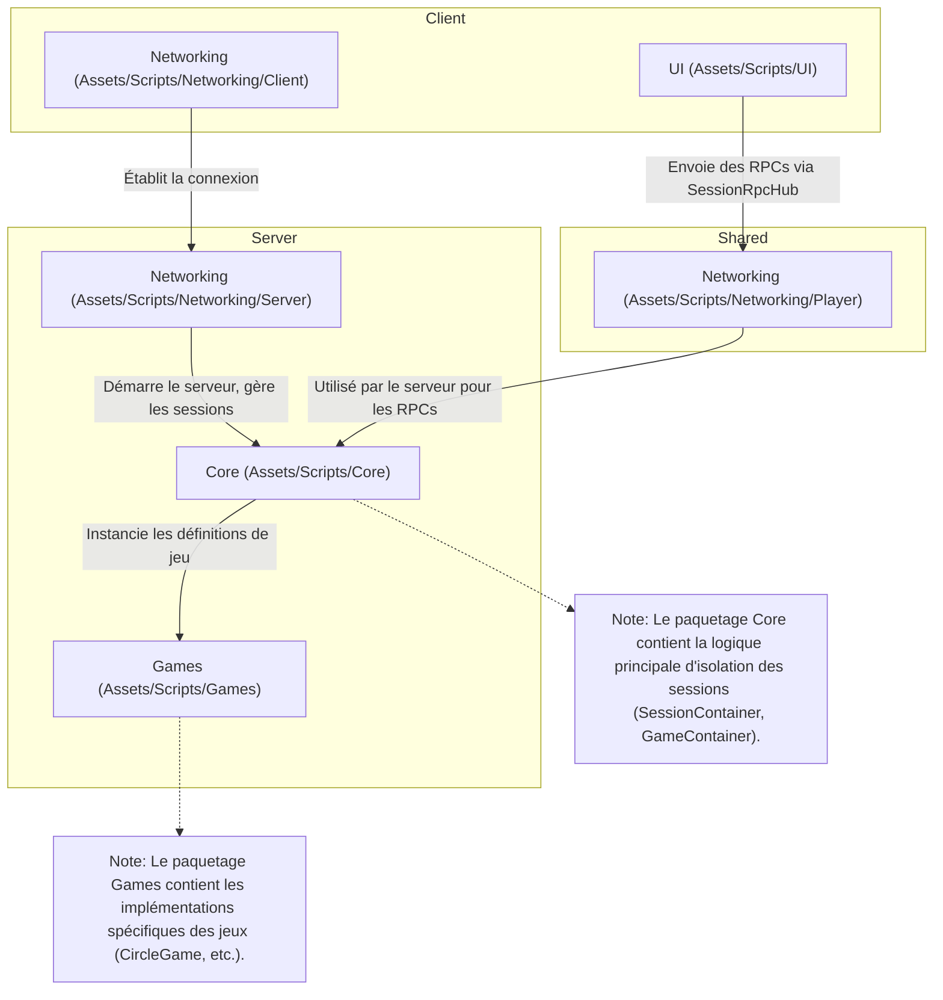

```mermaid
%% Diagramme de Paquetages
flowchart TD
    subgraph "Client"
        direction LR
        package_UI["UI (Assets/Scripts/UI)"]
        package_ClientNetworking["Networking (Assets/Scripts/Networking/Client)"]
    end

    subgraph "Server"
        direction LR
        package_ServerNetworking["Networking (Assets/Scripts/Networking/Server)"]
        package_Core["Core (Assets/Scripts/Core)"]
        package_Games["Games (Assets/Scripts/Games)"]
    end

    subgraph "Shared"
        direction LR
        package_SharedNetworking["Networking (Assets/Scripts/Networking/Player)"]
    end

    package_UI -- "Envoie des RPCs via SessionRpcHub" --> package_SharedNetworking
    package_ClientNetworking -- "Établit la connexion" --> package_ServerNetworking
    
    package_ServerNetworking -- "Démarre le serveur, gère les sessions" --> package_Core
    package_Core -- "Instancie les définitions de jeu" --> package_Games
    package_SharedNetworking -- "Utilisé par le serveur pour les RPCs" --> package_Core

    NoteCore["Note: Le paquetage Core contient la logique principale d'isolation des sessions (SessionContainer, GameContainer)."]
    NoteGames["Note: Le paquetage Games contient les implémentations spécifiques des jeux (CircleGame, etc.)."]
    package_Core -.-> NoteCore
    package_Games -.-> NoteGames
```
