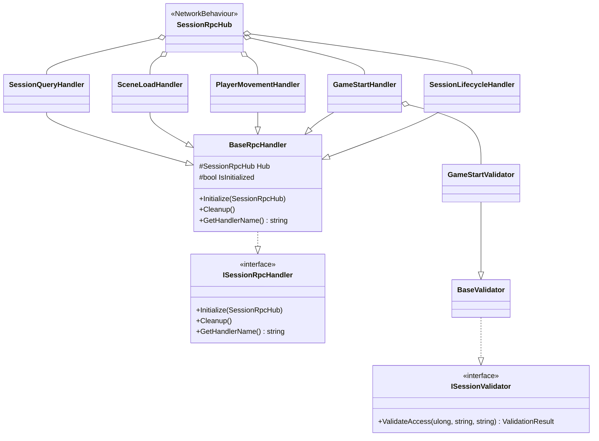

```mermaid
%% Sources: Assets/Scripts/Networking/RpcHandlers/Base/BaseRpcHandler.cs, Assets/Scripts/Networking/RpcHandlers/Interfaces/ISessionRpcHandler.cs, Assets/Scripts/Networking/RpcHandlers/Handlers/GameStartHandler.cs
classDiagram
    class SessionRpcHub {
        <<NetworkBehaviour>>
    }

    class ISessionRpcHandler {
        <<interface>>
        +Initialize(SessionRpcHub)
        +Cleanup()
        +GetHandlerName() string
    }

    class BaseRpcHandler {
        #SessionRpcHub Hub
        #bool IsInitialized
        +Initialize(SessionRpcHub)
        +Cleanup()
        +GetHandlerName() string
    }

    class SessionLifecycleHandler
    class GameStartHandler
    class PlayerMovementHandler
    class SceneLoadHandler
    class SessionQueryHandler

    class ISessionValidator {
        <<interface>>
        +ValidateAccess(ulong, string, string) ValidationResult
    }

    class BaseValidator
    class GameStartValidator

    BaseRpcHandler ..|> ISessionRpcHandler
    SessionLifecycleHandler --|> BaseRpcHandler
    GameStartHandler --|> BaseRpcHandler
    PlayerMovementHandler --|> BaseRpcHandler
    SceneLoadHandler --|> BaseRpcHandler
    SessionQueryHandler --|> BaseRpcHandler

    BaseValidator ..|> ISessionValidator
    GameStartValidator --|> BaseValidator
    GameStartHandler o-- GameStartValidator

    SessionRpcHub o-- SessionLifecycleHandler
    SessionRpcHub o-- GameStartHandler
    SessionRpcHub o-- PlayerMovementHandler
    SessionRpcHub o-- SceneLoadHandler
    SessionRpcHub o-- SessionQueryHandler
```
