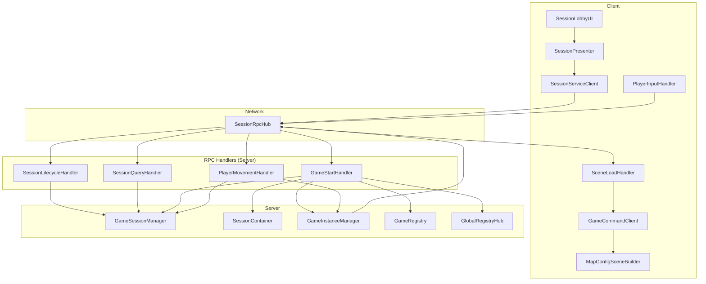

```mermaid
%% Sources: Assets/Scripts/Networking/Player/SessionRpcHub.cs, Assets/Scripts/Networking/RpcHandlers/Handlers/SessionLifecycleHandler.cs, Assets/Scripts/Networking/RpcHandlers/Handlers/GameStartHandler.cs, Assets/Scripts/Networking/RpcHandlers/Handlers/PlayerMovementHandler.cs, Assets/Scripts/Networking/RpcHandlers/Handlers/SceneLoadHandler.cs, Assets/Scripts/Networking/RpcHandlers/Handlers/SessionQueryHandler.cs
flowchart TB
    subgraph Client
        UI[SessionLobbyUI]
        Presenter[SessionPresenter]
        Service[SessionServiceClient]
        Input[PlayerInputHandler]
        SceneLoad[SceneLoadHandler]
        CommandClient[GameCommandClient]
        SceneBuilder[MapConfigSceneBuilder]
    end

    subgraph Network
        Hub[SessionRpcHub]
    end

    subgraph ServerHandlers["RPC Handlers (Server)"]
        Lifecycle[SessionLifecycleHandler]
        GameStart[GameStartHandler]
        Movement[PlayerMovementHandler]
        Query[SessionQueryHandler]
    end

    subgraph Server
        GSM[GameSessionManager]
        Container[SessionContainer]
        GIM[GameInstanceManager]
        Registry[GameRegistry]
        RegistryHub[GlobalRegistryHub]
    end

    UI --> Presenter
    Presenter --> Service
    Service --> Hub
    Input --> Hub

    Hub --> Lifecycle
    Hub --> GameStart
    Hub --> Movement
    Hub --> Query
    Hub --> SceneLoad

    SceneLoad --> CommandClient
    CommandClient --> SceneBuilder

    Lifecycle --> GSM
    Query --> GSM
    GameStart --> GSM
    GameStart --> Container
    GameStart --> Registry
    GameStart --> GIM
    GameStart --> RegistryHub
    Movement --> GSM
    Movement --> GIM

    GIM --> Hub
```
