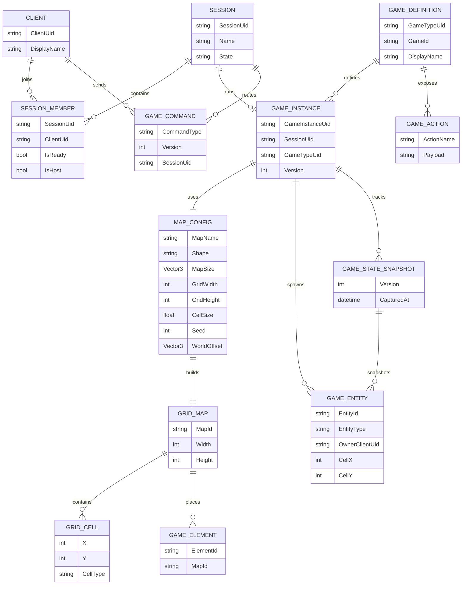

```mermaid
%% Sources: Assets/Scripts/Networking/Data/PlayerNetworkData.cs, Assets/Scripts/Networking/Player/PlayerManager.cs, Assets/Scripts/Networking/Sessions/GameSession.cs, Assets/Scripts/Networking/Sessions/SessionState.cs, Assets/Scripts/Networking/StateSync/SessionRegistry.cs, Assets/Scripts/Networking/StateSync/ClientRegistry.cs, Assets/Scripts/Networking/StateSync/GameInstanceRegister.cs, Assets/Scripts/Networking/StateSync/GameCommandProtocol.cs, Assets/Scripts/Networking/StateSync/MapConfigData.cs, Assets/Scripts/Core/Maps/GridMapData.cs, Assets/Scripts/Core/Games/GameInstanceManager.cs, Assets/Scripts/Core/Games/GameRegistry.cs
%% Schema conceptuel (MCD) - vue globale

erDiagram
    CLIENT ||--o{ SESSION_MEMBER : joins
    SESSION ||--o{ SESSION_MEMBER : contains

    GAME_DEFINITION ||--o{ GAME_INSTANCE : defines
    SESSION ||--o| GAME_INSTANCE : runs

    GAME_INSTANCE ||--|| MAP_CONFIG : uses
    MAP_CONFIG ||--|| GRID_MAP : builds
    GRID_MAP ||--o{ GRID_CELL : contains
    GRID_MAP ||--o{ GAME_ELEMENT : places

    GAME_INSTANCE ||--o{ GAME_ENTITY : spawns
    GAME_INSTANCE ||--o{ GAME_STATE_SNAPSHOT : tracks
    GAME_STATE_SNAPSHOT ||--o{ GAME_ENTITY : snapshots

    SESSION ||--o{ GAME_COMMAND : routes
    CLIENT ||--o{ GAME_COMMAND : sends

    GAME_DEFINITION ||--o{ GAME_ACTION : exposes

    CLIENT {
        string ClientUid
        string DisplayName
    }

    SESSION {
        string SessionUid
        string Name
        string State
    }

    SESSION_MEMBER {
        string SessionUid
        string ClientUid
        bool IsReady
        bool IsHost
    }

    GAME_DEFINITION {
        string GameTypeUid
        string GameId
        string DisplayName
    }

    GAME_INSTANCE {
        string GameInstanceUid
        string SessionUid
        string GameTypeUid
        int Version
    }

    MAP_CONFIG {
        string MapName
        string Shape
        Vector3 MapSize
        int GridWidth
        int GridHeight
        float CellSize
        int Seed
        Vector3 WorldOffset
    }

    GRID_MAP {
        string MapId
        int Width
        int Height
    }

    GRID_CELL {
        int X
        int Y
        string CellType
    }

    GAME_ELEMENT {
        string ElementId
        string MapId
    }

    GAME_ENTITY {
        string EntityId
        string EntityType
        string OwnerClientUid
        int CellX
        int CellY
    }

    GAME_STATE_SNAPSHOT {
        int Version
        datetime CapturedAt
    }

    GAME_COMMAND {
        string CommandType
        int Version
        string SessionUid
    }

    GAME_ACTION {
        string ActionName
        string Payload
    }
```
