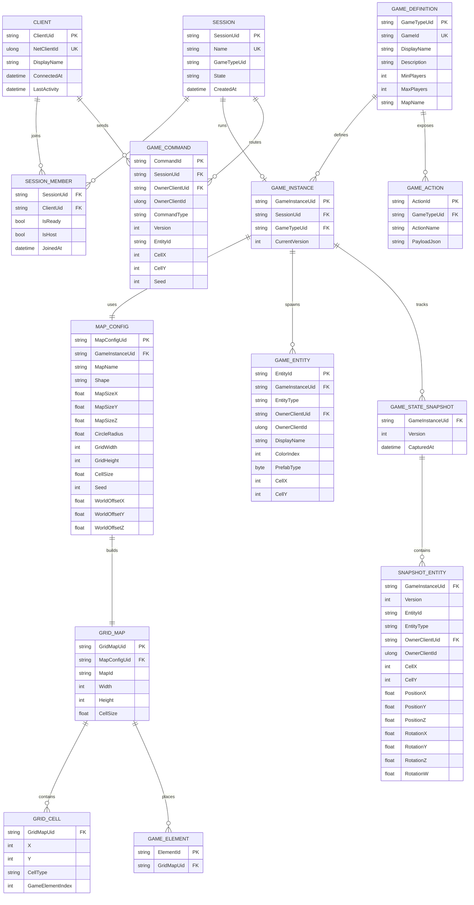

```mermaid
%% Sources: Assets/Scripts/Networking/Data/PlayerNetworkData.cs, Assets/Scripts/Networking/Player/PlayerManager.cs, Assets/Scripts/Networking/Sessions/GameSession.cs, Assets/Scripts/Networking/Sessions/SessionState.cs, Assets/Scripts/Networking/StateSync/SessionRegistry.cs, Assets/Scripts/Networking/StateSync/ClientRegistry.cs, Assets/Scripts/Networking/StateSync/GameInstanceRegister.cs, Assets/Scripts/Networking/StateSync/GameCommandProtocol.cs, Assets/Scripts/Networking/StateSync/MapConfigData.cs, Assets/Scripts/Core/Maps/GridMapData.cs, Assets/Scripts/Core/Games/GameInstanceManager.cs, Assets/Scripts/Core/Games/GameRegistry.cs
%% Schema logique (MLD) - clefs et relations

erDiagram
    CLIENT ||--o{ SESSION_MEMBER : joins
    SESSION ||--o{ SESSION_MEMBER : contains
    GAME_DEFINITION ||--o{ GAME_INSTANCE : defines
    SESSION ||--o| GAME_INSTANCE : runs
    GAME_INSTANCE ||--|| MAP_CONFIG : uses
    MAP_CONFIG ||--|| GRID_MAP : builds
    GRID_MAP ||--o{ GRID_CELL : contains
    GRID_MAP ||--o{ GAME_ELEMENT : places
    GAME_INSTANCE ||--o{ GAME_ENTITY : spawns
    GAME_INSTANCE ||--o{ GAME_STATE_SNAPSHOT : tracks
    GAME_STATE_SNAPSHOT ||--o{ SNAPSHOT_ENTITY : contains
    SESSION ||--o{ GAME_COMMAND : routes
    CLIENT ||--o{ GAME_COMMAND : sends
    GAME_DEFINITION ||--o{ GAME_ACTION : exposes

    CLIENT {
        string ClientUid PK
        ulong NetClientId UK
        string DisplayName
        datetime ConnectedAt
        datetime LastActivity
    }

    SESSION {
        string SessionUid PK
        string Name UK
        string GameTypeUid
        string State
        datetime CreatedAt
    }

    SESSION_MEMBER {
        string SessionUid FK
        string ClientUid FK
        bool IsReady
        bool IsHost
        datetime JoinedAt
    }

    GAME_DEFINITION {
        string GameTypeUid PK
        string GameId UK
        string DisplayName
        string Description
        int MinPlayers
        int MaxPlayers
        string MapName
    }

    GAME_INSTANCE {
        string GameInstanceUid PK
        string SessionUid FK
        string GameTypeUid FK
        int CurrentVersion
    }

    MAP_CONFIG {
        string MapConfigUid PK
        string GameInstanceUid FK
        string MapName
        string Shape
        float MapSizeX
        float MapSizeY
        float MapSizeZ
        float CircleRadius
        int GridWidth
        int GridHeight
        float CellSize
        int Seed
        float WorldOffsetX
        float WorldOffsetY
        float WorldOffsetZ
    }

    GRID_MAP {
        string GridMapUid PK
        string MapConfigUid FK
        string MapId
        int Width
        int Height
        float CellSize
    }

    GRID_CELL {
        string GridMapUid FK
        int X
        int Y
        string CellType
        int GameElementIndex
    }

    GAME_ELEMENT {
        string ElementId PK
        string GridMapUid FK
    }

    GAME_ENTITY {
        string EntityId PK
        string GameInstanceUid FK
        string EntityType
        string OwnerClientUid FK
        ulong OwnerClientId
        string DisplayName
        int ColorIndex
        byte PrefabType
        int CellX
        int CellY
    }

    GAME_STATE_SNAPSHOT {
        string GameInstanceUid FK
        int Version
        datetime CapturedAt
    }

    SNAPSHOT_ENTITY {
        string GameInstanceUid FK
        int Version
        string EntityId
        string EntityType
        string OwnerClientUid FK
        ulong OwnerClientId
        int CellX
        int CellY
        float PositionX
        float PositionY
        float PositionZ
        float RotationX
        float RotationY
        float RotationZ
        float RotationW
    }

    GAME_COMMAND {
        string CommandId PK
        string SessionUid FK
        string OwnerClientUid FK
        ulong OwnerClientId
        string CommandType
        int Version
        string EntityId
        int CellX
        int CellY
        int Seed
    }

    GAME_ACTION {
        string ActionId PK
        string GameTypeUid FK
        string ActionName
        string PayloadJson
    }
```
