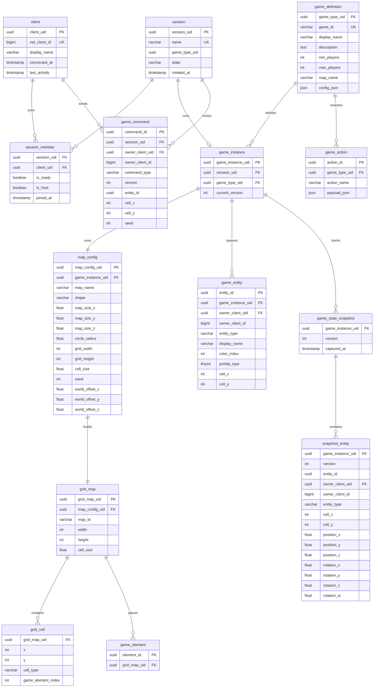

```mermaid
%% Sources: Assets/Scripts/Networking/Data/PlayerNetworkData.cs, Assets/Scripts/Networking/Player/PlayerManager.cs, Assets/Scripts/Networking/Sessions/GameSession.cs, Assets/Scripts/Networking/Sessions/SessionState.cs, Assets/Scripts/Networking/StateSync/SessionRegistry.cs, Assets/Scripts/Networking/StateSync/ClientRegistry.cs, Assets/Scripts/Networking/StateSync/GameInstanceRegister.cs, Assets/Scripts/Networking/StateSync/GameCommandProtocol.cs, Assets/Scripts/Networking/StateSync/MapConfigData.cs, Assets/Scripts/Core/Maps/GridMapData.cs, Assets/Scripts/Core/Games/GameInstanceManager.cs, Assets/Scripts/Core/Games/GameRegistry.cs
%% Schema physique (MPD) - tables et types proposes

erDiagram
    client ||--o{ session_member : joins
    session ||--o{ session_member : contains
    game_definition ||--o{ game_instance : defines
    session ||--o| game_instance : runs
    game_instance ||--|| map_config : uses
    map_config ||--|| grid_map : builds
    grid_map ||--o{ grid_cell : contains
    grid_map ||--o{ game_element : places
    game_instance ||--o{ game_entity : spawns
    game_instance ||--o{ game_state_snapshot : tracks
    game_state_snapshot ||--o{ snapshot_entity : contains
    session ||--o{ game_command : routes
    client ||--o{ game_command : sends
    game_definition ||--o{ game_action : exposes

    client {
        uuid client_uid PK
        bigint net_client_id UK
        varchar display_name
        timestamp connected_at
        timestamp last_activity
    }

    session {
        uuid session_uid PK
        varchar name UK
        uuid game_type_uid
        varchar state
        timestamp created_at
    }

    session_member {
        uuid session_uid FK
        uuid client_uid FK
        boolean is_ready
        boolean is_host
        timestamp joined_at
    }

    game_definition {
        uuid game_type_uid PK
        varchar game_id UK
        varchar display_name
        text description
        int min_players
        int max_players
        varchar map_name
        json config_json
    }

    game_instance {
        uuid game_instance_uid PK
        uuid session_uid FK
        uuid game_type_uid FK
        int current_version
    }

    map_config {
        uuid map_config_uid PK
        uuid game_instance_uid FK
        varchar map_name
        varchar shape
        float map_size_x
        float map_size_y
        float map_size_z
        float circle_radius
        int grid_width
        int grid_height
        float cell_size
        int seed
        float world_offset_x
        float world_offset_y
        float world_offset_z
    }

    grid_map {
        uuid grid_map_uid PK
        uuid map_config_uid FK
        varchar map_id
        int width
        int height
        float cell_size
    }

    grid_cell {
        uuid grid_map_uid FK
        int x
        int y
        varchar cell_type
        int game_element_index
    }

    game_element {
        uuid element_id PK
        uuid grid_map_uid FK
    }

    game_entity {
        uuid entity_id PK
        uuid game_instance_uid FK
        uuid owner_client_uid FK
        bigint owner_client_id
        varchar entity_type
        varchar display_name
        int color_index
        tinyint prefab_type
        int cell_x
        int cell_y
    }

    game_state_snapshot {
        uuid game_instance_uid FK
        int version
        timestamp captured_at
    }

    snapshot_entity {
        uuid game_instance_uid FK
        int version
        uuid entity_id
        uuid owner_client_uid FK
        bigint owner_client_id
        varchar entity_type
        int cell_x
        int cell_y
        float position_x
        float position_y
        float position_z
        float rotation_x
        float rotation_y
        float rotation_z
        float rotation_w
    }

    game_command {
        uuid command_id PK
        uuid session_uid FK
        uuid owner_client_uid FK
        bigint owner_client_id
        varchar command_type
        int version
        uuid entity_id
        int cell_x
        int cell_y
        int seed
    }

    game_action {
        uuid action_id PK
        uuid game_type_uid FK
        varchar action_name
        json payload_json
    }
```
