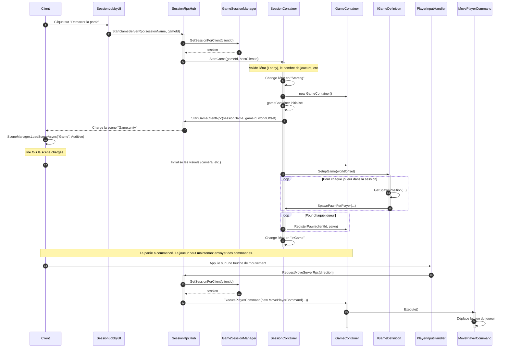

```mermaid
%% Diagramme de Séquence - Démarrage d'une Partie
sequenceDiagram
    participant Client
    participant SessionLobbyUI
    participant SessionRpcHub
    participant GameSessionManager
    participant SessionContainer
    participant GameContainer

    autonumber

    Client->>SessionLobbyUI: Clique sur "Démarrer la partie"
    SessionLobbyUI->>SessionRpcHub: StartGameServerRpc(sessionName, gameId)

    activate SessionRpcHub
    SessionRpcHub->>GameSessionManager: GetSessionForClient(clientId)
    GameSessionManager-->>SessionRpcHub: session
    SessionRpcHub->>SessionContainer: StartGame(gameId, hostClientId)
    deactivate SessionRpcHub

    activate SessionContainer
    note over SessionContainer: Valide l'état (Lobby), le nombre de joueurs, etc.
    SessionContainer->>SessionContainer: Change l'état en "Starting"
    SessionContainer->>GameContainer: new GameContainer()
    SessionContainer-->>SessionContainer: gameContainer initialisé

    SessionContainer->>SessionRpcHub: StartGameClientRpc(sessionName, gameId, worldOffset)
    activate SessionRpcHub
    SessionRpcHub-->>Client: Charge la scène "Game.unity"
    deactivate SessionRpcHub

    Client->>Client: SceneManager.LoadSceneAsync("Game", Additive)
    note over Client: Une fois la scène chargée...
    Client->>GameContainer: Initialise les visuels (caméra, etc.)

    SessionContainer->>IGameDefinition: SetupGame(worldOffset)
    activate IGameDefinition
    loop Pour chaque joueur dans la session
        IGameDefinition->>IGameDefinition: GetSpawnPosition(...)
        IGameDefinition->>SessionContainer: SpawnPawnForPlayer(...)
    end
    deactivate IGameDefinition
    
    activate SessionContainer
    loop Pour chaque joueur
        SessionContainer->>GameContainer: RegisterPawn(clientId, pawn)
    end
    deactivate SessionContainer

    SessionContainer->>SessionContainer: Change l'état en "InGame"
    deactivate SessionContainer

    note over Client, GameContainer: La partie a commencé. Le joueur peut maintenant envoyer des commandes.

    Client->>PlayerInputHandler: Appuie sur une touche de mouvement
    PlayerInputHandler->>SessionRpcHub: RequestMoveServerRpc(direction)

    activate SessionRpcHub
    SessionRpcHub->>GameSessionManager: GetSessionForClient(clientId)
    GameSessionManager-->>SessionRpcHub: session
    SessionRpcHub->>GameContainer: ExecutePlayerCommand(new MovePlayerCommand(...))
    deactivate SessionRpcHub

    activate GameContainer
    GameContainer->>MovePlayerCommand: Execute()
    activate MovePlayerCommand
    MovePlayerCommand->>MovePlayerCommand: Déplace le pion du joueur
    deactivate MovePlayerCommand
    deactivate GameContainer
```
