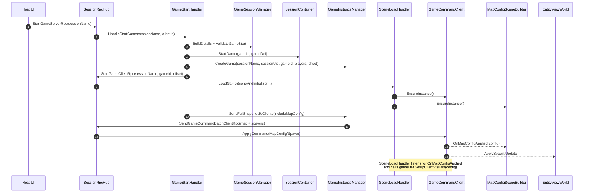

```mermaid
%% Sources: Assets/Scripts/Networking/Player/SessionRpcHub.cs, Assets/Scripts/Networking/RpcHandlers/Handlers/GameStartHandler.cs, Assets/Scripts/Networking/RpcHandlers/Handlers/SceneLoadHandler.cs, Assets/Scripts/Core/Games/GameInstanceManager.cs, Assets/Scripts/Networking/StateSync/GameCommandClient.cs
sequenceDiagram
    autonumber
    participant UI as Host UI
    participant Hub as SessionRpcHub
    participant Start as GameStartHandler
    participant GSM as GameSessionManager
    participant SC as SessionContainer
    participant GIM as GameInstanceManager
    participant Scene as SceneLoadHandler
    participant GCC as GameCommandClient
    participant Map as MapConfigSceneBuilder
    participant View as EntityViewWorld

    UI->>Hub: StartGameServerRpc(sessionName)
    Hub->>Start: HandleStartGame(sessionName, clientId)
    Start->>GSM: BuildDetails + ValidateGameStart
    Start->>SC: StartGame(gameId, gameDef)
    Start->>GIM: CreateGame(sessionName, sessionUid, gameId, players, offset)
    Start->>Hub: StartGameClientRpc(sessionName, gameId, offset)
    Hub->>Scene: LoadGameSceneAndInitialize(...)
    Scene->>GCC: EnsureInstance()
    Scene->>Map: EnsureInstance()
    Start->>GIM: SendFullSnapshotToClients(includeMapConfig)
    GIM->>Hub: SendGameCommandBatchClientRpc(map + spawns)
    Hub->>GCC: ApplyCommand(MapConfig/Spawn)
    GCC-->>Map: OnMapConfigApplied(config)
    GCC-->>View: ApplySpawn/Update
    Note over Scene,GCC: SceneLoadHandler listens for OnMapConfigApplied<br/>and calls gameDef.SetupClientVisuals(config)
```
