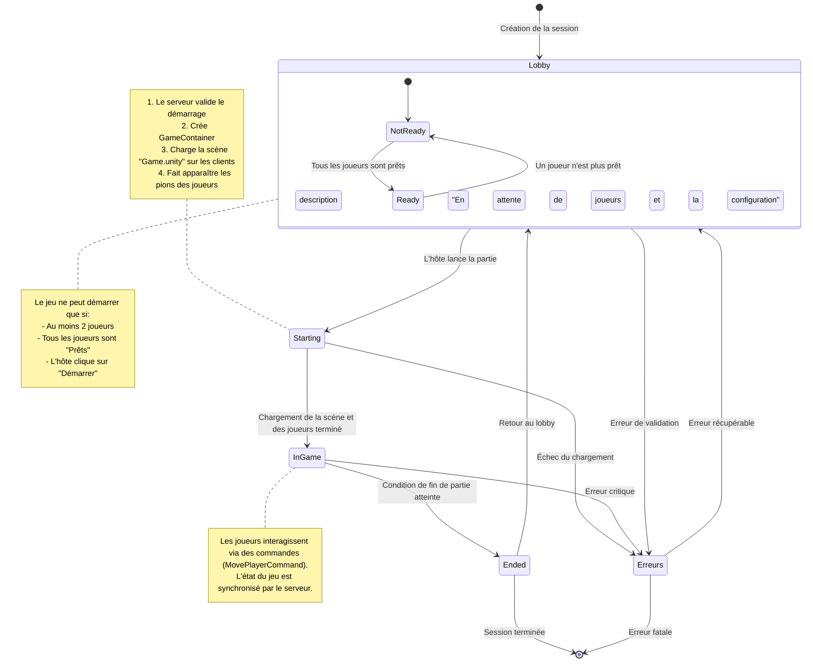

```mermaid
%% Diagramme d'états de la Session de Jeu
stateDiagram-v2
    direction TB

    [*] --> Lobby : Création de la session

    state Lobby {
        description "En attente de joueurs et de la configuration"
        [*] --> NotReady
        NotReady --> Ready : Tous les joueurs sont prêts
        Ready --> NotReady : Un joueur n'est plus prêt
    }

    Lobby --> Starting : L'hôte lance la partie
    note right of Lobby
        Le jeu ne peut démarrer que si:
        - Au moins 2 joueurs
        - Tous les joueurs sont "Prêts"
        - L'hôte clique sur "Démarrer"
    end note

    Starting --> InGame : Chargement de la scène et des joueurs terminé
    note left of Starting
        1. Le serveur valide le démarrage
        2. Crée GameContainer
        3. Charge la scène "Game.unity" sur les clients
        4. Fait apparaître les pions des joueurs
    end note

    InGame --> Ended : Condition de fin de partie atteinte
    note right of InGame
        Les joueurs interagissent via des commandes (MovePlayerCommand).
        L'état du jeu est synchronisé par le serveur.
    end note

    Ended --> Lobby : Retour au lobby
    Ended --> [*] : Session terminée

    state "Erreurs" as Errors
    Lobby --> Errors : Erreur de validation
    Starting --> Errors : Échec du chargement
    InGame --> Errors : Erreur critique

    Errors --> Lobby : Erreur récupérable
    Errors --> [*] : Erreur fatale
```
