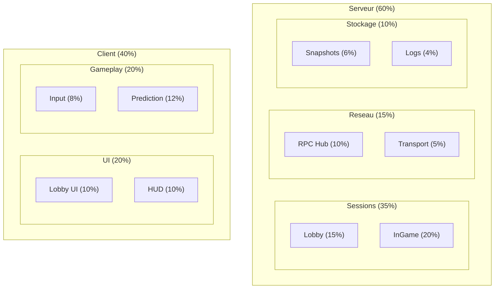

```mermaid
%% Treemap (Repartition Ressources)
flowchart TB
    subgraph Serveur["Serveur (60%)"]
        subgraph Sessions["Sessions (35%)"]
            Lobby["Lobby (15%)"]
            InGame["InGame (20%)"]
        end
        subgraph Networking["Reseau (15%)"]
            Rpc["RPC Hub (10%)"]
            Transport["Transport (5%)"]
        end
        subgraph Stockage["Stockage (10%)"]
            Snapshots["Snapshots (6%)"]
            Logs["Logs (4%)"]
        end
    end

    subgraph Client["Client (40%)"]
        subgraph UI["UI (20%)"]
            LobbyUI["Lobby UI (10%)"]
            Hud["HUD (10%)"]
        end
        subgraph Gameplay["Gameplay (20%)"]
            Input["Input (8%)"]
            Prediction["Prediction (12%)"]
        end
    end
```
