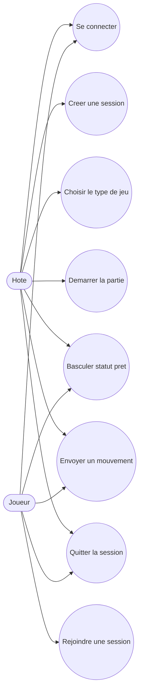

```mermaid
%% Diagramme de Cas d'Utilisation
flowchart LR
    host([Hote])
    player([Joueur])

    connect((Se connecter))
    create((Creer une session))
    join((Rejoindre une session))
    ready((Basculer statut pret))
    selectGame((Choisir le type de jeu))
    start((Demarrer la partie))
    move((Envoyer un mouvement))
    leave((Quitter la session))

    host --> connect
    player --> connect

    host --> create
    player --> join

    host --> selectGame
    host --> start

    host --> ready
    player --> ready

    host --> move
    player --> move

    host --> leave
    player --> leave
```
